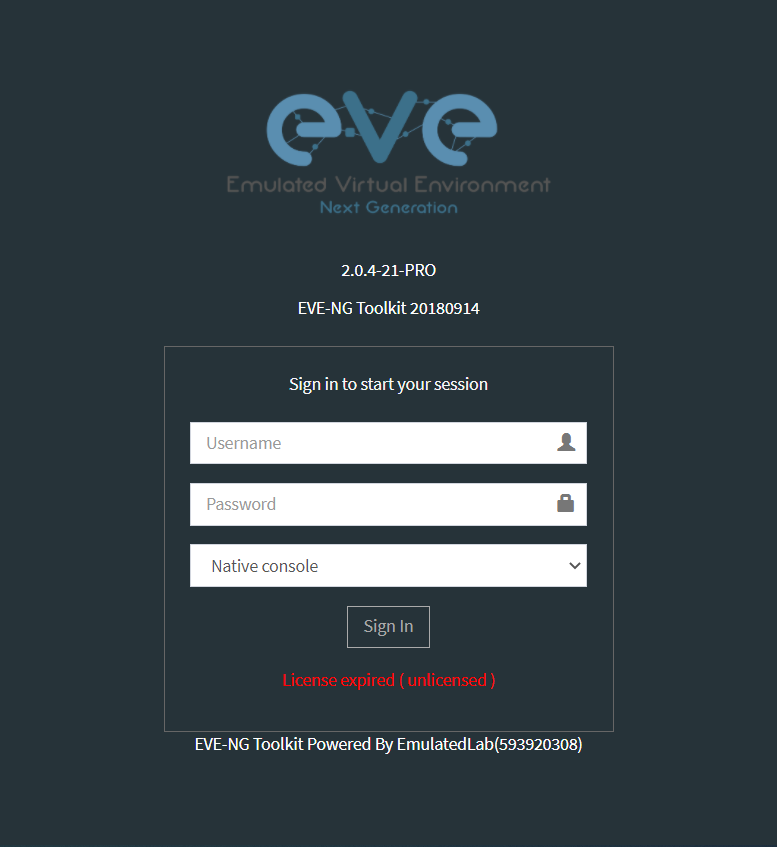
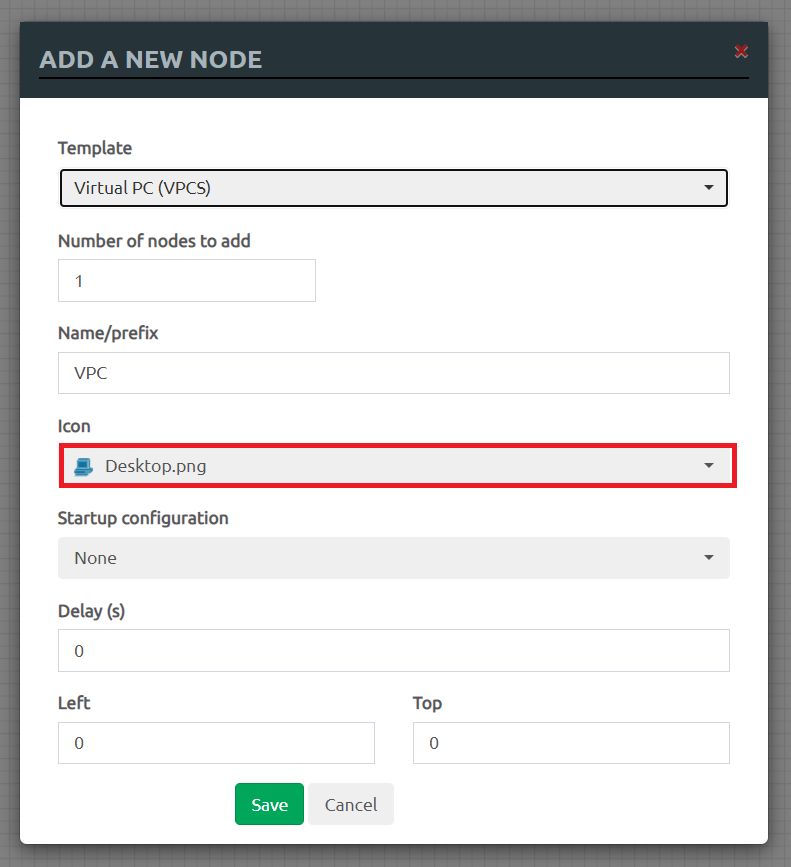
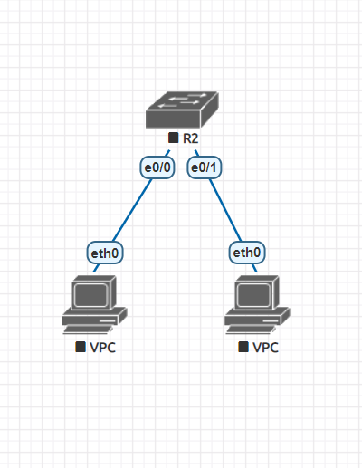
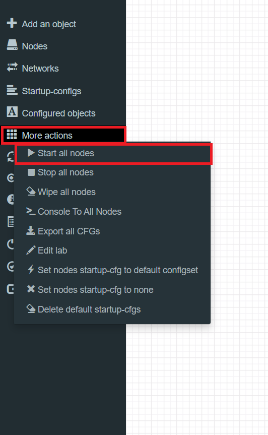
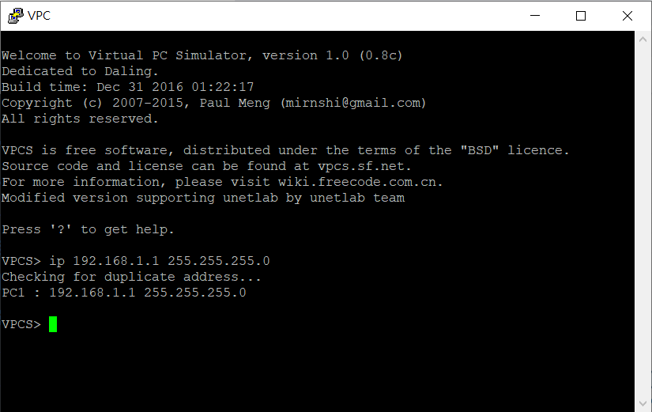
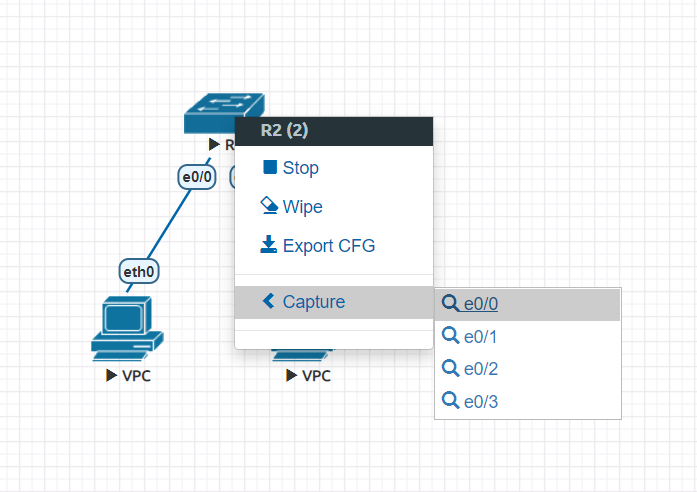
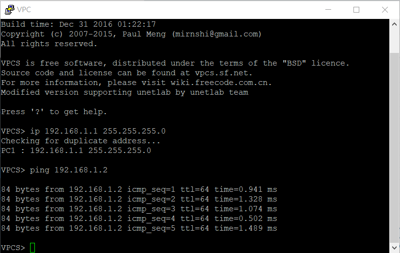

# 環境測試

- 進入網頁圖形化平台，帳號預設admin，密碼預設eve

    

- 加入交換機

    

- 加入兩台虛擬電腦

    

- 將虛擬電腦連線至交換器

    

- 開啟所有節點

    

- 雙擊PC後設置PC的IP

    
    

- 擷取交換機的封包

    
    
    

# 額外補充

- LAN 簡單來說就是廣播封包可送達的區域網路

- 扁平化設計即把所有電腦放在同一個網路

- VLAN 邏輯上將區域網路切分成各個區域網路

- 迴圈的好處就是擁有容錯率，但在運作上要沒有迴圈，要做到就要用到
spanning tree

- tree就是節點到節點只有單一路線

- core aggregate access