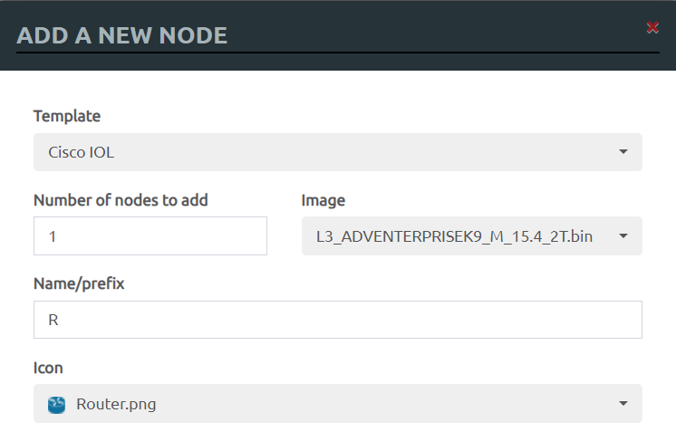
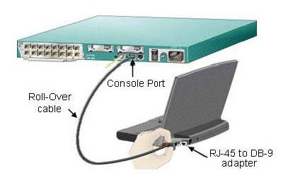
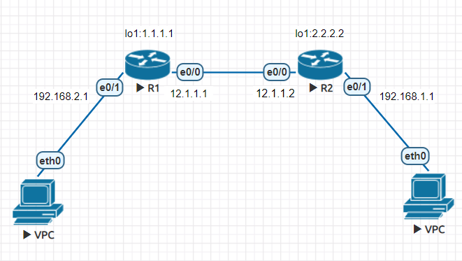
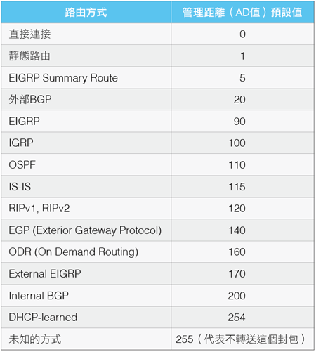

# EVE

- `halt -p`、`shutdown -h now` : 關機

# Router指令

- 作業系統也是IOS(Internetwork Operating System)

- 新增節點

    

- 指令前面+ `no` 代表做指令的相反動作

- `Ctrl+Shift+6` : 快速中止動作

## Privileged Mode

- `sh run` : show running-config

- `wr` : write memory

- `sh ip int brief` : show ip interface brief，查看網路設定

- `conf t` : configure terminal，進入config模式

- `telnet 12.1.1.2`

- `show ip route` : 顯示路由表

- `show arp`

- `show interface e0/0` : 顯示interface詳細資訊,如ip addr, mac addr,傳送速度,MTU,送了多少封包,接收多少封包等等

- `debug ip icmp` : 開啟debug模式

- `no debug all`

- `ping` : 第一個封包失敗代表arp還沒解析完成

## Config Mode

- `int e0/0` : interface ethernet 0/0，進入接口，接口可以有實體也可以有虛擬的

- `Ctrl+Z` : 直接跳回privileged mode

- `ho R1` : hostname R1

- `ena p eve` : enable password eve，設定密碼為eve，以明文顯示

- `ena s eve` : enable secret eve，設定密碼並用亂碼顯示，會覆蓋enable password

- 首次連接至實體Router

    

    ```
    Router(config)#line console 0

    Router(config-line)#password 密碼   

    Router(config-line)#login
    ```

- `line vty 0 4` : 進入telnet(vty)

- `line console 0`

- `no ip domain lookup` : 關閉DNS查詢

- `int lo 1`

### Interface

- `ip addr 12.1.1.1 255.255.255.0` : 設定接口IP

- `no shoutdown`

### Config-Line

- line vty 0 4

    - `password eve` : 設定telnet密碼

    - `login`

    - `transport input telnet`

- line con 0

    - `exec-timeout 0 0` : 設定逾時時間， `0 0` 代表永不逾時

    - `logging synchronous` : log訊息不會中斷指令輸入

# 簡單路由器DHCP

- 測試環境

    

## Router

(Config Mode)

- R1、R2

    - `ip dhcp pool DHCP` : 做一個名為DHCP的IP池

(dhcp-config)

- R1
    - `network 192.168.2.0 /24`

    - `default-router 192.168.2.1`

    - `dns-server 8.8.8.8`

- R2

    - `network 192.168.1.0 /24`

    - `default-router 192.168.1.1`

    - `dns-server 8.8.8.8`

(Config Mode)

- R1、R2

    - `int e0/1`

(Interface)

- R1

    - `ip addr 192.168.2.1 255.255.255.0`

    - `no shutdown`

- R2

    - `ip addr 192.168.1.1 255.255.255.0`

    - `no shutdown`

(Config Mode)

- R1

    - `ip route 192.168.1.0 255.255.255.0 12.1.1.2`

- R2

    - `ip route 192.168.2.0 255.255.255.0 12.1.1.1`


## VPC

- `ip dhcp`

# AD(Administrative Distance)實測


*管理距離（AD值）是一個從0到255的整數，每一種路由協定都有一個預設的管理距離（AD值）與之對應，代表這個路由協定所提供的資訊的可靠程度，其值越低，代表可靠程度越高。*

- 測試環境

    

## Router
(Config Mode)

- R1、R2、R3

    - `int e0/0`

(Interface)

- R1

    - `ip addr 12.1.1.1 255.255.255.0`

    - `no sh`

    - `int e0/1`

    - `ip addr 12.2.2.1 255.255.255.0`

    - `no sh`

- R2

    - `ip addr 12.1.1.2 255.255.255.0`

    - `no sh`

    - `int e0/1`

    - `ip addr 12.3.3.1 255.255.255.0`

    - `no sh`

- R3

    - `ip addr 12.2.2.2 255.255.255.0`

    - `no sh`

    - `int e0/1`

    - `ip addr 12.3.3.2 255.255.255.0`

    - `no sh`

(Config Mode)

- R1

    - `ip route 12.3.3.0 255.255.255.0 12.1.1.2`
    
    - `ip route 12.3.3.0 255.255.255.0 12.2.2.2 10`

- R2

    - `ip route 12.2.2.0 255.255.255.0 12.1.1.1`

    - `ip route 12.2.2.0 255.255.255.0 12.3.3.2 10`

- R3

    - `ip route 12.1.1.0 255.255.255.0 12.2.2.1`

    - `ip route 12.1.1.0 255.255.255.0 12.3.3.1`
---

**參考資料:**

- [Router設定](https://giboss.pixnet.net/blog/post/26807628)