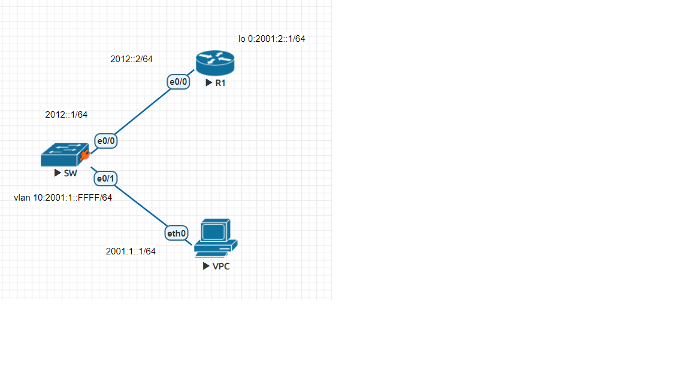
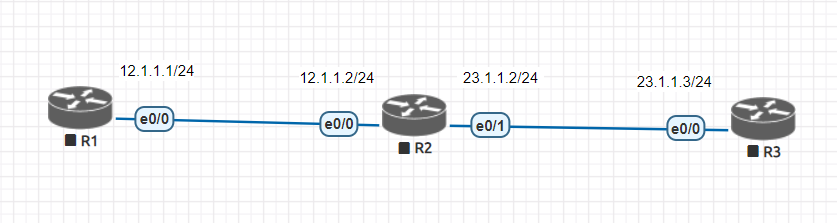

# IPv6

## 交換機

- 模式

    - access : 會幫封包打標籤

    - trunk

## 手動分配ipv6實作



- R1

    ```
    en
    conf t
    ipv6 unic
    int lo 0
    ipv6 addr 2001:2::1/64
    int e0/0
    ipv6 addr 2012::2/64
    no shut
    do show ipv6 int brief
    exit
    ipv6 route 2001:1::/64 e0/0 2012::1
    ```

- SW

    ```
    en
    conf t
    ipv6 uni
    int e0/0
    no switchport
    ipv6 enable
    ipv6 addr 2012::1/64
    no shut
    exit
    ipv6 route ::/0 e0/0 2012::2
    vlan 10
    int vlan 10
    ipv6 addr 2001:1::FFFF/64
    no shut
    ipv6 enable
    int e0/1
    switch mode access
    switchport access vlan 10
    ```

- VPC

    ```
    ip 2001:1::1/64 2001:1::FFFF
    show ipv6
    ping 2001:1::FFFF
    ping 2012::1
    ```
    
## 自動分配ipv6

狀態式 dhcpv6 

無狀態式 SLAAC EUI-64

- 無狀態自動分配實作 router advertisement

- SW

    ```
    no ipv6 nd suppress-ra
    ```

- VPC

    ```
    ip auto
    ```

# 動態路由
- 三種方法

    1. 距離向量法

        - 設定簡單

    2. 連線狀態法

    3. 混合型尋徑法

- ECMP (Equal-cost multi-path routing)

- 判斷同個資料流方式

    - 5-tuple

        1. src ip

        2. dst ip

        3. src port

        4. dst port

        5. tcp/udp

- 路徑表更新
    
    - 30s更新一次
        
    - 超過180s停止運作

    - 超過240s刪除路由

## RIP v1實作



- R1

    ```
    en
    conf t
    hostname R1
    int e0/0
    ip addr 12.1.1.1 255.255.255.0
    no shut
    exit
    router rip
    network 12.0.0.0
    ```

- R2

    ```
    en
    conf t
    hostname R2
    int e0/0
    ip addr 12.1.1.2 255.255.255.0
    no shut
    int e0/1 23.1.1.2 255.255.255.0
    no shut
    exit
    router rip
    network 12.0.0.0
    network 23.0.0.0
    ```

- R3

    ```
    en
    conf t
    hostname R3
    int e0/0
    ip addr 23.1.1.3 255.255.255.0
    no shut
    exit
    router rip
    network 23.0.0.0
    ```

## RIP v2實作
- R1
    ```
    en
    conf t
    int lo 0
    ip addr 10.0.1.1 255.255.255.0
    exit
    router rip
    version 2
    no auto-summary
    network 10.0.1.0
    do clear ip route *
    ```