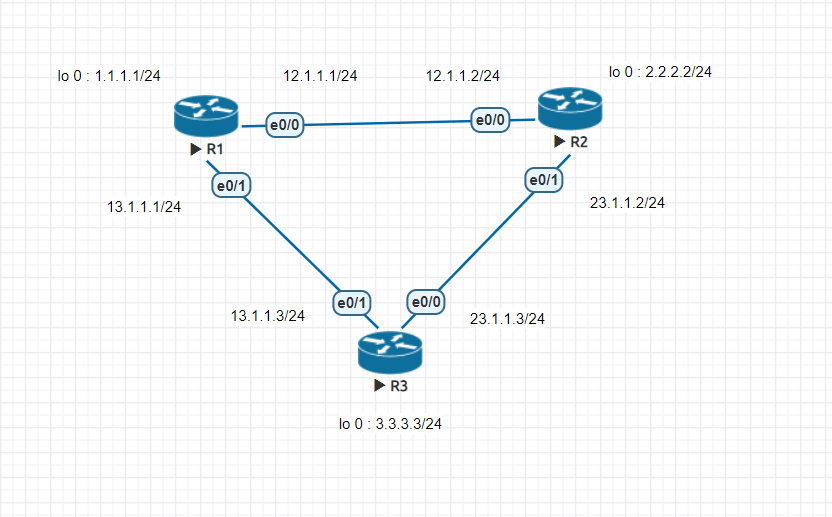
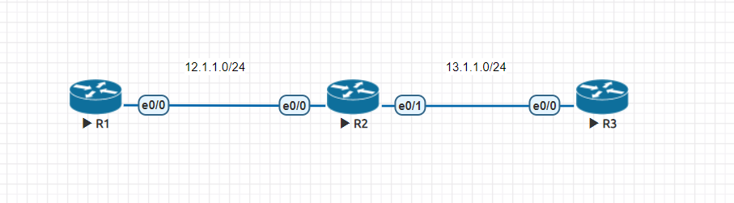
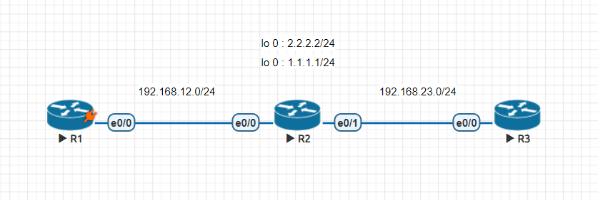

# RIP

第一個動態路由協定

▼|RIPv1|RIPv2
-|-|-
Layer|Application|Application
VSLM&CIDR|×|√
AD|120|120
metric|hop count|hop count
update method|broadcast255.255.255.255|multicast224.0.0.9
auto summary|×|√

> VLSM(Variable Length Dubnet Mask)\
hop count -> 16代表不可到達，15以內才合法)\
RIPv2可以加密

## RIPv2實作



- R1

    ```
    en
    conf t
    hostname R1
    int e0/0
    ip addr 12.1.1.1 255.255.255.0
    no shut
    int e0/1
    ip addr 13.1.1.1 255.255.255.0
    no shut
    int lo 0
    ip addr 1.1.1.1 255.255.255.0
    exit
    router rip
    version 2
    no auto-summary
    network 12.1.1.0
    network 13.1.1.0
    network 1.1.1.0
    ```


- R2

    ```
    en
    conf t
    hostname R2
    int e0/0
    ip addr 12.1.1.2 255.255.255.0
    no shut
    int e0/1
    ip addr 23.1.1.2 255.255.255.0
    no shut
    int lo 0
    ip addr 2.2.2.2 255.255.255.0
    exit
    router rip
    version 2
    no auto-summary
    network 12.1.1.0
    network 23.1.1.0
    network 2.2.2.0
    ```

- R3

    ```
    en
    conf t
    hostname R3
    int e0/0
    ip addr 23.1.1.3 255.255.255.0
    no shut
    int e0/1
    ip addr 13.1.1.3 255.255.255.0
    no shut
    int lo 0
    ip addr 3.3.3.3 255.255.255.0
    exit
    router rip
    version 2
    no auto-summary
    network 13.1.1.0
    network 23.1.1.0
    network 3.3.3.0
    ```

## Auto Summary實作

此實作基礎建立於上個實作

- R3

    ```
    int lo 1
    ip addr 172.16.0.1 255.255.255.0
    int lo 2
    ip addr 172.16.1.1 255.255.255.0
    int lo 3
    ip addr 172.16.2.1 255.255.255.0
    int lo 4
    ip addr 172.16.3.1 255.255.255.0
    int e0/1
    ip summary-address rip 172.16.0.0 255.255.252.0
    int e0/0
    ip summary-address rip 172.16.0.0 255.255.252.0
    ```
    
    > 252是因為合併4個子網路，所以需要兩個bit

## Passive Interface實作



- R1

    ```
    en
    conf t
    hostname R1
    int e0/0
    ip addr 12.1.1.1 255.255.255.0
    no shut
    router rip
    version 2
    no auto-summary
    network 12.1.1.0
    ```

- R2

    ```
    en
    conf t
    hostname R2
    int e0/0
    ip addr 12.1.1.2 255.255.255.0
    no shut
    int e0/1
    ip addr 13.1.1.2 255.255.255.0
    no shut
    router rip
    version 2
    no auto-summary
    passive-interface Ethernet0/1
    network 13.1.1.0
    ```

- R3

    ```
    en
    conf t
    hostname R3
    int e0/0
    ip addr 13.1.1.3 255.255.255.0
    no shut
    router rip
    version 2
    no auto-summary
    network 13.1.1.0
    ```

## Defalut-Information Originate實作



- R1
```
en
conf t
hostname R1
int e0/0
ip addr 192.168.12.1 255.255.255.0
no shut
router rip
version 2
no auto-summary
network 192.168.12.0
```

- R2
```
en
conf t
hostname R2
int e0/0
ip addr 192.168.12.2 255.255.255.0
no shut
int e0/1
ip addr 192.168.23.2 255.255.255.0
no shut
int lo 0 
ip addr 1.1.1.1 255.255.255.0
int lo 1
ip addr 2.2.2.2 255.255.255.0
router rip
version 2
no auto-summary
default-information originate
network 192.168.12.0
network 192.168.23.0
```

- R3
```
en
conf t
hostname R3
int e0/0
ip addr 192.168.23.3 255.255.255.0
no shut
router rip
version 2
no auto-summary
network 192.168.23.0
```