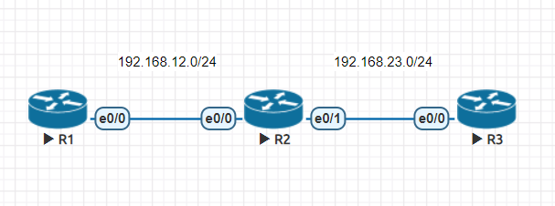

# EIGRP(Enhanced Interior Gateway Routing Protocol)

封包類型|用途
-|-
hello|用於建立和維持neighborhood (5sec一次)
update|用於傳送路由條目
ack|用於實現可靠傳輸
query|用於路由丟失時，向鄰居發送路由請求
reply|收到路由請求，給予回覆

- 採用DUAL演算法(route table顯示D)

- 高級的DV(Distance Vector) or Mixed

    - metrics **BW, Delay**, Load, Reliability, MTU

    - trigger update 224.0.0.10

- IP header protocal:88

- VLSM(Variable Length Subnet Mask) and CIDR(Classless Inter-Domain Routing)

- AD=90

- EIGRP有三張表 **:** 鄰居表、拓樸表、路由表

## 簡單EIFRP實作



- R1

    ```
    en
    conf t
    hostname R1
    int e0/0
    ip addr 192.168.12.1 255.255.255.0
    no shut
    router eigrp 90
    network 192.168.12.0 0.0.0.255  wild card mask跟普通mask相反
    ```

- R2

    ```
    en
    conf t
    hostname R2
    int e0/0
    ip addr 192.168.12.2 255.255.255.0
    no shut
    int e0/1
    ip addr 192.168.23.2 255.255.255.0
    no shut
    router eigrp 90
    network 192.168.12.0 0.0.0.255
    network 192.168.23.0 0.0.0.255
    ```

- R3

    ```
    en
    conf t
    hostname R3
    int e0/0
    ip addr 192.168.23.3 255.255.255.0
    no shut
    router eigrp 90
    network 192.168.23.0 0.0.0.255
    do sh ip eigrp nei
    do sh ip eigrp to
    do sh ip route eigrp
    ```

## EIGRP路由加密

- R1

    ```
    conf t
    key chain mychain
    key 90
    key-string cisco
    int e0/0
    ip authe key-chain eigrp 90 mychain
    ip authe mode eigrp 90 md5
    do sh ip eigrp int detail
    ```

- R2

    ```
    conf t
    key chain mychain
    key 90
    key-string cisco
    int e0/0
    ip authe key-chain eigrp 90 mychain
    ip authe mode eigrp 90 md5
    int e0/1
    ip authe key-chain eigrp 90 mychain
    ip authe mode eigrp 90 md5
    ```

- R3

    ```
    conf t
    key chain mychain
    key 90
    key-string cisco
    int e0/0
    ip authe key-chain eigrp 90 mychain
    ip authe mode eigrp 90 md5
    ```
---
**參考資料:**

- [EIGRP](https://www.jannet.hk/en/post/enhanced-interior-gateway-routing-protocol-eigrp/)
