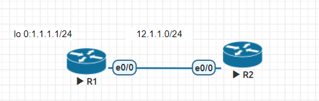
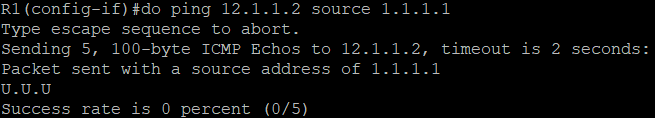

# EIGRP(Enhanced Interior Gateway Routing Protocol)

## Metric

- 計算公式 = `(K1 * BW * 256 + (K2 * BW ) / (256 – load) + K3 * delay * 256 ) * (K5 / (reliability + K4))`

    - 預設 K1 = 1, K2 = 0, K3 = 1, K4 = 0, K5 = 0

    - 所以可以將公式簡化成 `(BW + delay) * 256`

    - BW = `10^7 / interface bandwidth (Kbit)`

    - delay = `interface delay (usec) / 10`

## 路徑選擇

- AD (Advertised Distance) **:** 下一個節點到目的地的距離

- FD (Feasible Distance) **:** 從自己到目的地的最小值

- FD 的 Path 成為 Successor，並放入路由表

- AD 小於 FD 的 Path 則成為 Feasible successor，作為 Successor 的備用

## Variance

這是一個倍數，看可以容許多少倍的 FD 內的 AD 值的路徑，預設為 1

## Summarization

自動彙整的話只會用 /8、/16、/24，而手動即可根據要彙整的數量作相對應的遮罩

# ACL(Access Control List)

可以做簡易防火牆、資料分類

## 過濾封包

沒有設定的話最後會丟掉封包，效力等同於 deny any



- R1

    ```
    en
    conf t
    ho R1
    int e0/0
    ip addr 12.1.1.1 255.255.255.0
    no shut
    int lo 0
    ip addr 1.1.1.1 255.255.255.0
    ```

- R2

    ```
    en
    conf t
    ip route 1.1.1.0 255.255.255.0 e0/0 12.1.1.1
    ho R2
    access-list 1 deny host 1.1.1.1
    access-list 1 permit any
    int e0/0
    ip access-group 1 in
    ip addr 12.1.1.2 255.255.255.0
    no shut
    ```

- 實作結果 (阻擋 IP 為 1.1.1.1 的封包)

    

---
**參考資料:**

- [Jan Ho 的網絡世界](https://www.jannet.hk/zh-Hant/post/enhanced-interior-gateway-routing-protocol-eigrp/#path)
- [封包過濾表 – 存取控制清單](http://www.tsnien.idv.tw/Manager_WebBook/chap9/9-5%20%E5%B0%81%E5%8C%85%E9%81%8E%E6%BF%BE%E8%A1%A8%20%E2%80%93%20ACL.html)