# ACL(Access Control List)

Cisco 路由器的存取控制清單有三種：

1. 『標準存取控制清單』( Standard ACL)：僅檢視 IP 封包中的來源位址(source address) ，來決定封包是否允許通過，編號由 1~99, 1300~1999。

2. 『延伸式存取清單』(Extended ACL)：可比對 IP 封包中的 IP 標頭與上一層(TCP、UDP)標頭內的多個欄位，屬於比較進階細膩的過濾條件。編號由 100 ~ 199、2000 ~ 2699。

3. 『名稱式存取清單』(Named ACL)：是屬於前面兩種存取清單，但僅以名稱命名，也許這樣比較能了解該清單目的與功能。

## 標準存取控制清單實作

標準存取控制清單越靠近目的端越好

實作 **:** 僅阻擋IP來源為2.2.2.2的封包

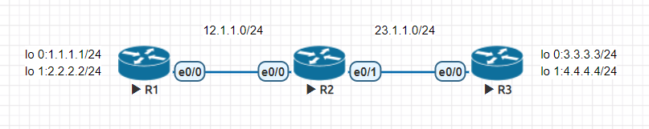

- R1

    ```
    en
    conf t
    ho R1
    int e0/0
    ip addr 12.1.1.1 255.255.255.0
    no shut
    int lo 0
    ip addr 1.1.1.1 255.255.255.0
    int lo 1
    ip addr 2.2.2.2 255.255.255.0
    router rip
    version 2
    net 1.1.1.0 
    net 2.2.2.0 
    net 12.1.1.0
    ```

- R2

    ```
    en
    conf t
    ho R2
    int e0/0
    ip addr 12.1.1.2 255.255.255.0
    no shut
    int e0/1
    ip addr 23.1.1.2 255.255.255.0
    no shut
    router rip
    version 2
    net 12.1.1.0 
    net 23.1.1.0 
    ```

- R3

    ```
    en
    conf t
    ho R3
    (黑名單)
    access-list 1 deny 2.2.2.0 0.0.0.255
    access-list 1 permit any
    (白名單)
    access-list 1 permit 1.1.1.0 0.0.0.255
    int e0/0
    ip access-group 1 in
    ip addr 23.1.1.3 255.255.255.0
    no shut
    int lo 0
    ip addr 3.3.3.3 255.255.255.0
    int lo 1
    ip addr 4.4.4.4 255.255.255.0
    router rip
    version 2
    net 3.3.3.0 
    net 4.4.4.0 
    net 23.1.1.0 
    ```

- 實作結果

    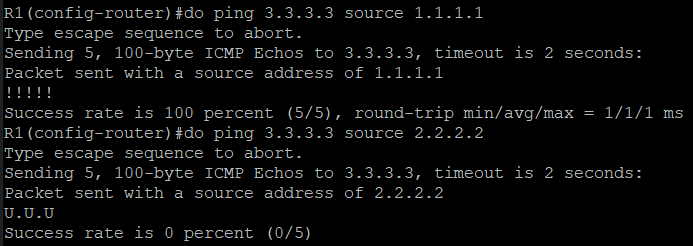

## 延伸式存取清單實作

延伸式存取清單越靠近來源端越好

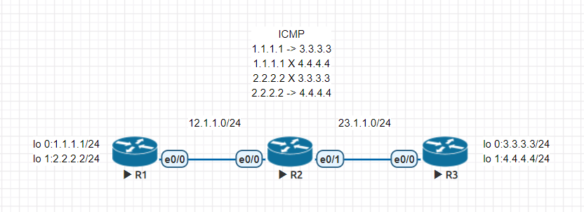

- R1

    ```
    en
    conf t
    ho R1
    int e0/0
    ip addr 12.1.1.1 255.255.255.0
    no shut
    int lo 0
    ip addr 1.1.1.1 255.255.255.0
    int lo 1
    ip addr 2.2.2.2 255.255.255.0
    router rip
    version 2
    net 1.1.1.0 
    net 2.2.2.0 
    net 12.1.1.0
    ```

- R2

    ```
    en
    conf t
    ho R2
    (黑名單)
    access-list 100 deny icmp 1.1.1.0 0.0.0.255 4.4.4.0 0.0.0.255
    access-list 100 deny icmp 2.2.2.0 0.0.0.255 3.3.3.0 0.0.0.255
    access-list 100 permit ip any any
    (白名單)
    access-list 100 permit 1.1.1.0 0.0.0.255 3.3.3.0 0.0.0.255
    access-list 100 permit 2.2.2.0 0.0.0.255 4.4.4.0 0.0.0.255
    int e0/0
    ip access-group 100 in
    ip addr 12.1.1.2 255.255.255.0
    no shut
    int e0/1
    ip addr 23.1.1.2 255.255.255.0
    no shut
    router rip
    version 2
    net 12.1.1.0 
    net 23.1.1.0 
    ```

- R3

    ```
    en
    conf t
    ho R3
    int e0/0
    ip addr 23.1.1.3 255.255.255.0
    no shut
    int lo 0
    ip addr 3.3.3.3 255.255.255.0
    int lo 1
    ip addr 4.4.4.4 255.255.255.0
    router rip
    version 2
    net 3.3.3.0 
    net 4.4.4.0 
    net 23.1.1.0 
    ```

- 實作結果
    
    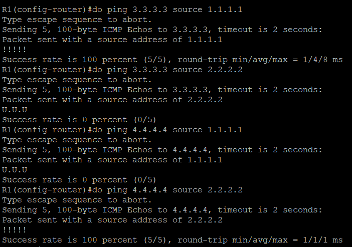

## 延伸式存取清單實作2

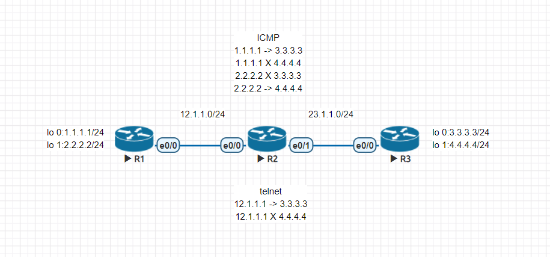

- R2

    ```
    en
    conf t
    (黑名單)
    access-list 101 deny tcp 12.1.1.0 0.0.0.255 4.4.4.0 0.0.0.255 eq 23
    access-list 101 permit tcp any any eq 23
    (白名單)
    access-list 101 permit tcp 12.1.1.0 0.0.0.255 3.3.3.0 0.0.0.255 eq 23
    int e0/1
    ip access-group 101 out
    ```

- R3

    ```
    en
    conf t
    line vty 0 4 (0 4 代表最多可以允許五台0、1、2、3、4)
    password cisco
    login
    transport input telnet
    ```

## 名稱式存取清單實作

可以插入規則

實作 **:** 先阻擋連線到4.4.4.0/24，再修改規則阻擋往3.3.3.0/24的連線

- R2

    ```
    en
    conf t
    ip access-list extended telnet-acl
    deny tcp any 4.4.4.0 0.0.0.255 eq 23
    permit ip any any
    int e0/1
    no ip access-group 101 out
    ip access-group telnet-acl out
    ```

- 實作結果

    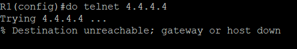

- R2

    ```
    en
    conf t
    ip access-list extended telnet-acl
    no 10
    5 deny tcp any 3.3.3.0 0.0.0.255 eq 23
    ```

- 實作結果

    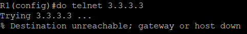

## 練習1

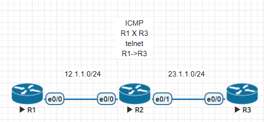

- R1

    ```
    en
    conf t
    ho R1
    ip route 23.1.1.0 255.255.255.0 e0/0 12.1.1.2
    int e0/0
    ip addr 12.1.1.1 255.255.255.0
    no shut
    ```

- R2

    ```
    en
    conf t
    ho R2
    ip access-list ex rule
    permit tcp 12.1.1.0 0.0.0.255 23.1.1.0 0.0.0.255 eq 23
    deny icmp 12.1.1.0 0.0.0.255 23.1.1.0 0.0.0.255
    int e0/0
    ip access-group rule in
    ip addr 12.1.1.2 255.255.255.0
    no shut
    int e0/1
    ip addr 23.1.1.2 255.255.255.0
    no shut
    ```

- R3

    ```
    en
    conf t
    ho R3
    ip route 12.1.1.0 255.255.255.0 e0/0 23.1.1.2
    line vty 0 4
    password cisco
    login
    transport input telnet
    int e0/0
    ip addr 23.1.1.3 255.255.255.0
    no shut
    ```

- 實作結果

    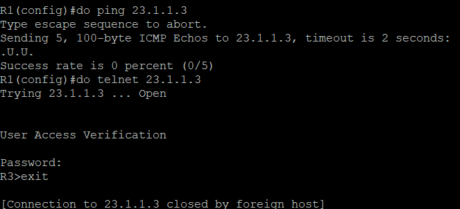
    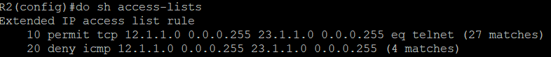

## 練習2

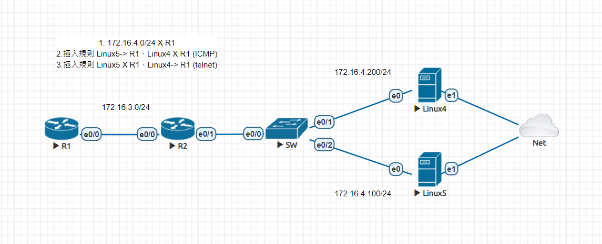

kali linux 帳號密碼 : root / toor

kali linux 下載軟體需要使用 `apt update`，但一開始都會失敗，因為日期不對，所以要打 `systemctl restart ntp.service` & `timedatectl set-timezone Asia/Taipei`

- R1

    ```
    en
    conf t
    ho R1
    ip route 172.16.4.0 255.255.255.0 e0/0 172.16.3.2
    int e0/0
    ip addr 172.16.3.1 255.255.255.0
    no shut
    ```

- R2

    ```
    en
    conf t
    ho R2
    ip access-list ex rule
    deny ip 172.16.4.0 0.0.0.255 172.16.3.0 0.0.0.255
    int e0/0
    ip addr 172.16.3.2 255.255.255.0
    no shut
    int e0/1
    ip access-group rule in
    ip addr 172.16.4.2 255.255.255.0
    no shut
    ```

- Linux4

    ```
    ip addr add 172.16.4.200/24 brd + dev eth0
    ip route add default via 172.16.4.2
    ```

- Linux5

    ```
    ip addr add 172.16.4.100/24 brd + dev eth0
    ip route add default via 172.16.4.2
    ```

- 實作結果

    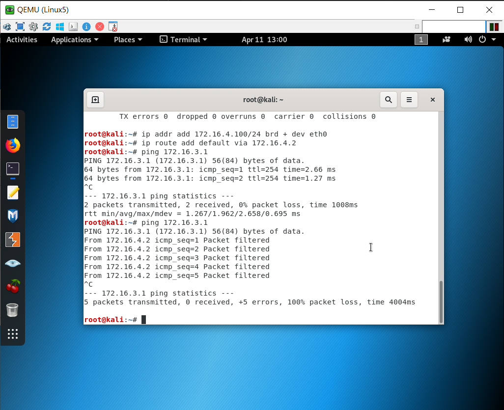

- R2

    ```
    en
    conf t
    ip access-list ex rule
    5 permit icmp 172.16.4.100 0.0.0.0 172.16.3.0 0.0.0.255
    ```


- 實作結果

    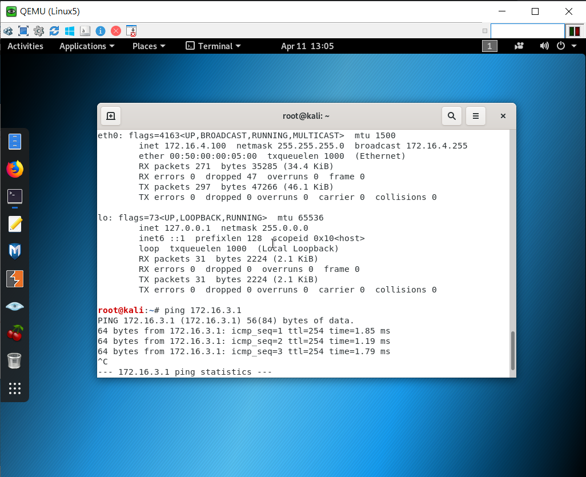

- R1

    ```
    en 
    conf t
    line vty 0 4
    password cisco
    login 
    transport input ssh
    ```

- R2

    ```
    en
    conf t
    ip access-list ex rule
    6 permit tcp 172.16.4.200 0.0.0.0 172.16.3.0 0.0.0.255 eq 22
    ```

- Linux4、Linux5

    ```
    timedatectl set-timezone Asia/Taipei
    systemctl restart ntp.service
    apt update
    apt install telnet
    ```

- Linux4

    ```
    telnet 172.16.3.1
    ```

- 實作結果

    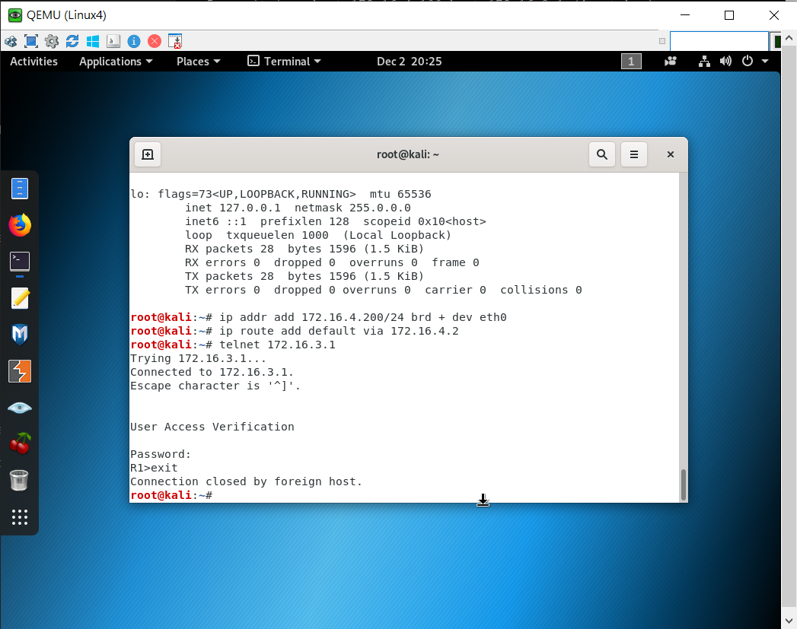