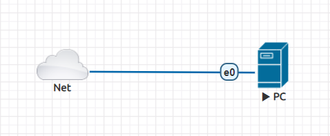
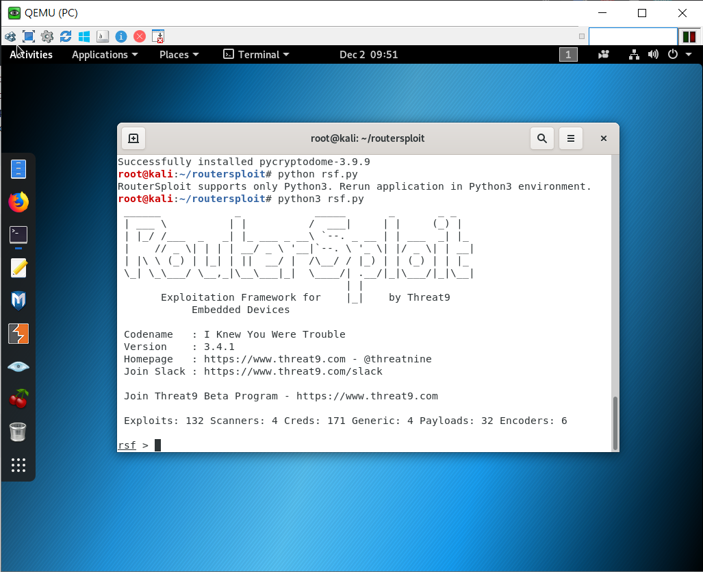
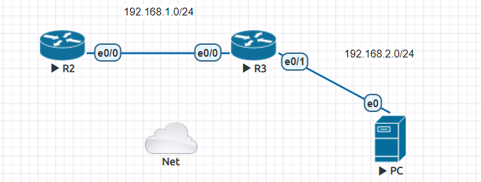
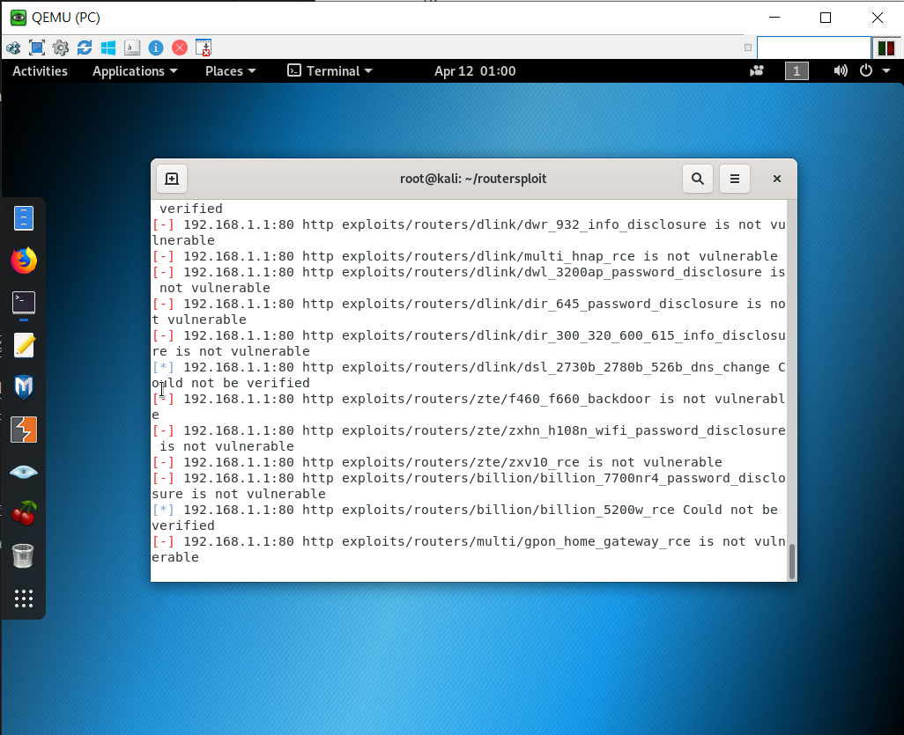

# routersploit

## 安裝

使用 kali linux

net type = management(cloud 0)




- PC

    ```
    systemctl restart ntp.service
    timedatectl set-timezone Asia/Taipei
    apt update
    useradd user
    mkdir /home/user
    chown user:user /home/user
    git clone https://github.com/reverse-shell/routersploit
    cd routersploit
    python3 -m pip install -r requirements.txt
    python3 rsf.py
    ```

    

## 實驗



- R1

    ```
    en
    conf t
    ho R2
    int e0/0
    ip addr 192.168.1.1 255.255.255.0
    no shut
    router rip
    version 2
    no auto
    net 192.168.1.0
    ip domain-name test.com
    ip ssh version 2
    crypto key generate rsa

        1024

    username root privilege 15 password 123456
    line vty 0 4
    login local
    transport input ssh
    ```

- R2

    ```
    en
    conf t
    ho R3
    int e0/0
    ip addr 192.168.1.2 255.255.255.0
    no shut
    int e0/1
    ip addr 192.168.2.2 255.255.255.0
    no shut
    router rip
    version 2
    no auto
    net 192.168.1.0
    net 192.168.2.0

    ssh -l root 192.168.1.1  (測試ssh連線)
    ```

- PC

    ```
    ip addr add 192.168.2.3/24 brd + dev eth0
    ip route add default via 192.168.2.2
    python3 rsf.py
    use scanners/routers/router_scan
    set target 192.168.1.1
    run
    ```

    

# 遠端管理(Pexpect)

## 實驗

- R2

    ```
    en
    conf t
    ena pass 123456
    line vty 0 4
    login
    password 123456
    transport input telnet
    int e0/1
    ip addr dhcp
    no shut
    ```

- PC

    ```
    yum install telnet python3 python3-pip -y
    pip3 install pexpect
    ```
---
**參考資料:**

- [routersploit 安裝](https://ssorc.tw/7397/routersploit-%E6%8E%83-router-%E8%A8%AD%E5%82%99%E6%BC%8F%E6%B4%9E-%E5%BC%B1%E9%BB%9E/)

- [Cisco設定遠端連線](https://sites.google.com/a/james-tw.com/j-note/cisco/cisco-she-ding-yuan-duan-lian-xian-telnet-ssh)

- [hydra](https://netsec.ws/?p=353)