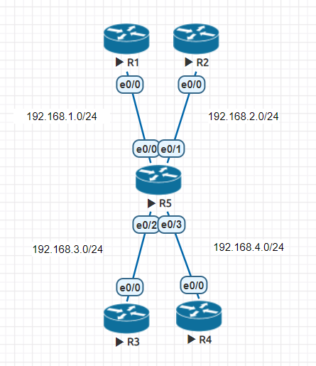

# VRF (Virtual routing and forwarding)

## 網路虛擬化 : VLAN、VRF

虛擬化很重要的就是資料的隔離，安全性較高。VRF 可以不讓他人看見內部路由結構。

## 實驗



- R1

    ```
    en
    conf t
    ho R1
    int e0/0
    ip addr 192.168.1.1 255.255.255.0
    no shut
    ```

- R2

    ```
    en
    conf t
    ho R2
    int e0/0
    ip addr 192.168.2.1 255.255.255.0
    no shut
    ```

- R3

    ```
    en
    conf t
    ho R3
    int e0/0
    ip addr 192.168.3.1 255.255.255.0
    no shut
    ```

- R4

    ```
    en
    conf t
    ho R4
    int e0/0
    ip addr 192.168.4.1 255.255.255.0
    no shut
    ```

- R5

    ```
    en
    conf t
    ho R5
    ip vrf Upper
    exit
    ip vrf Lower
    exit
    int e0/0
    ip vrf forwarding Upper
    ip addr 192.168.1.2 255.255.255.0
    no shut
    int e0/1
    ip vrf forwarding Upper
    ip addr 192.168.2.2 255.255.255.0
    no shut
    int e0/2
    ip vrf forwarding Lower
    ip addr 192.168.3.2 255.255.255.0
    no shut
    int e0/3
    ip vrf forwarding Lower
    ip addr 192.168.4.2 255.255.255.0
    no shut
    do sh ip vrf
    do sh ip route vrf Upper 
    do sh ip route vrf Lower 
    do ping vrf Upper 192.168.1.1
    ```

- R1

    ```
    en
    conf t
    router ospf 1
    net 192.168.1.0 0.0.0.255 area 0
    ```

- R2

    ```
    en
    conf t
    router ospf 1
    net 192.168.2.0 0.0.0.255 area 0
    ```

- R3

    ```
    en
    conf t
    router ospf 1
    net 192.168.3.0 0.0.0.255 area 0
    ```

- R4

    ```
    en
    conf t
    router ospf 1
    net 192.168.4.0 0.0.0.255 area 0
    ```

- R5

    ```
    en
    conf t
    router ospf 1 vrf Upper
    net 192.168.1.0 0.0.0.255 area 0
    net 192.168.2.0 0.0.0.255 area 0
    router ospf 2 vrf Lower
    net 192.168.3.0 0.0.0.255 area 0
    net 192.168.4.0 0.0.0.255 area 0
    ```

# NAT (Network Address Translation)

Type|| 
-|-
DAT|many to many
PAT|many to one
Static NAT|one to one

- DAT 準備很多 Public IP。無法減少IP使用量。

- PAT 只需要一個 Public IP。目前常用此方法。


## DAT 實驗


- R1

    ```
    en
    conf t
    ho R1
    ip route 0.0.0.0 0.0.0.0 12.1.1.2
    int e0/0 
    ip addr 12.1.1.1 255.255.255.0
    no shut
    int lo 1
    ip addr 192.168.1.1 255.255.255.0
    int lo 2
    ip addr 192.168.2.1 255.255.255.0
    no sh
    ```

- R2

    ```
    en
    conf t
    ho R2
    ip route 192.168.1.0 255.255.255.0 e0/0 12.1.1.1
    ip route 192.168.2.0 255.255.255.0 e0/0 12.1.1.1
    int e0/0 
    ip addr 12.1.1.2 255.255.255.0
    no sh
    int e0/1
    ip addr 23.1.1.2 255.255.255.0
    no sh
    ```

- R3

    ```
    en
    conf t
    ho R3
    int e0/0 
    ip addr 23.1.1.3 255.255.255.0
    no sh
    ```

- R2

    ```
    en
    conf t
    access-list 1 permit 192.168.1.0 0.0.0.255
    access-list 2 permit 192.168.2.0 0.0.0.255
    ip nat pool DAT 23.1.1.100 23.1.1.200 netmask 255.255.255.0
    int e0/0
    ip nat inside
    int e0/1
    ip nat outside
    exit
    ip nat inside source list 1 pool DAT
    ip nat inside source list 2 pool DAT
    ```

## PAT 實驗

- R2

    ```
    en 
    conf t
    no ip nat inside source list 1 pool DAT
    no ip nat inside source list 2 pool DAT
    ip nat pool PAT 23.1.1.2 23.1.1.2 netmask 255.255.255.0
    ip nat inside source list 1 pool PAT overload
    ip nat inside source list 2 pool PAT overload
    do debug ip nat
    ```

## Static NAT 實驗

- R1

    ```
    en
    conf t
    line vty 0 4
    password cisco
    login
    transport input telnet
    ```

- R2

    ```
    ip nat inside source static 12.1.1.1 23.1.1.10
    ```