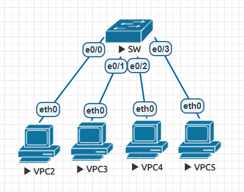
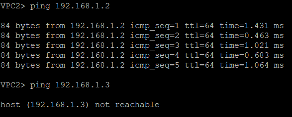
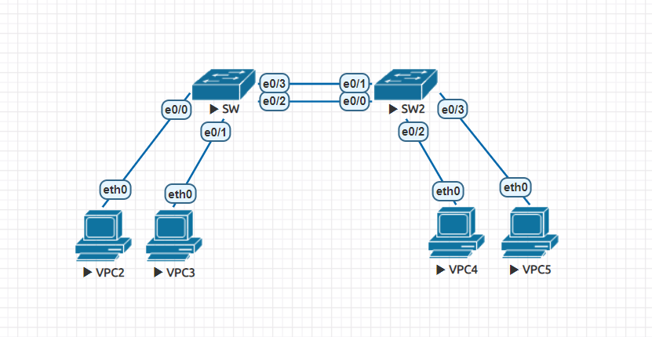
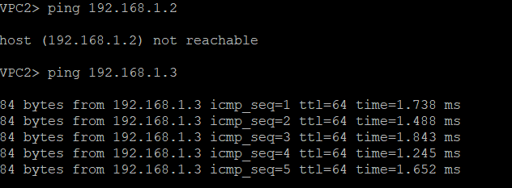
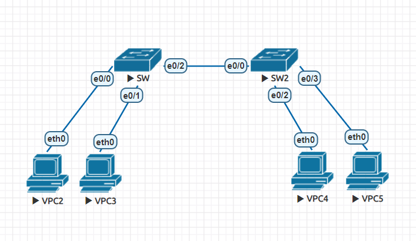
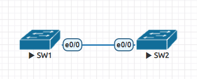
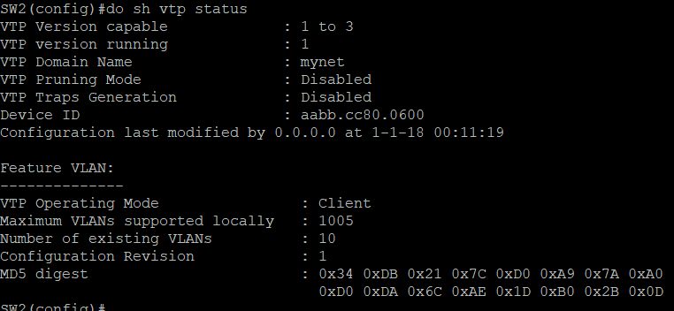

# VLAN

屬於第二層的虛擬化，把區域網路隔離成很多個廣播域。第二層設備有位置學習的功能，也就是會記錄裝置位於哪裡，當一開始不知道的時候，就會使用廣播的方式搜尋。所以當主機很多時，會有很多廣播封包在網路中。

區分不同 VLAN 是在封包裡面會有 802.1Q VLAN Tag (4 Bytes)，當第二層設備在沒設定時，裝置都處於 Defult VLAN，Defult VLAN 預設是 VLAN 1，這個預設可以更改，在 Defult VLAN 傳輸不需要貼標籤。

## VLAN 實驗

- VPC2

    ```
    set pcname VPC2
    ip 192.168.1.1 /24
    ```

- VPC3

    ```
    set pcname VPC3
    ip 192.168.1.2 /24
    ```

- VPC4

    ```
    set pcname VPC4
    ip 192.168.1.3 /24
    ```

- VPC5

    ```
    set pcname VPC5
    ip 192.168.1.4 /24
    ```

- SW

    access port 的線路上不會帶有 tag，因為是聯繫主機用的；trunk port 的線路上會帶有 tag，因為是聯繫可以分辨 tag 的裝置用的

    

    ```
    en
    sh vlan brief
    conf t
    vlan 10
    name Vlan10
    exit
    vlan 20
    name Vlan20
    do sh vlan bri
    int e0/0
    switchport mode access  
    switchport access vlan 10
    int e0/1
    switchport mode access  
    switchport access vlan 10
    int e0/2
    switchport mode access  
    switchport access vlan 20
    int e0/3
    switchport mode access  
    switchport access vlan 20
    ```

    

## VLAN 實驗2



- VPC2

    ```
    set pcname VPC2
    ip 192.168.1.1 /24
    ```

- VPC3

    ```
    set pcname VPC3
    ip 192.168.1.2 /24
    ```

- VPC4

    ```
    set pcname VPC4
    ip 192.168.1.3 /24
    ```

- VPC5

    ```
    set pcname VPC5
    ip 192.168.1.4 /24
    ```

- SW

    ```
    en
    conf t
    vlan 10
    vlan 20
    int range e0/0,e0/2
    sw mode access
    sw access vlan 10
    int range e0/1,e0/3
    sw mode access
    sw access vlan 20
    ```

- SW2

    ```
    en
    conf t
    vlan 10
    vlan 20
    int range e0/0,e0/2
    sw mode access
    sw access vlan 10
    int range e0/1,e0/3
    sw mode access
    sw access vlan 20
    ```
    
    

## VLAN 實驗3



- SW

    ```
    en
    conf t
    int e0/2
    switchport trunk encapsulation dot1q
    sw mode trunk
    do sh int trunk
    ```

    - `switchport trunk native vlan 10` **:** 可修改預設 vlan

- SW2

    ```
    en
    conf t
    int e0/0
    switchport trunk encapsulation dot1q
    sw mode trunk
    do sh int trunk
    ```

    

# VTP (VLAN Trunking Protocol)

VLAN Trunking Protocol (VTP) 是 Cisco 專利，主要用作 VLAN 管理。話說要在網絡裡加入一個新的 VLAN，需要在該 VLAN Traffic 所經過的每一隻 Switch 創建此 VLAN。使用 VTP 則可以實施中央管理，只需在一隻 VTP Server 新增 VLAN，VLAN 資訊就會自動發怖到其他 Switch，其他 Switch 就會新增此 VLAN。然而 VTP Version 1 及 Version 2 有點缺陷，有機會出現災難性的後果，因此有經驗的網管人員都會避免使用。直至 VTP Version 3，才把問題解決了，還加入了 MST 的管理。所以如果真的要應用 VTP 在網絡中，應該使用 Version 3。

## 實驗



- SW1

    ```
    en
    conf t
    ho SW1
    vtp domain mynet
    vtp password cisco
    int e0/0
    sw trunk en dot1q
    sw mode trunk
    ```

- SW2

    ```
    en
    conf t
    ho SW2
    vtp mode client
    vtp domain mynet
    vtp password cisco
    int e0/0
    sw trunk en dot1q
    sw mode trunk
    ```

- SW1

    ```
    vlan 11-15,1006
    ```

- SW2

    ```
    do sh vtp status
    ```

    

## 實驗2

transparent 的現有網路不會被干擾，若要插上其他的交換機，需要先設成 transparent，以此保護舊的資料

- SW2

    ```
    en
    conf t
    vtp mode transparent  
    ```

- SW3

    ```
    en
    conf t
    ho SW3
    vtp mode client
    vtp domain mynet
    vtp password cisco
    int e0/0
    sw trunk en dot1q
    sw mode trunk
    ```

- SW1

    ```
    vlan 20-22
    ```

- SW2

    ```
    do sh vtp status  不會接收vlan消息，但可以創立也可以刪除
    ```

- SW2

    ```
    do sh vtp status
    ```


---
**參考資料:**

- [隔离广播域的 VLAN 来了 - 以终为始 - 博客园](https://www.cnblogs.com/michael9/p/13360084.html)

- [VLAN Trunking Protocol (VTP) 虛擬區域網絡中繼協定](https://www.jannet.hk/zh-Hant/post/vlan-trunking-protocol-vtp/)