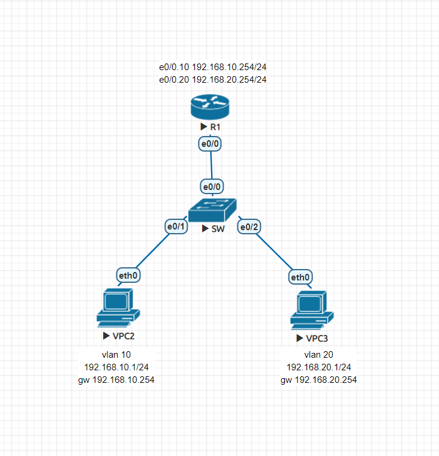
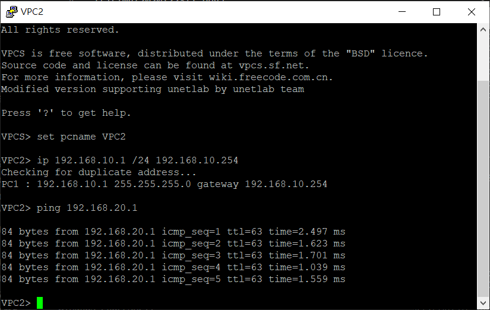
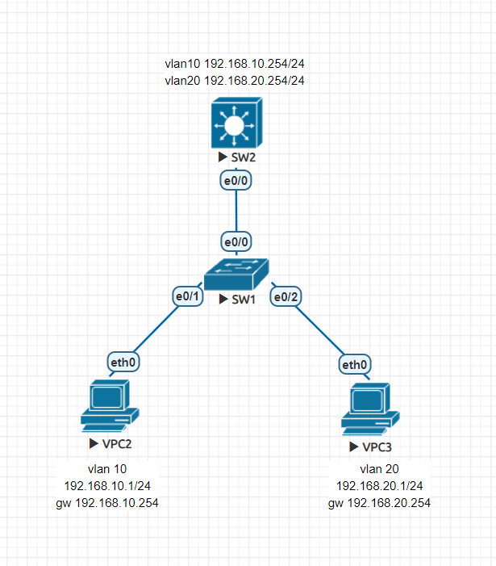
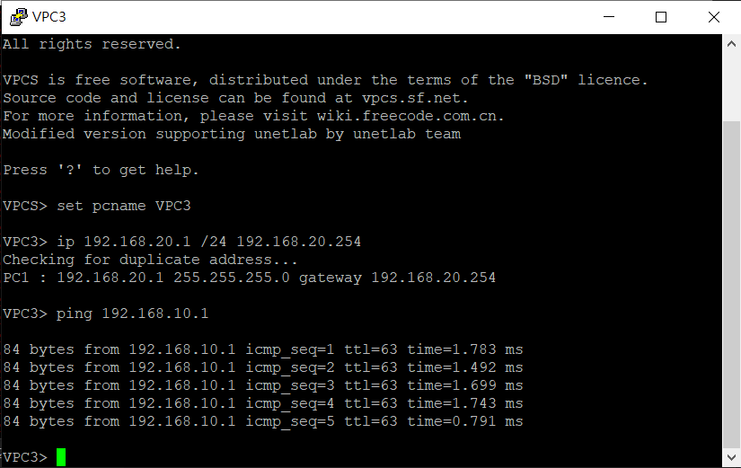
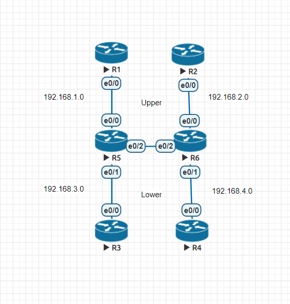
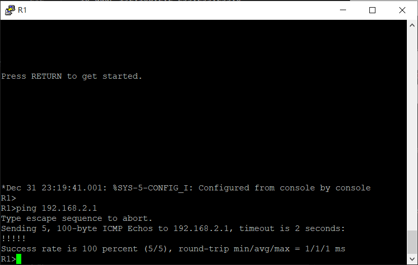

# 單臂路由

## 實驗


- R1

    ```
    en
    conf t
    ho R1
    int e0/0
    no shut
    int e0/0.10
    encapsulation dot1Q 10
    ip addr 192.168.10.254 255.255.255.0
    int e0/0.20
    encapsulation dot1Q 20
    ip addr 192.168.20.254 255.255.255.0
    ```

- SW

    ```
    en
    conf t
    vlan 10
    vlan 20
    int e0/0
    sw trunk en dot1q
    sw mode trunk
    int e0/1
    sw mode access
    sw access vlan 10
    int e0/2
    sw mode access
    sw access vlan 20
    do sh int trunk
    do sh vlan int bri
    ```

- VPC2

    ```
    set pcname VPC2
    ip 192.168.10.1 /24 192.168.10.254
    ```

- VPC3

    ```
    set pcname VPC3
    ip 192.168.20.1 /24 192.168.20.254
    ```

    

## Layer3 Switch實驗



- SW2

    ```
    en
    conf t
    ho SW2
    ip routing
    vlan 10
    vlan 20
    vtp mode server
    vtp domain ccna
    vtp password cisco
    int e0/0
    sw trunk en dot
    sw mode trunk
    int vlan 10
    ip addr 192.168.10.254 255.255.255.0
    no shut
    int vlan 20
    ip addr 192.168.20.254 255.255.255.0
    no shut
    ```

- SW1

    ```
    en
    conf t
    ho SW1
    vtp mode client
    vtp domain ccna
    vtp password cisco
    int e0/0
    sw trunk en dot
    sw mode trunk
    int e0/1
    sw mode access
    sw access vlan 10
    int e0/2
    sw mode access
    sw access vlan 20
    do sh int trunk
    do sh vlan int bri
    ```

- VPC2

    ```
    set pcname VPC2
    ip 192.168.10.1 /24 192.168.10.254
    ```

- VPC3

    ```
    set pcname VPC3
    ip 192.168.20.1 /24 192.168.20.254
    ```

    

# VRF

## 練習



- R1

    ```
    en
    conf t
    ho R1
    int e0/0
    ip addr 192.168.1.1 255.255.255.0
    no shut
    ```

- R2

    ```
    en
    conf t
    ho R2
    int e0/0
    ip addr 192.168.2.1 255.255.255.0
    no shut
    ```

- R3

    ```
    en
    conf t
    ho R3
    int e0/0
    ip addr 192.168.3.1 255.255.255.0
    no shut
    ```

- R4

    ```
    en
    conf t
    ho R4
    int e0/0
    ip addr 192.168.4.1 255.255.255.0
    no shut
    ```

- R5

    ```
    en
    conf t
    ho R5
    ip vrf Upper
    ip vrf Lower
    int e0/0
    ip vrf forwarding Upper
    ip addr 192.168.1.2 255.255.255.0
    no shut
    int e0/1
    ip vrf forwarding Lower
    ip addr 192.168.3.2 255.255.255.0
    no shut
    int e0/2
    no shut
    int e0/2.10
    ip vrf for Upper
    encapsulation dot1Q 10
    ip addr 56.1.1.1 255.255.255.0
    int e0/2.20
    ip vrf for Lower
    encapsulation dot1Q 20
    ip addr 56.3.3.3 255.255.255.0
    do sh ip vrf
    do sh ip route vrf Upper 
    do sh ip route vrf Lower
    ```

- R6

    ```
    en
    conf t
    ho R6
    ip vrf Upper
    ip vrf Lower
    int e0/0
    ip vrf forwarding Upper
    ip addr 192.168.2.2 255.255.255.0
    no shut
    int e0/1
    ip vrf forwarding Lower
    ip addr 192.168.4.2 255.255.255.0
    no shut
    int e0/2
    no shut
    int e0/2.10
    ip vrf for Upper
    encapsulation dot1Q 10
    ip addr 56.1.1.2 255.255.255.0
    int e0/2.20
    ip vrf for Lower
    encapsulation dot1Q 20
    ip addr 56.3.3.4 255.255.255.0
    do sh ip vrf
    do sh ip route vrf Upper 
    do sh ip route vrf Lower
    ```

- R1

    ```
    en
    conf t
    router ospf 1
    net 192.168.1.0 0.0.0.255 area 0
    ```

- R2

    ```
    en
    conf t
    router ospf 1
    net 192.168.2.0 0.0.0.255 area 0
    ```

- R3

    ```
    en
    conf t
    router ospf 1
    net 192.168.3.0 0.0.0.255 area 0
    ```

- R4

    ```
    en
    conf t
    router ospf 1
    net 192.168.4.0 0.0.0.255 area 0
    ```

- R5

    ```
    en
    conf t
    router ospf 1 vrf Upper
    net 192.168.1.0 0.0.0.255 area 0
    net 56.1.1.0 0.0.0.255 area 0
    router ospf 2 vrf Lower
    net 192.168.3.0 0.0.0.255 area 0
    net 56.3.3.0 0.0.0.255 area 0
    ```

- R6

    ```
    en
    conf t
    router ospf 1 vrf Upper
    net 192.168.2.0 0.0.0.255 area 0
    net 56.1.1.0 0.0.0.255 area 0
    router ospf 2 vrf Lower
    net 192.168.4.0 0.0.0.255 area 0
    net 56.3.3.0 0.0.0.255 area 0
    ```

    