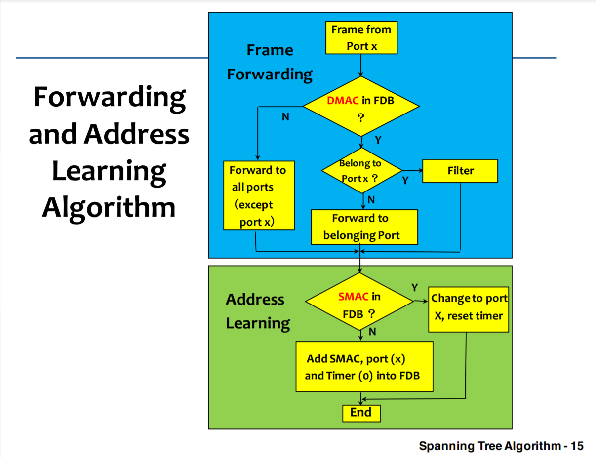
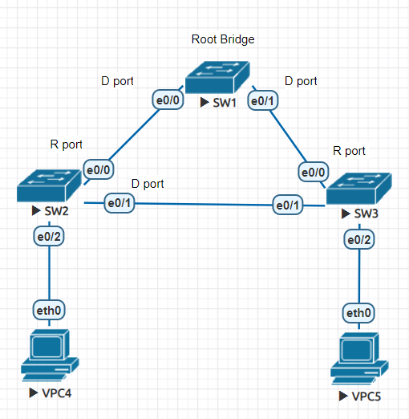
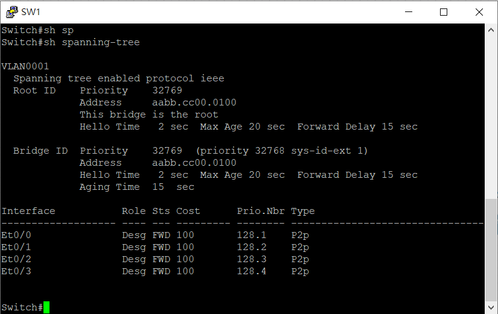
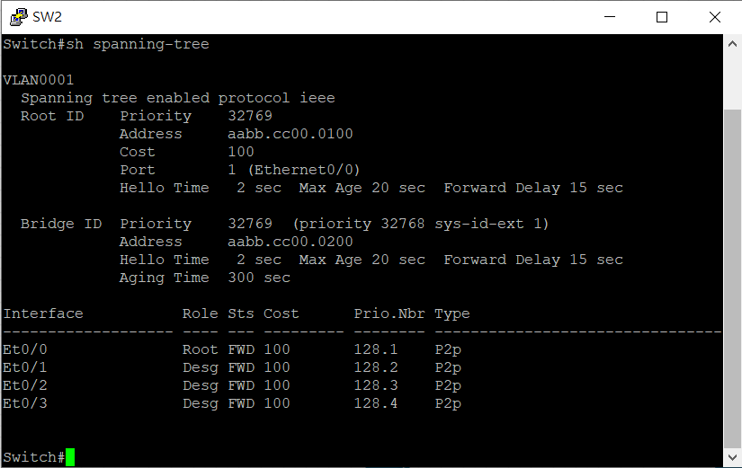
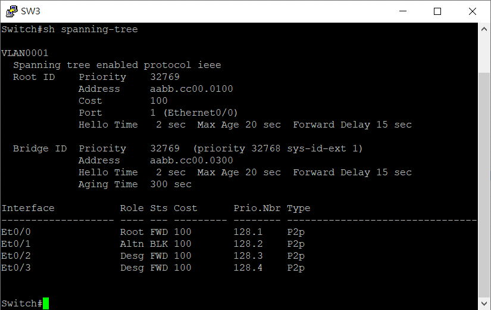
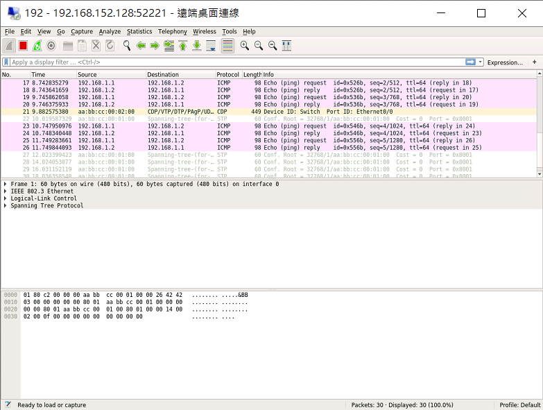
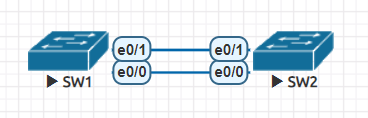
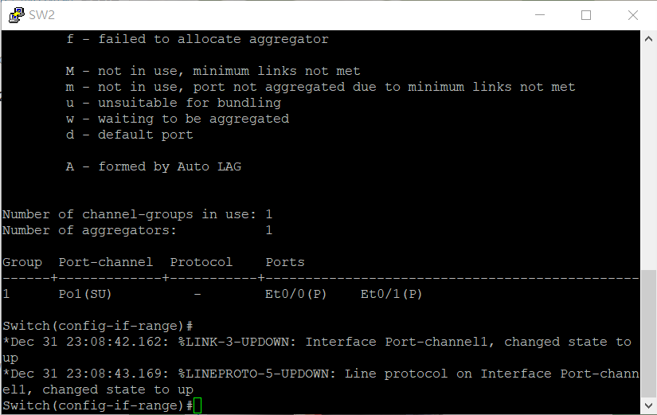
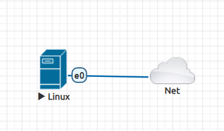
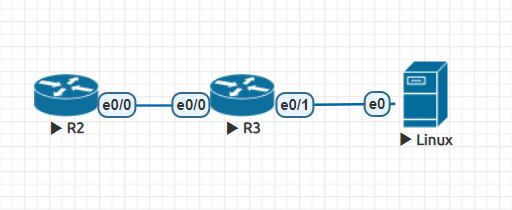

# Spanning Tree

## Forwarding and Address Learning Algorithm



## Spanning Tree Algorithm

1. Find the Root Bridge

    - Priority + MAC Address 最小的就是 Root Bridge

    - Cisco 裡面預設 Priority 是 32768，然後加上 VLAN ID

2. Find the Root Port

    - 所有 Bridge 找到往 Root Bridge 最少 cost 的 Port

3. Find the Designated Port

    - 所有區域網路找往到 Root Bridge 最少 cost 的 Port

    - 剩下的 Port 就是非指定 Port

## 實驗



- SW1

    ```
    en
    show spanning-tree
    ```

    

- SW2

    ```
    en
    show spanning-tree
    ```

    

- SW3

    ```
    en
    show spanning-tree
    ```

    

- VPC4

    ```
    set pc VPC4
    ip 192.168.1.1 /24
    ```

    
- VPC5

    ```
    set pc VPC5
    ip 192.168.1.2 /24
    ```

- SW1

    - Capture e0/0

- VPC4

    ```
    ping 192.168.1.2
    ```

    

# EtherChannel

EtherChannel 有很多別名，什麽 Port Channel、Link Aggregation、Teaming，其實全部都指同一種技術，就是把兩個或以上的 Physical Ethernet Port (包括: Ethernet、Fast Ethernet、Gigabit Ethernet、10 Gigabit Ethernet 等等) 合併成一個 Logical Port 去使用。設定方法有三種：分別是 Static (On Mode)，PAgP (Port Aggregation Protocol) 和 LACP (Link Aggregation Control Protocol)。其中 PAgP 是 Cisco 專有，只有 Cisco 產品上可以使用。

## 實驗



- SW1、SW2

    ```
    en
    conf t
    int range e0/0-1
    channel-group 1 mode on
    do sh etherchannel summary
    ```

    

# Authentication Authorization Accounting (AAA)

## 實驗



- Linux

    - `timedatectl set-timezone Asia/Taipei`

    - `systemctl restart ntp.service`

    - `wget ftp://ftp.shrubbery.net/pub/tac_plus/tacacs-F4.0.4.28.tar.gz`

    - `tar -zxvf tacacs-F4.0.4.28.tar.gz `

    - `apt install bison libwrap0-dev`

    - `cd tacacs-F4.0.4.28`

    - `./configure`

    - `make install`
    
    - `vim /etc/ld.so.conf` 
    
        ```
        include /etc/ld.so.conf.d/*.conf
        /usr/lib
        ```

    - `ldconfig`

    - `tac_pwd` **:** 加密 toor

    - `vim /etc/tac_plus.conf`

        ```
        key = ccie

        accounting file = /var/log/tac.acct

        user = root {
            member = group1
            login = des GFU7e39IHxU/g
        }

        group = group1{
            service = exec {
                priv-lvl  = 15
            }
        }
        ```

    - 關機重開並將網路重設



- Linux

    - `ifconfig eth0 192.168.1.2/24`

    - `tac_plus -C /etc/tac_plus.conf -G`

- R3

    ```
    en
    conf t
    ho R1
    int e0/0
    ip addr 23.1.1.3 255.255.255.0
    no shut
    int e0/1
    ip addr 192.168.1.1 255.255.255.0
    no shut
    exit
    aaa new-model
    tacacs server server
    address ipv4 192.168.1.2
    key ccie
    aaa authentication login loginlist group tacacs+ local
    aaa authorization exec privlist group tacacs+ local
    aaa accounting exec acclist start-stop group tacacs+
    aaa accounting commands 15 comm15list start-stop group tacacs+
    line vty 0 4
    login authentication loginlist
    authorization exec privlist
    accounting exec acclist
    accounting commands 15 comm15list
    transport input telnet
    ```

- R2

    ```
    en
    conf t
    ho R2
    int e0/0
    ip addr 23.1.1.2 255.255.255.0
    no shut
    do telnet 23.1.1.3  輸入username:root、password:toor
    ```

- Linux

    - `cat /var/log/tac.acct`

        

---

**參考資料:**

- [EtherChannel (PAgP and LACP) 以太通道](https://www.jannet.hk/zh-Hant/post/etherchannel-pagp-lacp/)

- [Authentication Authorization Accounting (AAA) 認證授權與計費](https://www.jannet.hk/zh-Hant/post/authentication-authorization-accounting-aaa/)

- [ubuntu tacacs+ 服務器安裝啓動 - 台部落](https://www.twblogs.net/a/5c220b1bbd9eee16b4a769ce)