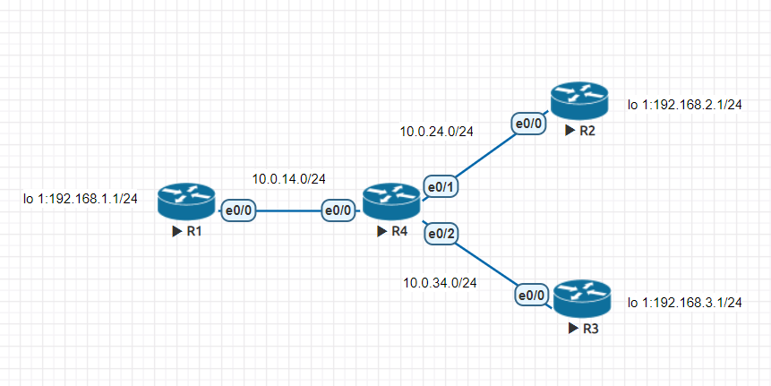
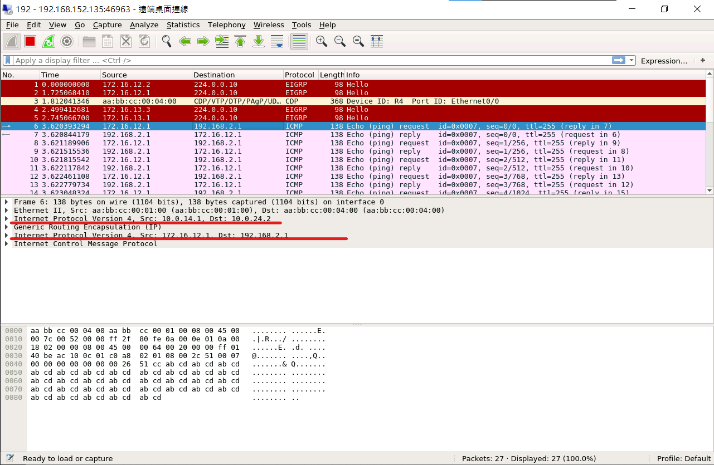
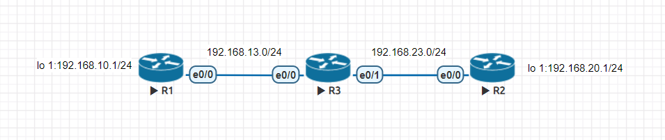
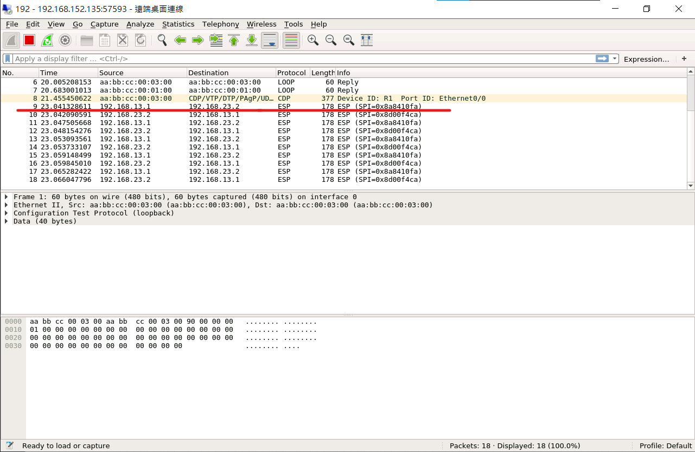

# VPN

## Generic Routing Encapsulation實驗

GRE 是一種 ip in ip 的技術，傳輸過程中沒有加密。



- R1

    ```
    en
    conf t
    ho R1
    int lo 1
    ip addr 192.168.1.1 255.255.255.0
    int e0/0
    ip addr 10.0.14.1 255.255.255.0
    no shut
    ```

- R2

    ```
    en
    conf t
    ho R2
    int lo 1
    ip addr 192.168.2.1 255.255.255.0
    int e0/0
    ip addr 10.0.24.2 255.255.255.0
    no shut
    ```

- R3

    ```
    en
    conf t
    ho R3
    int lo 1
    ip addr 192.168.3.1 255.255.255.0
    int e0/0
    ip addr 10.0.34.3 255.255.255.0
    no shut
    ```

- R4

    ```
    en
    conf t
    ho R4
    int e0/0
    ip addr 10.0.14.4 255.255.255.0
    no shut
    int e0/1
    ip addr 10.0.24.4 255.255.255.0
    no shut
    int e0/2
    ip addr 10.0.34.4 255.255.255.0
    no shut
    ```

- R1

    ```
    en
    conf t
    router rip
    version 2
    no auto
    network 10.0.14.0
    router eigrp 1
    net 172.16.12.0 0.0.0.255
    net 172.16.13.0 0.0.0.255
    net 192.168.1.0
    no auto
    int tunnel 12
    ip addr 172.16.12.1 255.255.255.0
    tunnel source e0/0
    tunnel destination 10.0.24.2 
    int tunnel 13
    ip addr 172.16.13.1 255.255.255.0
    tunnel source e0/0
    tunnel destination 10.0.34.3 
    ```

- R2

    ```
    en
    conf t
    router rip
    version 2
    no auto
    network 10.0.24.0
    router eigrp 1
    net 172.16.12.0 0.0.0.255
    net 192.168.2.0
    no auto
    int tunnel 12
    ip addr 172.16.12.2 255.255.255.0
    tunnel source e0/0
    tunnel destination 10.0.14.1 
    ```
    
- R3

    ```
    en
    conf t
    router rip
    version 2
    no auto
    network 10.0.34.0
    router eigrp 1
    net 172.16.13.0 0.0.0.255
    net 192.168.3.0
    no auto
    int tunnel 13
    ip addr 172.16.13.3 255.255.255.0
    tunnel source e0/0
    tunnel destination 10.0.14.1 
    ```

- R4

    ```
    en
    conf t
    router rip
    version 2
    no auto
    network 10.0.14.0
    network 10.0.24.0
    network 10.0.34.0
    ```

    - 在 e0/0 擷取封包

- R1

    ```
    ping 192.168.2.1 so 172.16.12.1
    ```

    

## IPsec實作

Phase1 是傳輸秘密金鑰，Phase2 才是傳輸使用者資料



- R1

    ```
    en
    conf t
    ho R1
    int e0/0
    ip addr 192.168.13.1 255.255.255.0
    no shut
    int lo 1
    ip addr 192.168.10.1 255.255.255.0
    exit
    ip route 0.0.0.0 0.0.0.0 192.168.13.3
    ```

- R2

    ```
    en
    conf t
    ho R2
    int e0/0
    ip addr 192.168.23.2 255.255.255.0
    no shut
    int lo 1
    ip addr 192.168.20.1 255.255.255.0
    exit
    ip route 0.0.0.0 0.0.0.0 192.168.23.3
    ```

- R3

    ```
    en
    conf t
    ho R3
    int e0/0
    ip addr 192.168.13.3 255.255.255.0
    no shut
    int e0/1
    ip addr 192.168.23.3 255.255.255.0
    no shut
    ```

- R1

    ```
    en
    conf t
    ip access-list extended vt
    permit ip 192.168.10.0 0.0.0.255 192.168.20.0 0.0.0.255
    exit
    crypto isakmp policy 1
    encryption aes
    hash md5  
    authentication pre-share
    group 2
    lifetime 30000
    exit
    crypto ipsec transform-set TS esp-3des ah-sha-hmac
    exit
    crypto isakmp key 6 ccie address 192.168.23.2
    crypto map CMAP 1 ipsec-isakmp
    set peer 192.168.23.2
    set transform-set TS
    match address vt
    exit
    int e0/0
    crypto map CMAP
    ```

- R2

    ```
    en
    conf t
    ip access-list extended vt
    permit ip 192.168.20.0 0.0.0.255 192.168.10.0 0.0.0.255
    exit
    crypto isakmp policy 1
    encryption aes
    hash md5  
    authentication pre-share
    group 2
    lifetime 30000
    exit
    crypto ipsec transform-set TS esp-3des ah-sha-hmac
    exit
    crypto isakmp key 6 ccie address 192.168.13.1
    crypto map CMAP 1 ipsec-isakmp
    set peer 192.168.13.1
    set transform-set TS
    match address vt
    exit
    int e0/0
    crypto map CMAP
    ```

- R3

    - 在 e0/0 抓封包

- R1

    ```
    en
    ping 192.168.20.1 source 192.168.10.1
    ```

    
    
---
**參考資料:**

- [Generic Routing Encapsulation (GRE) 通用路由封裝](https://www.jannet.hk/zh-Hant/post/generic-routing-encapsulation-gre/)
- [Internet Protocol Security (IPsec) 網際網路安全協定](https://www.jannet.hk/zh-Hant/post/internet-protocol-security-ipsec/)