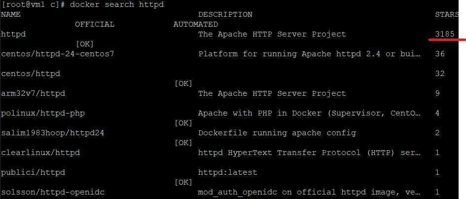
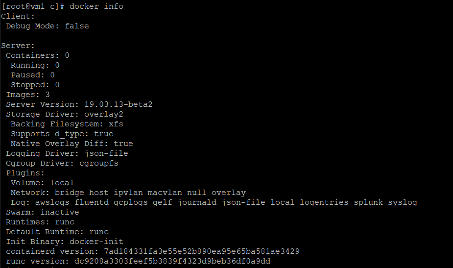
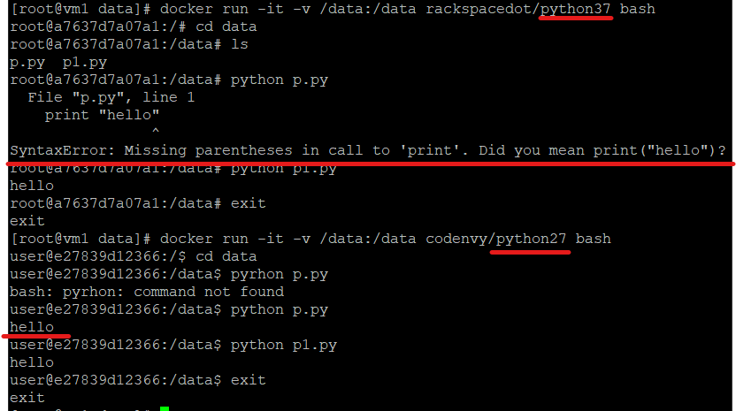

# Docker 介紹
## Docker指令
- `/var/lib/docker` : 可以當作是docker的家目錄

- `docker search httpd` : 選擇星星數高的比較好

    

- `docker info` : docker相關資訊

    

- `docker login` : 後面如果有IP，就是私有倉儲

- `-h` : 看docker指令的用法

- `docker images` : 查看鏡像

- `docker rmi` 

    - 後面可以接鏡像名字或ID 

    - 要確保沒有任何相關容器正在運行

- `docker pull busybox`

    - `docker run -it busybox:latest sh` 

    - `Ctrl + p + q` : 暫時離開容器(還是處於running)，跳回本地端

    - `docker attach` : 重新連回容器

    - 大部分鏡像檔沒有基礎功能

- `docker rm -f $(docker ps -a -q)` 刪除所有容器

    ```sh
    #指令中先執行的指令有以下兩種方法
    $(command) 
    `command` 
    ```

- `docker run -it busybox:latest echo "hello world"` : 一次性指令，若容器沒有持續性的指令，執行完即會關閉

### 使用容器環境 

**開發環境很複雜時，會讓系統很混亂，利用docker執行，就可以在想要的時候採用特別的編譯環境**

### C

- `docker pull gcc` 

    ```
    mkdir -p /data
    cd /data
    vim hello.c
        檔案寫入:
        #include <stdlib.h>
        #include <stdio.h>

        int main(){
            printf("hello world\n");
            return 0;
        }
    ```

    - `docker run -it -v /data:/data gcc:latest bash` 

        - `-v` : 映射資料，可以映射資料夾也可以映射檔案，也能將資料持久化，製造出來的檔案會被存放至映射資料夾，若想映射多個就使用多個-v
        
        - `gcc -o /data/hello /data/hello.c` : 編譯hello.c並把編譯後檔名命名為hello

        - `./hello` : 執行hello
        
### Python

- `docker pull codenvy/python27`

- `docker pull rackspacedot/python37`

    ```
    mkdir -p /data
    cd /data
    vim p.py
        檔案寫入:
        print "hello"
    vim p1.py 
        檔案寫入:
        print ("hello")
    ```

    
### Httpd
- `docker pull httpd`

     ```
    mkdir -p /myweb
    cd /myweb
    echo "hello world" > index.html
    ```

    - `docker run -itd --name myweb1 --rm -p 8080:80 httpd`

        - `-d` : 背景執行

        - `--rm` : 執行結束自動刪除

        - `docker cp index.html myweb1:/usr/local/apache2/htdocs`

        - `docker commit myweb1 ping/myweb:v1` : 將目前容器環境存成另一個鏡像
        
    - `docker run -itd --name myweb1 -v /myweb:/usr/local/apache2/htdocs --rm -p 8081:80 httpd`

- `docker exec -it myweb2 bash` : 進入正在執行的容器
