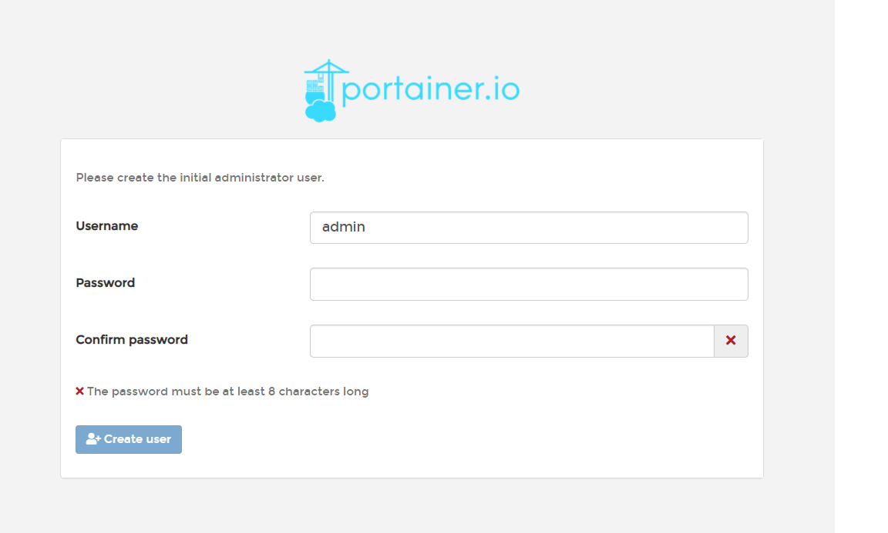
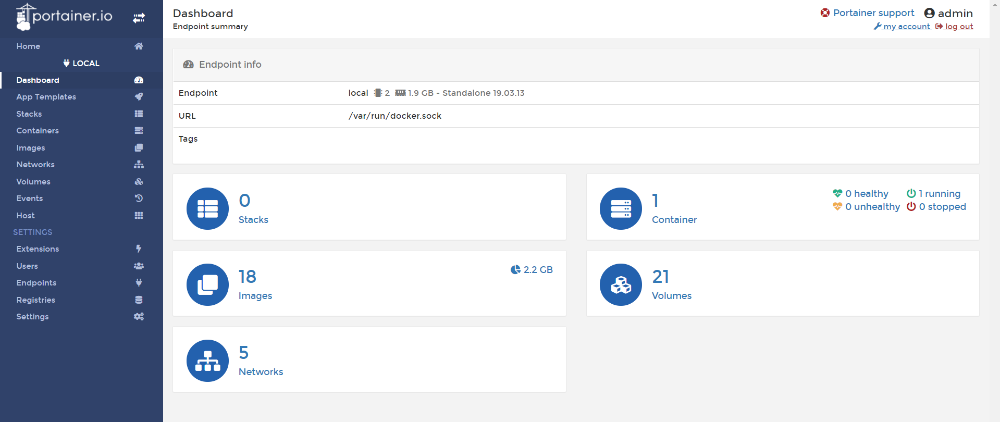

# Docker網路

## 不同容器互連

- `docker run -it --name c1 busybox sh`

- `docker run -it --name c2 --link c1:c1 busybox sh`

    - `--link name:alias` **:** 其中name是要連接的容器名稱，alias是這個連接的別名。將會寫進/etc/hosts。

- `docker network create -d bridge mynet` **:** 自行創造的網路，使用時會自動將名稱寫入/etc/hosts

# Docker volume

## Docker網頁

- `docker run -itd --name myweb -p 8080:80 -v /usr/local/apache2/htdocs httpd` **:** 自動產生的volume

- `docker inspect myweb`

- `docker volume ls`

- `docker volume create --name webdata`

- `docker run -itd --name myweb -p 8081:80 -v webdata:/usr/local/apache2/htdocs httpd` **:** 有名稱的volume

# Portainer

- `docker run -d -p 9000:9000 --restart=always --name portainer -v /var/run/docker.sock:/var/run/docker.sock -v /Users/lee/dev/docker_file/portainer/data:/data docker.io/portainer/portainer`
- 瀏覽器輸入 `http://192.168.56.109:9000/#/init/admin`

    

    

# Dockerfile

- **FROM : 基底映像檔**

    - **使用方式**

        1. `FROM <image>`

        2. `FROM <image>:<tag>`

        3. `FROM <image>@<digest>`

    - **額外補充**

        - 盡量寫版本號，不要使用latest，否則每次執行都會查看遠端版本，降低效能

- **MAINTAINER : 維護者**

    - **使用方式**

        1. `MAINTAINER <name>`
        

- **LABEL : 設定映像檔的Metadata資訊**

    - **使用方式**

        1. `LABEL <key>=<value> <key>=<value> ...`

    - **額外補充**

        - 設置的資訊可以使用 `docker inspect` 查看

- **RUN : 執行命令**

    - **使用方式**

        1. `RUN command param1 param2 ...` **:** 以Shell程式執行

        2. `RUN ["exectable","param1","param2, ...]` **:** 以exec方式執行

    - **額外補充**

        - 第一種方式可以使用 `/` 換行拆解命令，使命令更具有可讀性

        - 每一個RUN就會新增一層資料層，為了減少不必要的資料層，可以利用 `&&` 來串連多個命令

- **CMD : 容器預設執行命令**

    - **使用方式**

        1. `CMD ["executable","param1","param2",...]`

        2. `CMD ["param1","param2",...]` **:** 將參數傳給ENTRYPOINT

        3. `CMD commad param1 param2 ...`

    - **額外補充**

        - 盡量不要同時使用CMD與ENTRYPOINT，以減少出錯

        - CMD會覆蓋之前的指令，若有多行CMD指令，則只會執行最後一行

        - 若建立容器時有帶執行的指令，則會覆蓋CMD指令

- **ENTRYPOINT : 容器預設執行命令**

    - **使用方式**

        1. `ENTRYPOINT ["executable","param1","param2",...]`

        2. `ENTRYPOINT commad param1 param2 ...` 

    - **額外補充**

        - ENTRYPOINT不會被覆蓋，一定會執行

        - 使用ENTRYPOINT，CMD指令就不要使用以Shell程式執行的形式

- **COPY : 複製本地端的檔案/目錄到映像檔的指定位置**

    - **使用方式**

        1. `COPY [–chown=<user>:<group>] <src>... <dest>`

        2. `COPY [–chown=<user>:<group>] [“<src>”,... “<dest>”]` 

    - **額外補充**

        - 如果目的位置是目錄的話，記得最後要以 `/` 結尾

- **ADD : 將本地端的檔案/目錄加到映像檔的指定位置**

    - **使用方式**

        1. `ADD [–chown=<user>:<group>] <src>... <dest>`

        2. `ADD [–chown=<user>:<group>] [“<src>”,... “<dest>”]`

    - **額外補充**

        - ADD的來源路徑支援URL，也就是說可以加入遠端的檔案，COPY則不支援URL

        - 使用ADD加入檔案若為壓縮檔，會自動解壓縮，而COPY不會

- **EXPOSE : 宣告在映像檔中預設要使用(對外)的連接埠**

    - **使用方式**

        1. `EXPOSE <port> [<port>/<protocol> ...]`

    - **額外補充** 

        - 使用EXPOSE所定義的連接埠並不會自動的啟用，需要再 `docker run` 時搭配 `-P` 才會啟用定義的連接埠

- **ENV : 設定環境變數**

    - **使用方式**

        1. `ENV <key> <value>`
        
        2. `ENV <key>=<value>`

---
**參考資料:**

- [容器互連](https://philipzheng.gitbook.io/docker_practice/network/linking)
- [圖形化介面](https://www.kubernetes.org.cn/5883.html)
- [dockerfile教學](https://www.jinnsblog.com/2018/12/docker-dockerfile-guide.html)