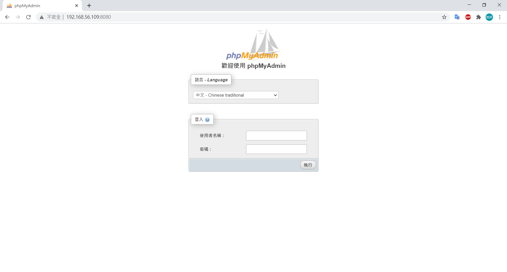
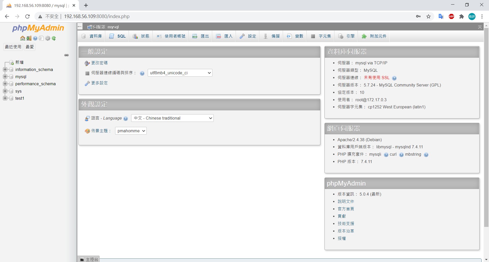
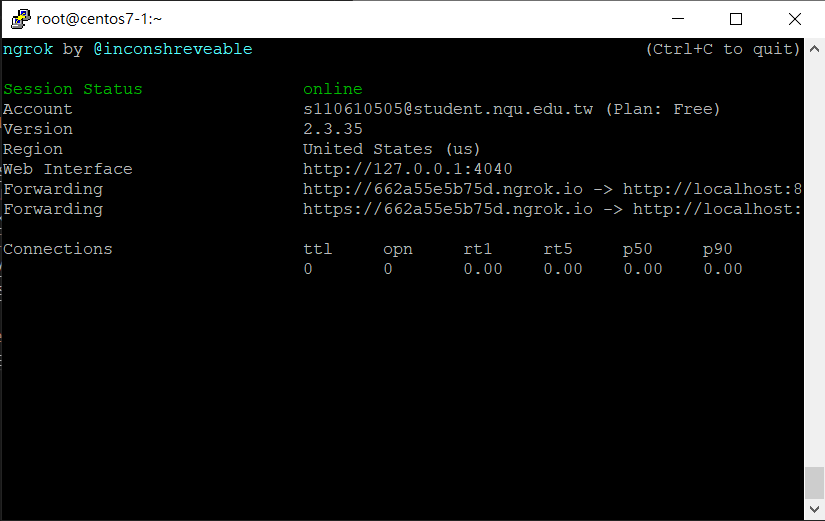

# 兩個容器合作phpMyAdmin + MySQL

- `docker run -itd --name mysql -p 3306:3306 -e MYSQL_ROOT_PASSWORD=root mysql:5.7.24` **:** 使用 `-e` 設置mysql的root密碼

- `docker run --name phpmyadmin -d --link mysql -e PMA_HOST="mysql" -p 8080:80 phpmyadmin/phpmyadmin` **:** 使用 `--link` 連接mysql

- 在瀏覽器中輸入 `192.168.56.109:8080` ，即會出現登入畫面

    

- 輸入mysql帳密就可看到資料庫

    

# 利用ngrok將本地網站讓外面可以連結

## ngrok安裝

- 到 [官網](https://ngrok.com/) 註冊帳號

- 複製Linux版本的網址

- `wget https://bin.equinox.io/c/4VmDzA7iaHb/ngrok-stable-linux-amd64.zip`

- `unzip ngrok-stable-linux-amd64.zip`

- `./ngrok authtoken 網頁上的Token`

## 公開網站實作

- `docker run -d -p 8080:80 httpd`

- `./ngrok http 8080`

    

- 至瀏覽器輸入網址即可連結本地網站

# Docker打包機器學習

## 安裝pip

- `yum install epel-release -y`

- `yum install python-pip -y`

- `pip install --upgrade pip`

## 機器學習

- `mkdir iris`

- `vim train_model.py`

    ```py
    import pickle
    from sklearn import datasets
    from sklearn.model_selection import train_test_split
    from sklearn import tree

    # simple demo for traing and saving model
    iris=datasets.load_iris()
    x=iris.data
    y=iris.target

    #labels for iris dataset
    labels ={
    0: "setosa",
    1: "versicolor",
    2: "virginica"
    }

    x_train, x_test, y_train, y_test = train_test_split(x, y, test_size=.25)
    classifier=tree.DecisionTreeClassifier()
    classifier.fit(x_train,y_train)
    predictions=classifier.predict(x_test)

    #export the model
    model_name = 'model.pkl'
    print("finished training and dump the model as {0}".format(model_name))
    pickle.dump(classifier, open(model_name,'wb'))
    ```

- `vim server.py`

    ```py
    # coding: utf-8
    import pickle

    from flask import Flask, request, jsonify

    app = Flask(__name__)

    # Load the model
    model = pickle.load(open('model.pkl', 'rb'))
    labels = {
    0: "versicolor",   
    1: "setosa",
    2: "virginica"
    }

    @app.route('/api', methods=['POST'])
    def predict():
        # Get the data from the POST request.
        data = request.get_json(force = True)
        predict = model.predict(data['feature'])
        return jsonify(predict[0].tolist())

    if __name__ == '__main__':
        app.run(debug = True, host = '0.0.0.0')
    ```

- `vim client.py`

    ```py
    # coding: utf-8
    import requests
    # Change the value of experience that you want to test
    url = 'http://127.0.0.1:5000/api'
    feature = [[5.8, 4.0, 1.2, 0.2]]
    labels ={
    0: "setosa",
    1: "versicolor",
    2: "virginica"
    }

    r = requests.post(url,json={'feature': feature})
    print(labels[r.json()])
    ```

- `python train_model.py && python server.py`

- `python client.py` 即會出現分類結果

## 打包成Docker

- `vim Dockerfile`
    
    ```
    FROM nitincypher/docker-ubuntu-python-pip

    COPY ./requirements.txt /app/requirements.txt

    WORKDIR /app

    RUN pip install -r requirements.txt

    COPY server.py /app

    COPY train_model.py /app

    CMD python /app/train_model.py && python /app/server.py
    ```

- `vim requirements.txt`

    ```
    sklearn
    flask
    ```

- `docker build -t iris:1.0 .`

- `docker run -itd -p 5000:5000 iris:1.0`

- `python client.py` 若成功出現辨識結果，即建置完成
---
**參考資料:**

- [利用 Docker 架起 phpMyAdmin + MySQL (MAC)](https://ithelp.ithome.com.tw/articles/10200754)
- [簡單的 MySQL 使用教學](https://jerrynest.io/mysql-tutorial/)
- [利用 Dockfile、Docker Compose 建立 LAMP 環境 (PHP、Apache、MySQL)](https://hackmd.io/@titangene/docker-lamp)
- [[開發工具小技巧][05]ngrok讓外部能夠連到localhost的網站及服務](https://blog.alantsai.net/posts/2018/04/devtooltips-5-ngrok-allow-public-to-access-localhost-website-and-sql-server)
- [通过 Flask, Docker, Jenkins 和 Kubernets 部署机器学习模型](http://wulc.me/2019/04/19/%E9%80%9A%E8%BF%87%20Flask,%20Docker,%20Jenkins%20%E5%92%8C%20Kubernets%20%E9%83%A8%E7%BD%B2%E6%9C%BA%E5%99%A8%E5%AD%A6%E4%B9%A0%E6%A8%A1%E5%9E%8B/)
