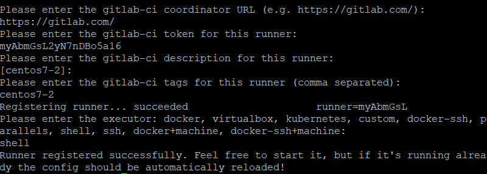

# CI(Continuous integration)/CD(Continuous Deployment)

## 第一台安裝範例並打包成Image測試

- `git clone https://github.com/yangshun2005/gitlab-cicd.git`

- `cd testgolang`

- `docker build -t testgo:1.0 .`

- `docker run -d -p 8001:8001 testgo:1.0`

- `curl 192.168.56.109:8001/hello`

## 將第二台的gitlab-runner註冊到專案

- `gitlab-runner start`

- `gitlab-runner register`

    

## 將第一台的檔案Push至專案

- `vim .gitlab-ci.yml`

    ```yml
    stages:
    - deploy

    docker-deploy:
        stage: deploy
        script:
            - docker build -t testgolang .
            - if [ $(docker ps -aq --filter name= testgolang) ]; then docker rm -f testgolang;fi
            - docker run -d -p 8001:8001 --name testgolang testgolang
        tags:
        # 只有tag是centos7-2才會更新
            - centos7-2
        only:
        # master分支更改才動作
            - master
    ```

- `git init`

- `git remote add origin git@gitlab.com:name/projectname.git`

- `git add -A`

- `git commit -m "massage"`

- `git push -u origin master` **:** origin代表專案，master代表分支名稱，若沒有此名稱的分支即會建立一個分支

# Docker-compose實作

- `mkdir test-dockercompose`

- `vim app.py`

    ```py
    import time
    import redis
    from flask import Flask

    app = Flask(__name__)
    cache = redis.Redis(host='redis', port=6379)

    def get_hit_count():
        retries = 5
        while True:
            try:
                return cache.incr('hits')
            except redis.exceptions.ConnectionError as exc:
                if retries == 0:
                    raise exc
                retries -= 1
                time.sleep(0.5)

    @app.route('/')
    def get_index():
        count = get_hit_count()
        return 'Yo! 你是第 {} 次瀏覽\n'.format(count)

    if __name__ == "__main__":
        app.run(host="0.0.0.0", debug=True)
    ```

- `vim requirements.txt`

    ```txt
    flask
    redis
    ```

- `vim Dockerfile`

    ```
    FROM python:3.4-alpine
    ADD . /code
    WORKDIR /code
    RUN pip install -r requirements.txt
    CMD ["python", "app.py"]
    ```

- `vim docker-compose.yml`

    ```
    version: '3'
    services:
        web:
            build: .
            ports:
                - "5000:5000"
            volumes:
                - .:/code
        redis:
            image: "redis:alpine"
    ```

- `docker-compose up -d`

- `curl 127.0.0.1:5000`
---
**參考資料:**

- [gitlab-cicd](https://github.com/yangshun2005/gitlab-cicd)
- [docker-compose](https://blog.techbridge.cc/2018/09/07/docker-compose-tutorial-intro/)