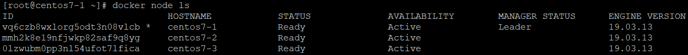
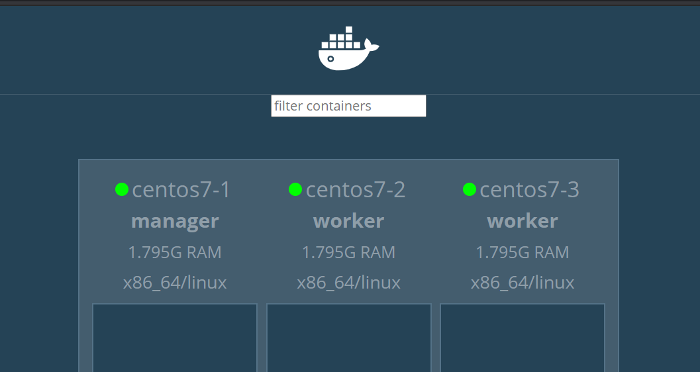
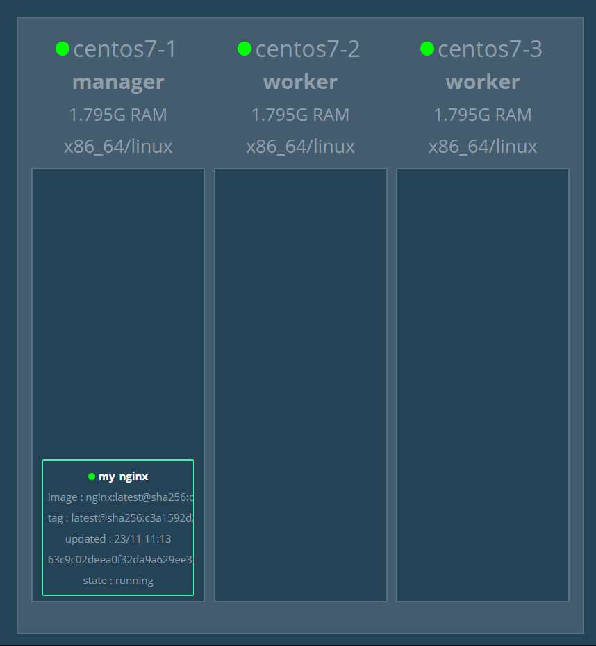
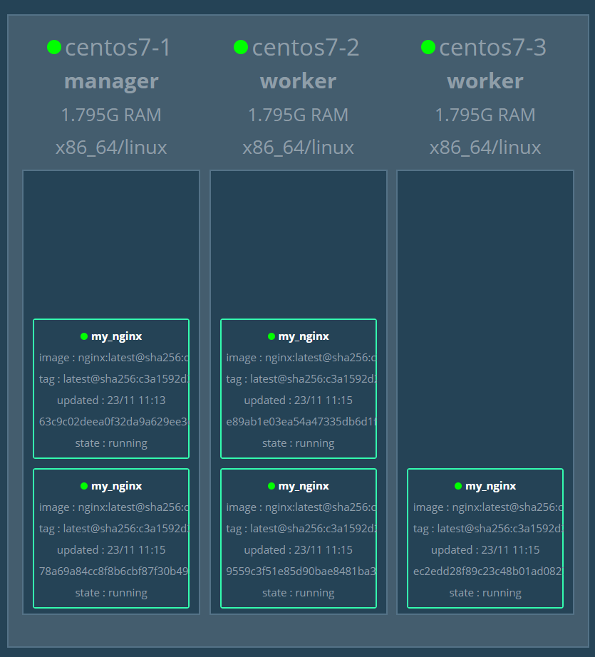
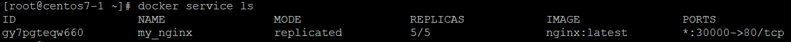
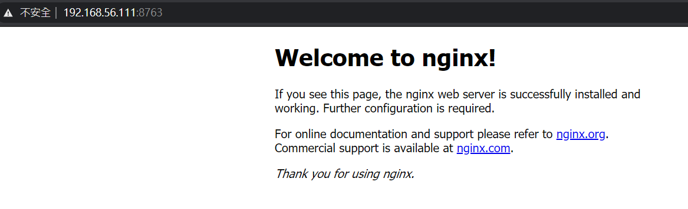
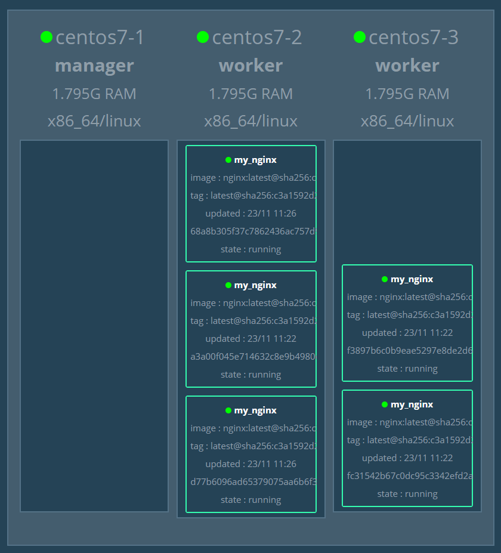

# docker swarm

## 節點進出

- centos7-1
    
    - `docker swarm init --advertise-addr 192.168.56.109` **:** 會得到含有權杖的加入指令

- centos7-2、centos7-3

    - 輸入剛剛得到的加入指令

- centos7-1

    - `docker node ls` **:** 可以看到目前的節點

        

    - `docker node rm` **:** 移除節點

- centos7-2、centos7-3

    - `docker swarm leave` **:** 離開 swarm

## 圖形化介面

- centos7-1

    - `docker pull dockersamples/visualizer`

    - `docker run -itd -p 8888:8080 -e HOST=192.168.56.109  -e PORT=8080 -v /var/run/docker.sock:/var/run/docker.sock --name visualizer dockersamples/visualizer`

- 瀏覽器輸入 `192.168.56.109:8888` 即可看到圖形化介面 

    

## 服務

- centos7-1

    - `docker service create --name=my_nginx nginx`

        

    - `docker service update --publish-add 8763:80 my_nginx` **:** 新增指定對外 port

    - `docker service scale my_nginx=5` **:** 將 my_nginx 複製成五個

        

    - `docker service ls` **:** 查看服務

        

    - `docker service rm` **:** 刪除服務

- 瀏覽器輸入 `192.168.56.111:8763` 即可看見 nginx 畫面

    

## 維護

雖然維護之後介面顯示該節點底下沒有容器存在，但是連到那個節點時，還是會出現畫面，這是因為 docker swarm 內建的 Loan Balance + Routing Mesh 幫我們完成了，Routing Mesh 會將你的 request 導到正在運行的容器上，如下圖

- centos7-1

    - `docker node update --availability drain centos7-1` **:** 將 centos7-1 設定成維護狀態，其他節點會幫忙 cover
    
        

---
**參考資料:**

- [docker-swarm-tutorial](https://github.com/twtrubiks/docker-swarm-tutorial)
- [同學筆記](https://github.com/TKTim/Docker-/blob/master/files/20201117.md)