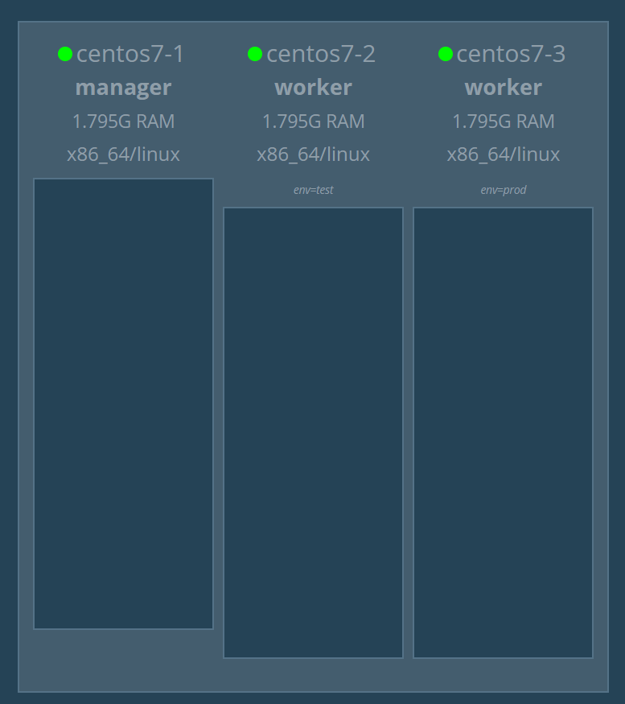
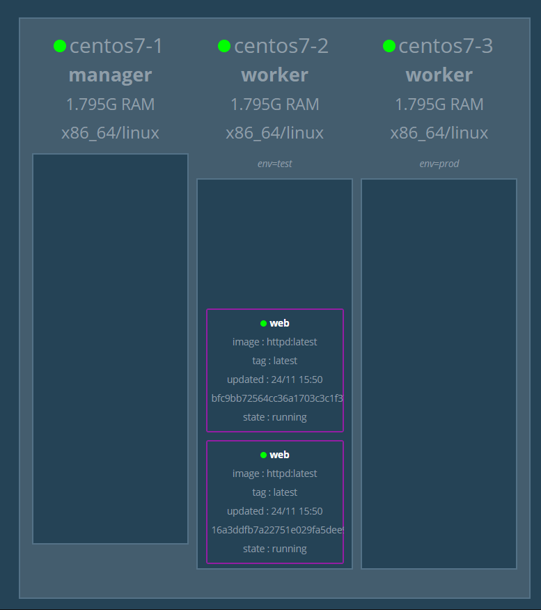
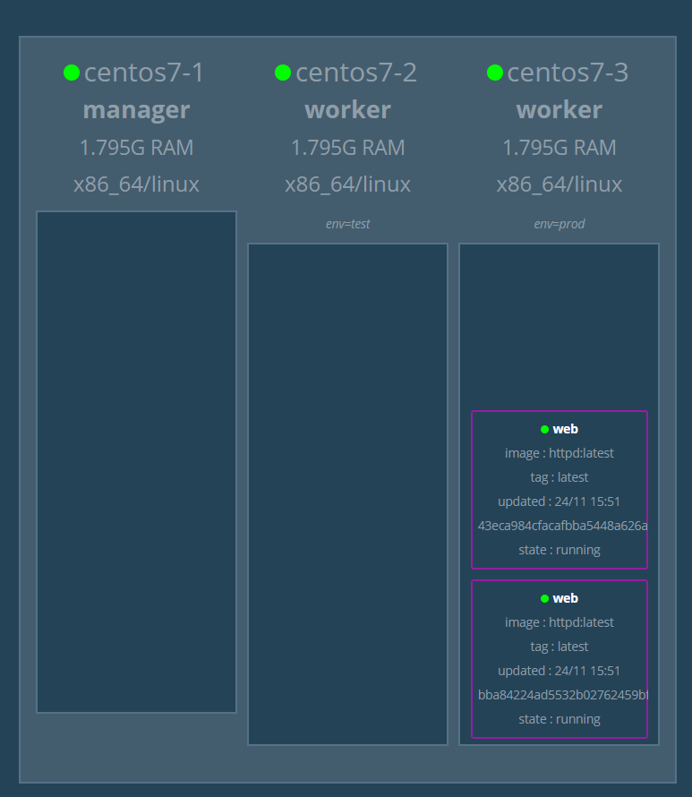

# docker swarm

## Global Mode

在每個node都會部屬容器，而預設的replica mode則是由manager分配哪幾個node啟動容器

- centos7-1

    - `docker service create --mode global --name myweb -p 8080:80 httpd`

## Rolling update

將服務在節點中一個一個進行更新，而不是將服務下線再更新

- centos7-1

    - `docker service create --name web --replicas 3 -p 8000:80 httpd:2.4.43`

    - `docker service update --image httpd:2.4.46 --update-patallelism 2 --update-delay 10s web`

        - `--update-patallelism` **:** 一次更新的數量 (加快效率)

        - `--update-delay` **:** 與下次更新的延遲 (確保穩定性)

    - `docker service update --rollback web` **:** 回到更新之前的版本

## 新增節點label

打上標籤後可以把節點分成各種不同的環境，以下就是做出測試環境與生成環境

- centos7-1

    - `docker node update --label-add env=test centos7-2`

    - `docker node update --label-add env=prod centos7-3`

- 瀏覽器畫面

    

- centos7-1

    - `docker service create --constraint node.labels.env==test --replicas 2 --name web -p 8000:80 httpd`

        - `--constraint` **:** 條件

        

    - `docker service update --constraint-rm node.labels.env==test web` **:** 移除條件

    - `docker service update --constraint-add node.labels.env==prod web` **:** 新增條件

        

    - `docker node update --label-rm env centos7-2` **:** 移除標籤
---
**參考資料:**

- [docker-swarm-tutorial](https://github.com/twtrubiks/docker-swarm-tutorial)