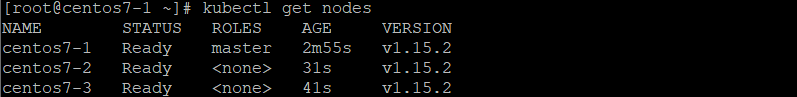

# Kubernetes

主機 | IP Address
-|-
master|192.168.56.109
node01|192.168.56.110
node02|192.168.56.111

## 觀念

- deployment (控制器) 管理 pods

    - 管理副本數

    - 滾動更新

## 安裝

- master、node01、node02

    - `yum install wget net-tools -y`

    - `vim /etc/hosts`

        ```
        127.0.0.1   localhost localhost.localdomain localhost4 localhost4.localdomain4
        ::1         localhost localhost.localdomain localhost6 localhost6.localdomain6

        192.168.56.109 master
        192.168.56.110 node01
        192.168.56.111 node02
        ```

    - `vim /etc/fstab` **:** kubernetes 基於性能理由建議關閉 swap

        ```
        .
        .
        .
        #/dev/mapper/centos-swap swap                    swap    defaults        0 0
        ```

    - `reboot`

    - `echo 1 > /proc/sys/net/ipv4/ip_forward`

    - `vim /etc/sysctl.conf`

        ```
        .
        .
        .
        net.ipv4.ip_forward = 1
        net.bridge.bridge-nf-call-iptables = 1
        ```
    
    - `modprobe br_netfilter`

    - `echo "br_netfilter" > /etc/modules-load.d/br_netfilter.conf`

    - `sysctl -p`

    - `yum install -y yum-utils device-mapper-persistent-data lvm2`

    - `vim /etc/yum.repos.d/kubernetes.repo`

        ```
        [kubernetes]
        name=Kubernetes
        baseurl=https://packages.cloud.google.com/yum/repos/kubernetes-el7-x86_64
        enabled=1
        gpgcheck=1
        repo_gpgcheck=1
        gpgkey=https://packages.cloud.google.com/yum/doc/yum-key.gpg https://packages.cloud.google.com/yum/doc/rpm-package-key.gpg
        ```

    - `yum clean all && yum repolist`

    - `yum install kubelet-1.15.2 kubectl-1.15.2 kubeadm-1.15.2 --nogpgcheck --disableexcludes=kubernetes -y`

    - `systemctl enable kubelet.service`

## 加入節點

- master

    - `kubeadm init --apiserver-advertise-address=192.168.56.110 --pod-network-cidr=10.244.0.0/16 --service-cidr=10.96.0.0/12 --kubernetes-version=v1.15.2 --cri-socket="/var/run/dockershim.sock"` **:** 會得到加入叢集的指令

    - `mkdir -p $HOME/.kube`

    - `sudo cp -i /etc/kubernetes/admin.conf $HOME/.kube/config`

    - `sudo chown $(id -u):$(id -g) $HOME/.kube/config`

    - `kubectl apply -f https://raw.githubusercontent.com/coreos/flannel/master/Documentation/kube-flannel.yml`

- node01、node02
    
    - 貼上加入叢集的指令

## 佈署測試

分為命令式、配置式。命令式簡單但若有錯誤即須全部重打；配置式較為複雜，但較好除錯。

- master

    - `kubectl get nodes` **:** 查詢叢集狀況

        
        
    - `kubectl create deployment httpd-app --image=httpd`

    - `kubectl expose deployment httpd-app --type=NodePort --name=httpd-service --port=80`

    - `kubectl get svc` **:** 查看 service

    - `kubectl describe node centos7-1` **:** 查看詳細節點資料

    - `kubectl scale deployment httpd-app --replicas 2` **:** 擴增成兩個

    - `kubectl get svc httpd-service -o yaml > web1.yaml` **:** 匯出 yaml 檔案

    - `kubectl apply -f web1.yaml` **:** 使用 yaml 檔案

---
**參考資料:**

- [k8s安裝教學](https://blog.tomy168.com/2019/08/centos-76-kubernetes.html)