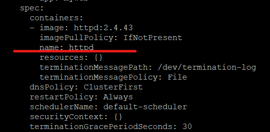

# Kubernetes

## Rolling Update

- `kubectl create deployment myweb --image=httpd:2.4.43`

- `kubectl scale deployment myweb --replicas 3` **:** deployment 預設產生一個 pod，使用 scale 將 pod 擴增

- `kubectl get deployment myweb -o yaml` **:** 查看 Container

    

- `kubecyl set image deployment myweb httpd=httpd:2.4.46` **:** 滾動更新。會先產生新的 pod，再把舊的刪除。

- `kubectl rollout undo deployment myweb` **:** 回退版本

## 進入容器

- `kubectl exec <pod-name> -c <container-name> -it -- bash` **:** -- 是用來給 kubectl 判別指令