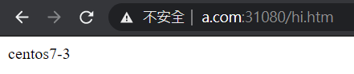
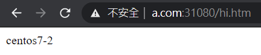

# Proxy Server

Proxy Server 有正向與反向兩種。

- 正向

    區域網路中許多主機去連線遠端伺服器，會很耗費資源。故使用 Proxy Server，當有其他主機搜尋過，就將資料存在 Local cache，這樣對外只要抓取一次資料，節省大量頻寬。

- 反向

    由 Proxy Server 提供 Virtual IP，當主機連線至 Vitrual IP 時，將連線導向背後真正的伺服器來提供服務。以此方式可以讓伺服器負載均衡。

## 反向實作

使用 Ingress 裡的 Nginx 軟體來實作反向 Proxy Server

- master

    - `unzip test-ingress-nginx.zip`

    - `kubectl apply -f mandatory.yaml`

    - `kubectl apply -f service-nodeport.yaml`

    - `kubectl get deployment -n ingress-nginx` **:** 腳本會創建另外一個命名空間，查詢時要加入 deployment 所在的命名空間

    - `kubectl apply -f httpd.yaml`

    - `vim ingress-httpd.yaml` **:** 將 serviceName 改成 httpd

        ```
        apiVersion: extensions/v1beta1
        kind: Ingress
        metadata:
        name: nginx-ingress
        spec:
        rules:
        - host: www.a.com
            http:
            paths:
            - path: /
                backend:
                serviceName: httpd
                servicePort: 80
        ```

    - `kubectl apply -f ingress-httpd.yaml`

    - `kubectl get ingress`

- windows

    - 修改 `C:/Windows/System32/drivers/etc/hosts`

        ```
        .
        .
        .
        192.168.56.110  www.a.com
        ```
        
    - 至瀏覽器輸入 `www.a.com:31080`

        

- master

    - `kubectl get pod -o wide`

    - `kubectl exec httpd-75659db65d-l2crs -it -- bash`

    - `cd htdocs`

    - `echo "centos7-3" > hi.htm`

    - `exit`

    - `kubectl exec httpd-75659db65d-wc8zp -it -- bash`

    - `cd htdocs`

    - `echo "centos7-2" > hi.htm`

    - `exit`

- windows

    - 至瀏覽器輸入 `www.a.com:31080/hi.htm`

        
        
        

---
**參考資料:**

- [Ingress控制器详解](https://www.cnblogs.com/along21/p/10333086.html)