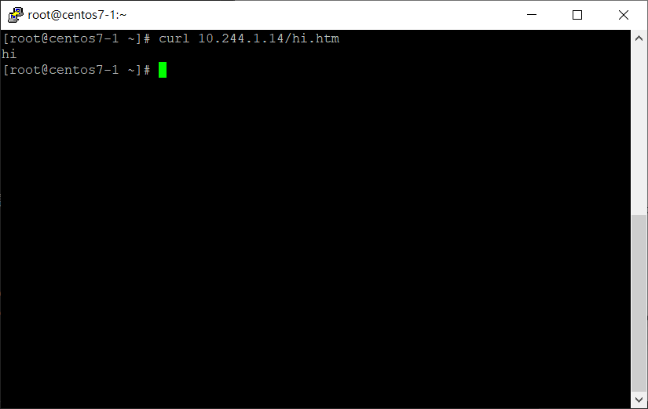

# PersistentVolume

## 安裝 nfs server

- master

    - `yum install nfs-utils -y`

    - `mkdir -p /var/nfsshare`

    - `chmod -R 777 /var/nfsshare`

    - `vim /etc/exports`

        ```
        .
        .
        .
        /var/nfsshare  192.168.56.0/24(rw,sync,no_root_squash,no_all_squash)
        ```

    - `systemctl restart rpcbind`

    - `systemctl restart nfs-server`

- node01、node02

    - `yum install nfs-utils -y`

    - `mkdir -p /mnt/nfs/var/nfsshare`

    - `mount -t nfs 192.168.56.110:/var/nfsshare /mnt/nfs/var/nfsshare/` **:** 先測試可不可以掛載

    - `umount /mnt/nfs/var/nfsshare/`

## 使用集群

- windows

    - 使用 winscp 將檔案上傳至 master 的 /root

        - [檔案](file/20201222/)

- master

    - `cd ~`

    - `vim pv.yaml`

        ```
        .
        .
        .
        nfs:
            path: /var/nfsshare
            server: 192.168.56.110
        ```

    - `kubectl apply -f pv.yaml`

    - `kubectl get pv`

    - `cd /var/nfsshare/`

    - `echo "hi" > hi.htm`

    - `echo "hello" > hello.htm`

    - `kubectl apply -f pvc.yaml`

    - `kubectl apply -f testpod.yaml`

    - `kubectl get pod -o wide`

    - `curl 10.244.1.14/hi.htm`

        

# ConfigMap

提供了向容器中註入配置信息的能力，可以另外保存還原屬性，也可以用來保存整個配置文件

- master

    - `kubectl create configmap cm-demo3 --from-literal=db.host=localhost --from-literal=db.port=3306`

    - `vim testcm.yaml`

        ```
        apiVersion: v1
        kind: Pod
        metadata:
          name: testcm1-pod
        spec:
          containers:
            - name: testcm1
              image: busybox
              command: [ "/bin/sh", "-c", "env" ]
              env:
                - name: DB_HOST
                  valueFrom:
                    configMapKeyRef:
                      name: cm-demo3
                      key: db.host
                - name: DB_PORT
                  valueFrom:
                      configMapKeyRef:
                        name: cm-demo3
                        key: db.port
        ```
    - `kubectl apply -f testcm.yaml`

    - `kubectl logs testcm1-pod`

        
        
---
**參考資料:**

- [配置 Pod 以使用 PersistentVolume 作为存储](https://kubernetes.io/zh/docs/tasks/configure-pod-container/configure-persistent-volume-storage/)

- [RHEL / CentOS 7 安裝 NFS Server](https://www.opencli.com/linux/rhel-centos-7-install-nfs-server)

- [ConfigMap · 从 Docker 到 Kubernetes 进阶手册](https://www.qikqiak.com/k8s-book/docs/28.ConfigMap.html)