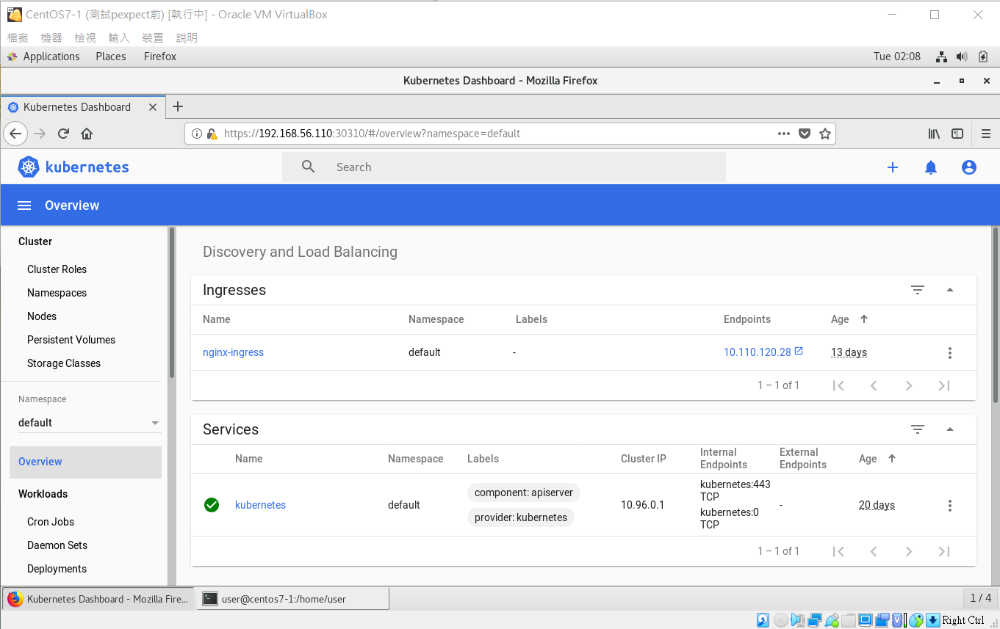
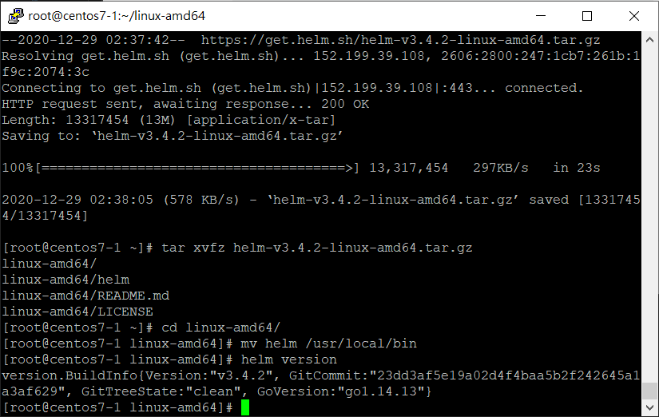
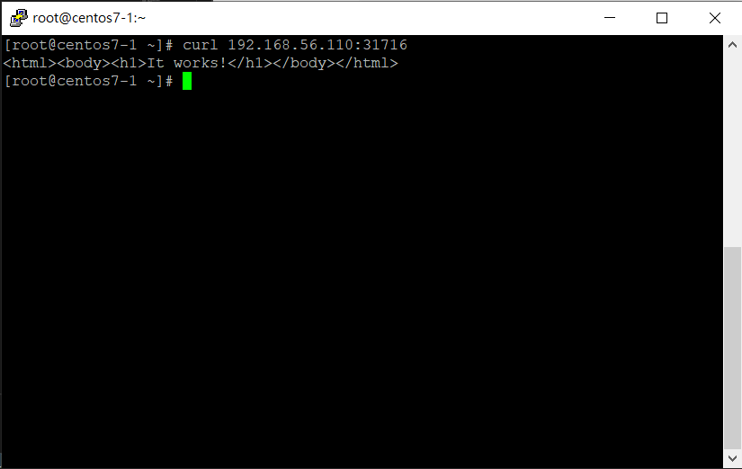

# Kubernetes Dashboard

## 安裝

- windows

    - 使用 winscp 將檔案上傳至 master 的 /root

        - [檔案](file/20201229/)

- master

    - `cd ~`

    - `vim dashboard.yaml`

        ```
        .
        .
        .
        kind: Service
        apiVersion: v1
        metadata:
          labels:
            k8s-app: kubernetes-dashboard
          name: kubernetes-dashboard
          namespace: kube-system
        spec:
          type: NodePort
          ports:
            - port: 443
              targetPort: 8443
              nodePort: 30310
        selector:
            k8s-app: kubernetes-dashboard
        ```

    - `vim admin-role.yaml`

        ```
        kind: ClusterRoleBinding
        apiVersion: rbac.authorization.k8s.io/v1                                                                           
        metadata:
          name: admin
          annotations:
            rbac.authorization.kubernetes.io/autoupdate: "true"
        roleRef:
          kind: ClusterRole
          name: cluster-admin
          apiGroup: rbac.authorization.k8s.io
        subjects:
        - kind: ServiceAccount
          name: admin
          namespace: kube-system'
        ---
        apiVersion: v1
        kind: ServiceAccount
        metadata:
          name: admin
          namespace: kube-system
          labels:
            kubernetes.io/cluster-service: "true"
            addonmanager.kubernetes.io/mode: Reconcile        
        ```

    - `kubectl apply -f kubernetes-dashboard.yaml`

    - `kubectl get all -n kubernetes-dashboard` **:** 顯示屬於 kubernetes-dashboard 命名空間所有東西

    - `kubectl apply -f admin-role.yaml`

    - `kubectl -n kube-system describe secret $(kubectl -n kube-system get secret | grep admin | awk '{print $1}') | grep token: | awk -F : '{print $2}' | xargs echo`

    - 至瀏覽器輸入 `https://192.168.56.110:30310/#!/login`

        

# Helm 

Helm 就是一個管理設定檔的工具。他會把 Kubernetes 一個服務中各種元件裡的 yaml 檔統一打包成一個叫做 chart 的集合，然後透過給參數的方式，去同時管理與設定這些 yaml 檔案。

## 安裝

- master

    - `wget https://get.helm.sh/helm-v3.4.2-linux-amd64.tar.gz`

    - `tar xvfz helm-v3.4.2-linux-amd64.tar.gz`

    - `cd linux-amd64/`

    - `mv helm /usr/local/bin`

    - `helm version`

        

## 簡易指令

- master

    - `helm repo add stable https://charts.helm.sh/stable` **:** 新增倉庫

    - `helm repo list` **:** 顯示已加入的倉庫

    - `helm repo add aliyun https://kubernetes.oss-cn-hangzhou.aliyuncs.com/charts`

    - `helm repo remove aliyun` **:** 刪除倉庫

    - `helm search repo stable` **:** 查看倉庫裡擁有的 chart

    - `helm repo update` **:** 抓取最新的倉庫資訊

    - `helm search repo mysql` **:** 用關鍵字尋找倉庫裡的 chart

    - `helm install stable/mysql --generate-name` **:** 安裝 chart

    - `helm ls` **:** 查看佈署的 chart

    - `helm uninstall mysql-1609228103` **:** 解除安裝 Release

## 製作 chart

- master

    - `helm create abc` **:** 創建 chart

    - `cd abc/templates/`

    - `rm -rf *`

    - `vim deployment.yaml`

        ```
        apiVersion: apps/v1
        kind: Deployment
        metadata:
          creationTimestamp: null
          labels:
            app: web1
          name: web1
        spec:
          replicas: 1
          selector:
            matchLabels:
              app: web1
          strategy: {}
          template:
            metadata:
              creationTimestamp: null
              labels:
                app: web1
            spec:
              containers:
              - image: httpd:2.4.46
                name: httpd
                resources: {}
        status: {}
        ```

    - `vim service.yaml`

        ```
        apiVersion: v1
        kind: Service
        metadata:
          creationTimestamp: null
          labels:
            app: web1
          name: web1
        spec:
          ports:
          - port: 80
            protocol: TCP
            targetPort: 80
          selector:
            app: web1
          type: NodePort
        status:
          loadBalancer: {}        
        ```

    - `helm install abc --generate-name` 

    - `helm ls`

    - `kubectl get svc`

    - `curl 192.168.56.110:31716`

        
        
---
**參考資料:**

- [佈署 & 存取 Kubernetes Dashboard](https://godleon.github.io/blog/Kubernetes/k8s-Deploy-and-Access-Dashboard/)

- [CentOS 7 安裝 Kubernetes (二) – 安裝 Kubernetes Dashboard](https://kenwu0310.wordpress.com/2019/01/16/centos-7-%E5%AE%89%E8%A3%9D-kubernetes-%E4%BA%8C-%E5%AE%89%E8%A3%9D-kubernetes-dashboard/)

- [Kubernetes 基礎教學（三）Helm 介紹與建立 Chart](https://cwhu.medium.com/kubernetes-helm-chart-tutorial-fbdad62a8b61)

- [Helm | Quickstart Guide](https://helm.sh/docs/intro/quickstart/)