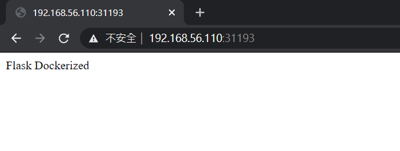
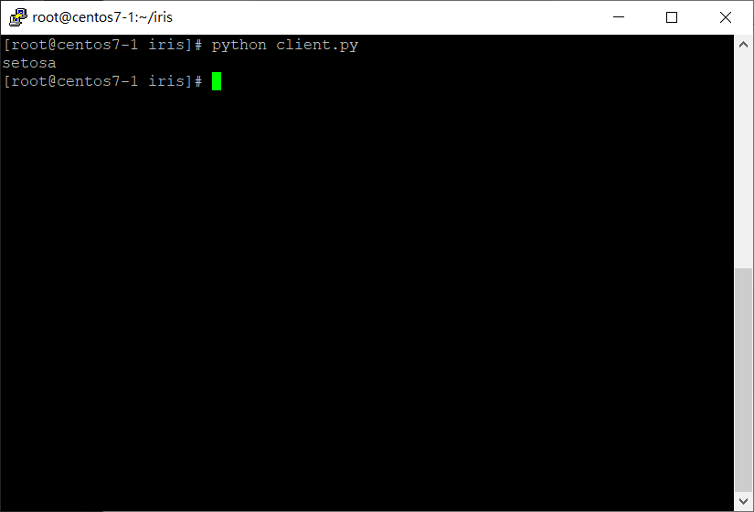
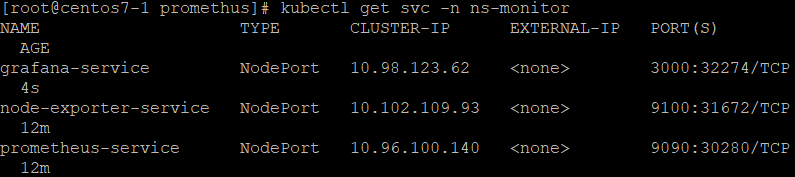
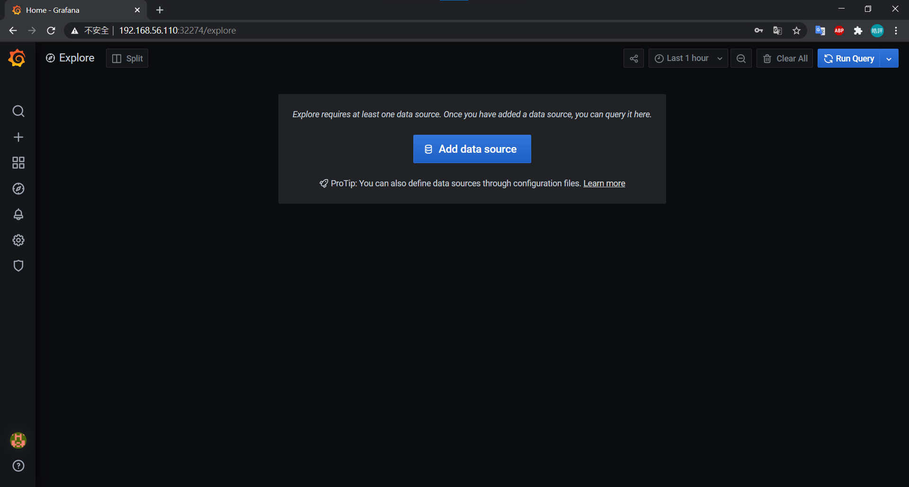
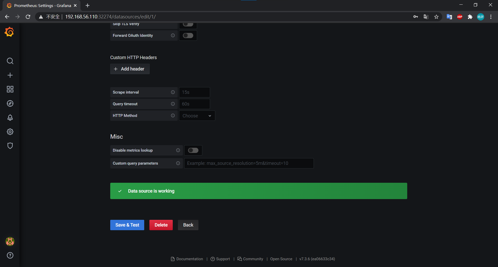
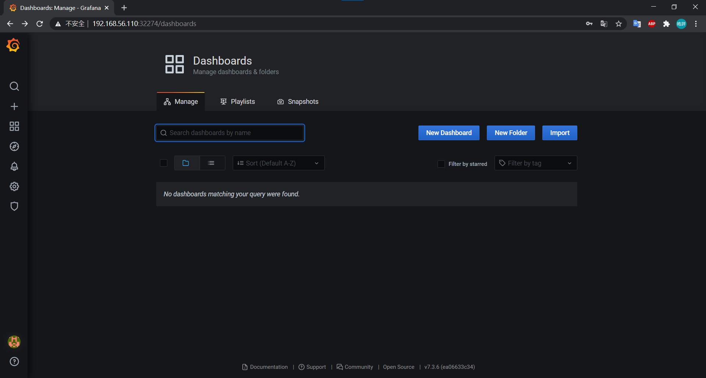
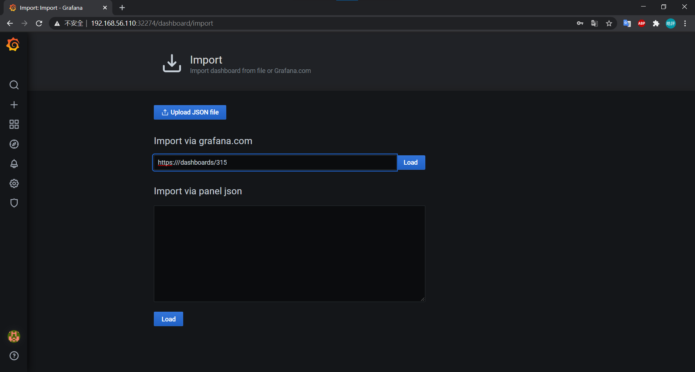
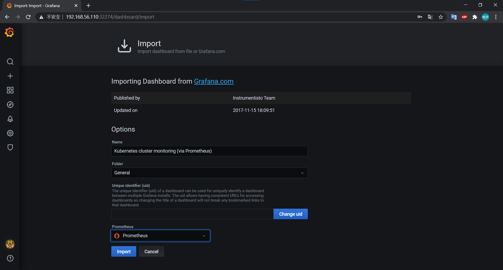
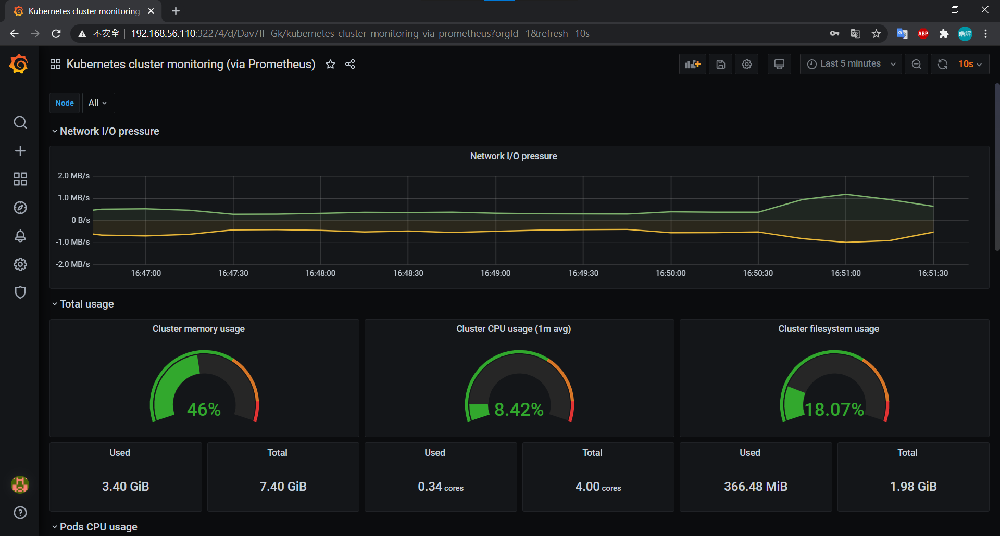

# k8s應用佈署

## 階段

1. 程式開發階段

    - coding

    - test

    - 編寫 Dockerfile

2. 持續交付集成 (CICD)

    - 代碼打包

    - 製作鏡像

    - 上傳至倉庫

3. 應用佈署

    - 環境準備

    - pod

    - service

    - ingress

4. 運維

    - 監控

        - k8s 使用的是 prometheus

    - 故障檢查

    - 升級優化

## 實作

- master、node01、node02

    - `docker login`

- master

    - `mkdir mydocker`

    - `cd mydocker`

    - `vim main.py`

        ```py
        from flask import Flask

        app = Flask(__name__)


        @app.route('/')
        def hello_world():
            return 'Flask Dockerized'


        if __name__ == "__main__":
            app.run(debug=True, host='0.0.0.0', port=8888)
        ```

    - `vim requirements.txt`

        ```
        Click==7.0
        Flask==1.1.1
        itsdangerous==1.1.0
        Jinja2==2.10.3
        MarkupSafe==1.1.1
        Werkzeug==0.16.0
        ```

    - `vim Dockerfile`

        ```
        FROM python:3.7.2-stretch

        WORKDIR /app

        ADD . /app

        RUN pip install -r requirements.txt

        CMD python main.py
        ```

    - `docker build -t mydocker:1.0.0 .`

    - `docker run -d -p 8081:8888 --name mydocker mydocker:1.0.0`

    - `docker tag d5d ping0726/mydocker:1.0.0`

    - `docker push ping0726/mydocker:1.0.0`

    - `kubectl create deployment mydocker --image=ping0726/mydocker:1.0.0 --dry-run -o yaml > mydocker-deployment.yaml`

    - `kubectl apply -f mydocker-deployment.yaml`

    - `kubectl expose deployment mydocker --port=8888 --target-port=8888 --type=NodePort`

        

## 實作2

- node01

    -`vim /etc/docker/daemon.json`

    ```json
    { 
    "insecure-registries":["192.168.56.109"] 
    }
    ```

    - `systemctl daemon-reload`

    - `systemctl restart docker.service`

    - `docker login 192.168.56.110`

- master

    - [安裝harbor並做前置作業](20201006.md)

    - [建立iris鏡像檔](20201020.md)

    - `docker tag fba 192.168.56.110/library/myiris:1.0.0`

    - `docker push 192.168.56.110/library/myiris:1.0.0`

    - `kubectl create deployment myiris --image=192.168.56.110/library/myiris:1.0.0 --dry-run -o yaml > myiris-deployment.yaml`

    - `kubectl apply -f myiris-deployment.yaml`

    - `kubectl expose deployment myiris --port=5000 --target-port=5000 --type=NodePort`

    - `kubectl get svc` **:** 看暴露的 port

    - `vim client.py`

        ```
        .
        .
        .
        url = 'http://127.0.0.1:30880/api'
        ```

    - `python client.py`

        

# Prometheus

## 安裝

- master

    - `mkdir prometheus`

    - [上傳檔案](file/20210105/)

    - `unzip prometheus.zip`

    - `vim grafana.yaml`

        ```yaml
        .
        .
        .
          nfs:
            path: /nfs/prometheus/data
            server: 192.168.56.110
        ```
    
    - `vim prometheus.yaml`

        ```yaml
        .
        .
        .
          nfs:
            path: /nfs/prometheus/data
            server: 192.168.56.110
        ```

    - `mkdir /nfs/prometheus/data/ -p`

    - `mkdir /nfs/grafana/data/ -p`

    - `vim /etc/exports`

        ```
        /nfs/prometheus/data    192.168.56.0/24(rw,sync,no_root_squash,no_all_squash)
        /nfs/grafana/data    192.168.56.0/24(rw,sync,no_root_squash,no_all_squash)
        ```
    
    - `systemctl restart nfs`

    - `kubectl apply -f namespace.yaml`

    - `kubectl apply -f prometheus.yaml`

    - `kubectl apply -f node-exporter.yaml`

    - `kubectl apply -f grafana.yaml`

    - `kubectl get svc -n ns-monitor`

        

        

        

- Grafana

    - 初次登入帳密admin/admin，然後就會要創新密碼

    - 增加 datasource

        
        
    - 填入 prometheus 的網址

        

    - 確認成功

        
        
    - import dashboard

        

    - 輸入模板網址

        

    - 設置成prometheus

        

    - 成果

        
        
---
**參考資料:**

- [實作 Dockerfile + flask 教學 (附GitHub完整程式) | Max行銷誌](https://www.maxlist.xyz/2020/01/11/docker-flask/)

- [Kubernetes+Prometheus+Grafana部署笔记-KaliArch-51CTO博客](https://blog.51cto.com/kaliarch/2160569)