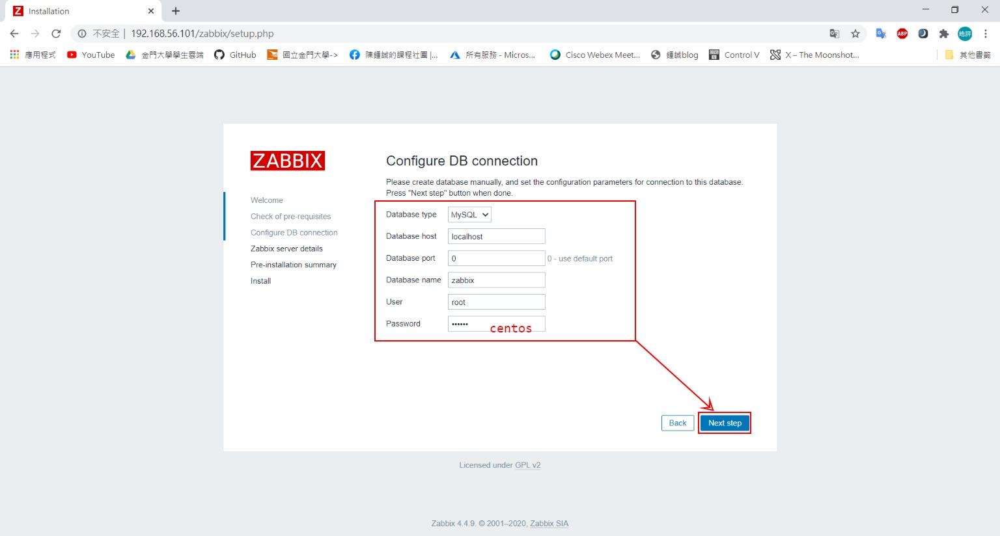
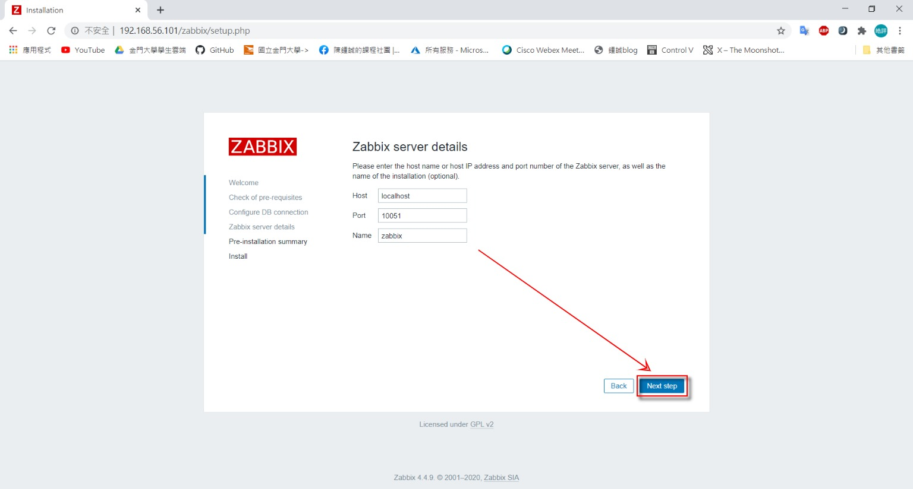

# 20200513
## Zabbix
- 安裝zabbix

    ```sh 
    [root@vm1 user]# rpm -Uvh https://repo.zabbix.com/zabbix/4.4/rhel/8/x86_64/zabbix-release-4.4-1.el8.noarch.rpm
    [root@vm1 user]# yum -y install zabbix-server-mysql zabbix-web-mysql zabbix-agent
    ```
    - 如果安裝失敗請參考 `https://blog.csdn.net/starting_now/article/details/103554237`
- 安裝database並啟動服務
    ```sh
    [root@vm1 user]# yum -y install mariadb mariadb-server
    [root@vm1 user]# systemctl start mariadb.service 
    [root@vm1 user]# systemctl enable mariadb.service 
    ```
- 創建zabbix資料庫
    ```sh
    [root@vm1 user]# mysqladmin -uroot password centos
    [root@vm1 user]# mysql -uroot -pcentos
    MariaDB [(none)]> create database zabbix character set utf8 collate utf8_bin;
    MariaDB [(none)]> grant all privileges on zabbix.* to zabbix@localhost identified by 'zabbix';
    [root@vm1 user]# zcat /usr/share/doc/zabbix-server-mysql*/create.sql.gz | mysql -uroot -pcentos zabbix
    ```
- 修改zabbix設定檔
    ```sh
    [root@vm1 user]# cp /etc/zabbix/zabbix_server.conf /etc/zabbix/zabbix_server.conf.bak 
    [root@vm1 user]# vim /etc/zabbix/zabbix_server.conf
    ```
    - 91 DBHost=localhost
    - 100 DBName=zabbix
    - 116 DBUser=zabbix 
    - 124 DBPassword=zabbix 
- 修改zabbix-agent設定檔
    ```sh
    [root@vm1 user]# vim /etc/zabbix/zabbix_agentd.conf      
    ```
    - 98 Server=127.0.0.1     
    - 139 ServerActive=127.0.0.1  
    - 150 Hostname=vm1  
- 修改前端配置
    ```sh
    [root@vm1 user]# vim /etc/httpd/conf.d/zabbix.conf 
    ```
    - 21 php_value date.timezone Asia/Taipei
- 開啟zabbix
    ```sh
    [root@localhost /]# systemctl start zabbix-server.service
    [root@localhost /]# systemctl start zabbix-agent.service
    ```
- 進入網頁
    - 網址輸入 `http://127.0.0.1/zabbix`

        
    - 設定資料庫存取資料

        
    - 登入

        
    - 進到Latest data，選擇Host，以及要看的資料，點擊Display Graph
---
- [學長的筆記](https://github.com/istar0me/linux-note/blob/107-2/Zabbix.md#%E5%AE%89%E8%A3%9D-zabbix)
- [同學的blog](https://timleesdailyfactory.blogspot.com/2020/05/0513-linux-note.html)