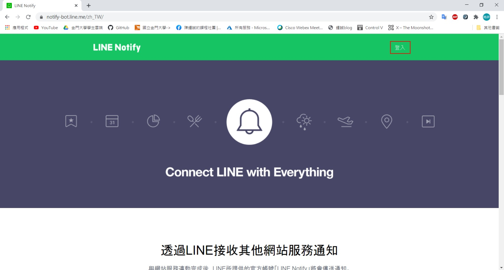
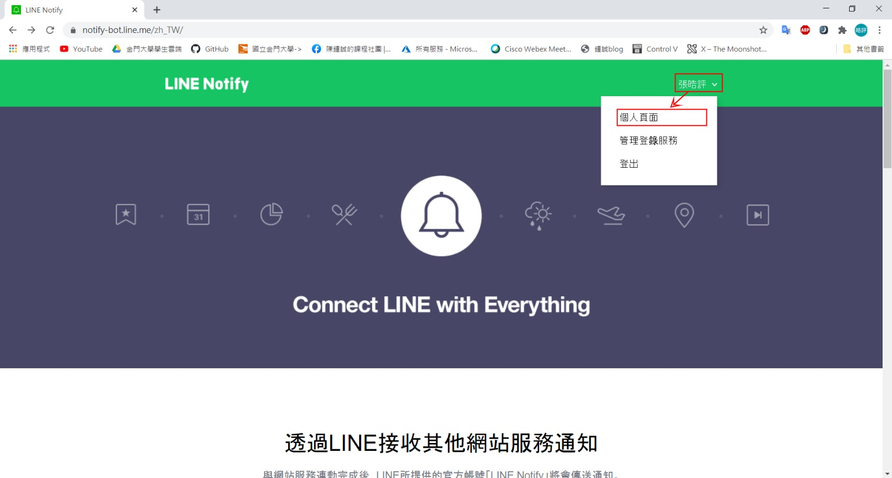
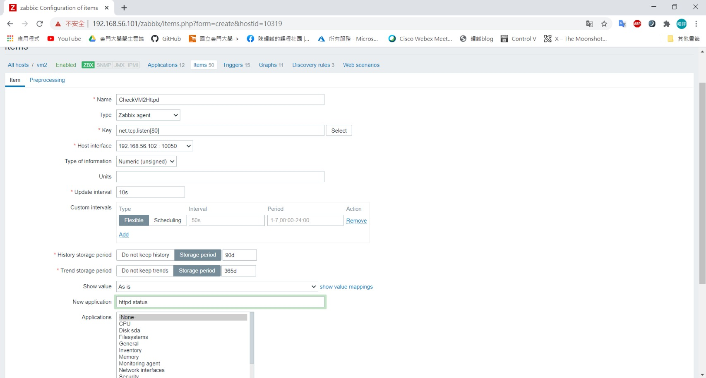
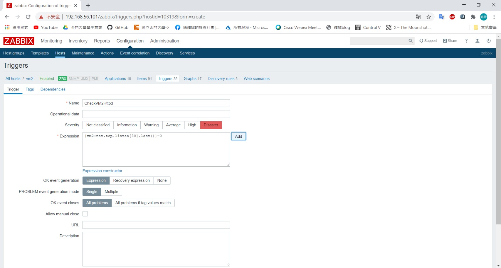
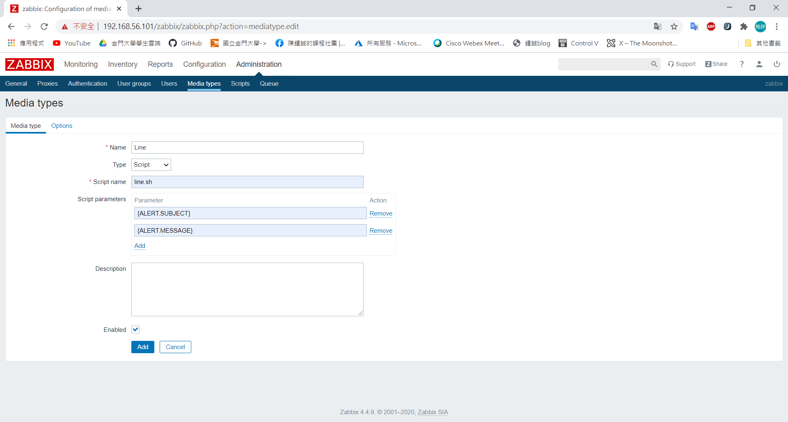
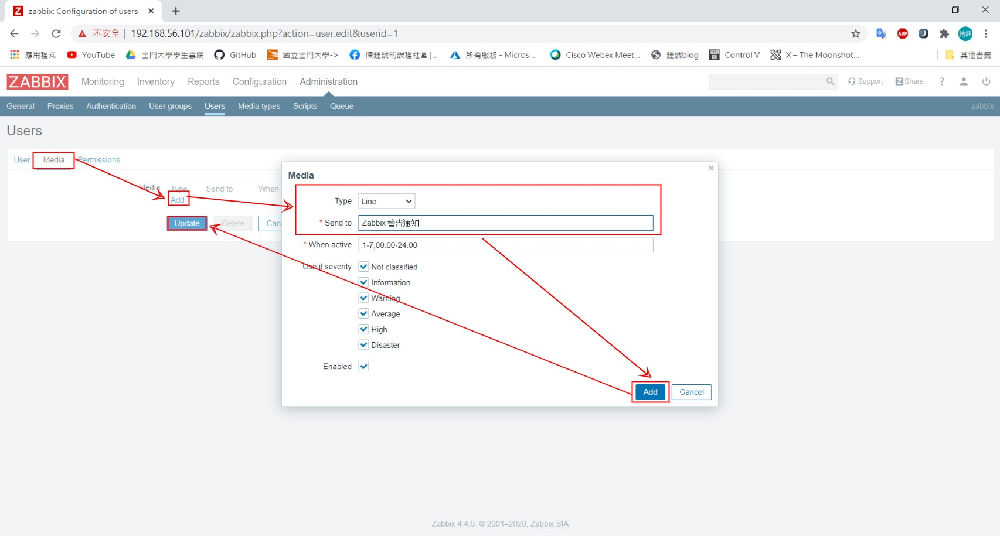
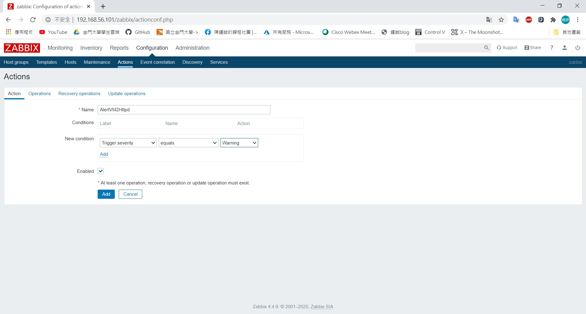
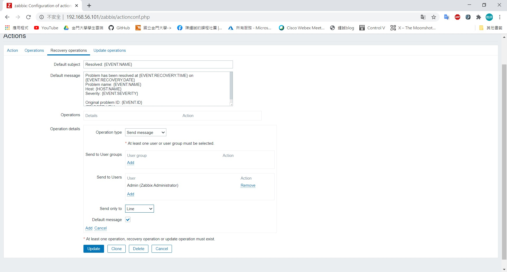
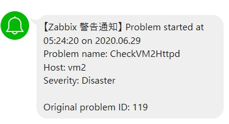

# 20200520
## zabbix與line連結
### Line Notify
- 到官網登入帳號

    
- 前往個人管理介面

    
- 發行權杖產生金鑰

    
    JGIeBxcytHuLbf7LCu1anHkhd5rLQd4DAI2rhIg2hXl
### VM1
- 新增腳本

    ```sh
    [root@vm1 user]# vim /usr/lib/zabbix/alertscripts/line.sh
    ```
- 腳本內容
    ```sh
    #!/usr/bin/bash
    # LINE Notify Token - Media > "Send to".
    TOKEN="金鑰"

    # {ALERT.SUBJECT}
    subject="$1"

    # {ALERT.MESSAGE}
    message="$2"

    curl https://notify-api.line.me/api/notify -H "Authorization: Bearer ${TOKEN}" -d "message=${message}"
    ```
- 新增權限
    ```sh
    [root@vm1 user]# chmod +x /usr/lib/zabbix/alertscripts/line.sh
    ```
### 網頁前端
- 新增item
    
    
- item設定

    
- 新增trigger

    
- trigger設定

    
- 新增Mediatype

    
- Mediatype設定

    
- 通知類型改成line

    
    
- 新增action

    
    
    
- 通知畫面

    