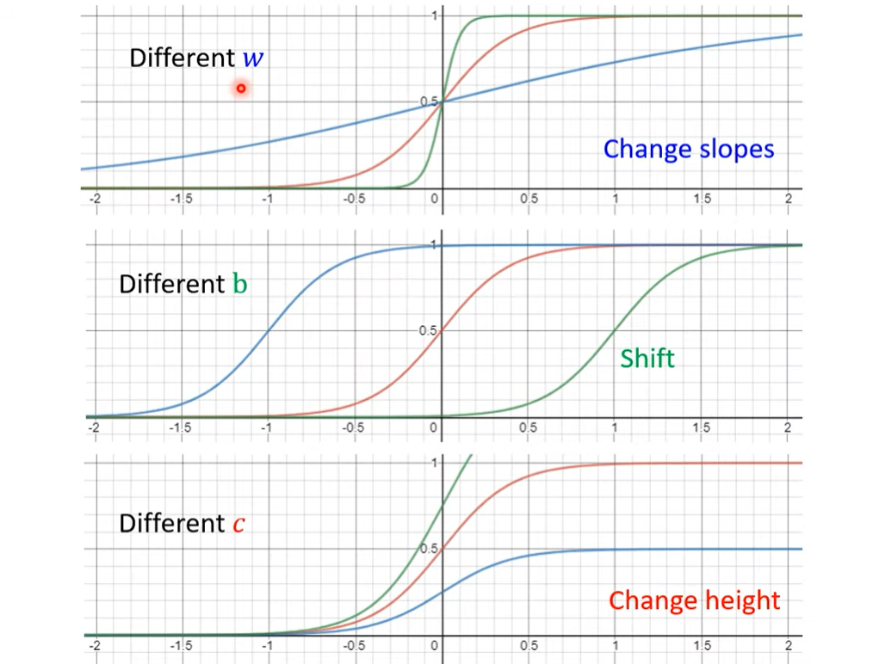

# Machine Learning

簡單來說，Machine Learning 就是讓機器來找一個函式

## 專有名詞

- Regression
    
    讓機器做預測，函式的輸出是一個數值

- Classification

    讓機器做選擇題，函式的輸出是正確的選項

- Structure Learning

    讓機器學會創造，函式的輸出是有結構的東西

- Model

    帶有未知參數的函式

- feature

    函式裡已知的參數

- weight

    與 feature 相乘的參數

- bias

    沒有與 feature 相乘的參數，而是用加法的參數

- loss

    也是一個函式，輸入是 Model 裡的參數，輸出的數值是用來判斷此 Model 參數誤差大小

- learning rate

    更新參數的大小幅度

- hyperparameters

    函式裡面需要自己定義的參數

- batch

    部分資料，用以更新 loss

- epoch

    當使用完一輪所有的 batch 來更新 loss，稱為一次 epoch

- Activation function

    一些特別的函式，用以實現非線性輸出。常見的有 sigmoid、ReLU 等等

- neuron

    在 Model 裡面的激發函數

- neural network

    很多的 neuron

- hidden layer

    model 裡面的參數與 activation function 的一次運算

- deep learning

    很多的 hidden layer

- overfitting

    在訓練集效果比較好，但是在測試集訓練較差

## 找函式的步驟

1. 寫出帶有未知參數的函式

2. 定義 loss 函式

3. 最佳化 (Optimization)

## Loss函式

- MAE (mean absolute error)

    - 計算方式 **:** `error = |y - y'|`

- MSE (mean square error)

    - 計算方式 **:**  `error = (y - y')^2`

## Optimization方法

- Gradient Descent

    1. 先隨便取參數的初始值

    2. 計算微分

    3. 根據斜率以及 learning rate 來更新參數

## model設計技巧

- linear

    - 函式 **:** `y = b + wx`

- sigmoid

    - 函式 **:** `y = c * (1 + e^-(b + wx))^-1 )`

        

- ReLU

    - 函式 **:** `y = c * max(0, b+wx)`

---

**參考資料 :**

- [預測本頻道觀看人數 (上) - 機器學習基本概念簡介](https://www.youtube.com/watch?v=Ye018rCVvOo)