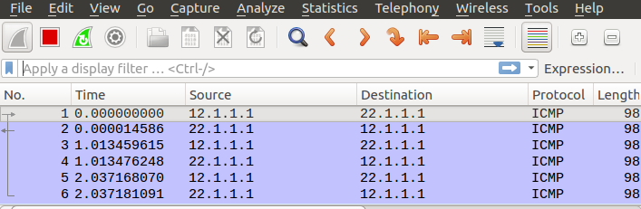
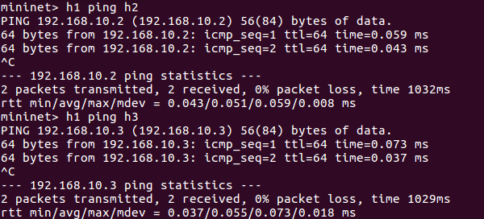

# 腳本建立Mininet

## NAT位置轉發

- ubuntu

    - `vim 4.py`

        ```py
        #!/usr/bin/env python
        from mininet.cli import CLI
        from mininet.net import Mininet
        from mininet.link import Link,TCLink
        
        if '__main__' == __name__:
          net = Mininet(link=TCLink)
          h1 = net.addHost('h1')
          h2 = net.addHost('h2')
          r1 = net.addHost('r1')
          r2 = net.addHost('r2')
          Link(h1, r1)
          Link(h2, r2)
          Link(r1, r2)
          net.build()
          h1.cmd("ifconfig h1-eth0 0")
          h1.cmd("ip addr add 192.168.1.1/24 brd + dev h1-eth0")
          h1.cmd("ip route add default via 192.168.1.254")
          h2.cmd("ifconfig h2-eth0 0")
          h2.cmd("ip addr add 22.1.1.1/24 brd + dev h2-eth0")
          h2.cmd("ip route add default via 22.1.1.2")
          r1.cmd("ifconfig r1-eth0 0")
          r1.cmd("ip addr add 192.168.1.254/24 brd + dev r1-eth0")
          r1.cmd("ifconfig r1-eth1 0")
          r1.cmd("ip addr add 12.1.1.1/24 brd + dev r1-eth1")
          r1.cmd("ip route add default via 12.1.1.2")
          r1.cmd("echo 1 > /proc/sys/net/ipv4/ip_forward")
          r1.cmd("iptables -t nat -A POSTROUTING -s 192.168.1.0/24 -o r1-eth1 -j MASQUERADE")
          r2.cmd("ifconfig r2-eth0 0")
          r2.cmd("ip addr add 22.1.1.2/24 brd + dev r2-eth0")
          r2.cmd("ifconfig r2-eth1 0")
          r2.cmd("ip addr add 12.1.1.2/24 brd + dev r2-eth1")
          r2.cmd("echo 1 > /proc/sys/net/ipv4/ip_forward")
          
          CLI(net)
          net.stop()
        ```
      
    - `python 4.py`

- mininet

    - r2

        - `wireshark -ik r2-eth1`

    - h1 

        - `ping 22.1.1.1 -c 3`

        	

<!--
## request、response 分開

- ubuntu

	- `vim 5.py`

        ```py
        #!/usr/bin/env python
        from mininet.cli import CLI
        from mininet.net import Mininet
        from mininet.link import Link,TCLink
        
        if '__main__' == __name__:
          net = Mininet(link=TCLink)
          h1 = net.addHost('h1')
          h2 = net.addHost('h2')
          r1 = net.addHost('r1')
          r2 = net.addHost('r2')
          r3 = net.addHost('r3')
          r4 = net.addHost('r4')
          Link(h1, r1)
          Link(h2, r4)
          Link(r1, r2)
		  Link(r1, r3)
		  Link(r2, r4)
		  Link(r3, r4)
          net.build()
          h1.cmd("ifconfig h1-eth0 0")
          h2.cmd("ifconfig h2-eth0 0")
		  
          h1.cmd("ip addr add 192.168.1.1/24 brd + dev h1-eth0")
          h1.cmd("ip route add default via 192.168.1.254")
          h2.cmd("ip addr add 192.168.2.1/24 brd + dev h2-eth0")
          h2.cmd("ip route add default via 192.168.2.254")

          r1.cmd("ifconfig r1-eth0 0")
		  r1.cmd("ifconfig r1-eth1 0")
		  r1.cmd("ifconfig r1-eth2 0")
		  r2.cmd("ifconfig r2-eth0 0")
          r2.cmd("ifconfig r2-eth1 0")
		  r3.cmd("ifconfig r3-eth0 0")
		  r3.cmd("ifconfig r3-eth1 0")
		  r4.cmd("ifconfig r4-eth0 0")
		  r4.cmd("ifconfig r4-eth1 0")
		  r4.cmd("ifconfig r4-eth2 0")

		  r1.cmd("ip addr add 192.168.1.254/24 brd + dev r1-eth0")
          r1.cmd("ip addr add 12.0.0.1/24 brd + dev r1-eth1")
		  r1.cmd("ip addr add 13.0.0.1/24 brd + dev r1-eth2")
		  r2.cmd("ip addr add 12.0.0.2/24 brd + dev r2-eth0")
          r2.cmd("ip addr add 24.0.0.2/24 brd + dev r2-eth1")
		  r3.cmd("ip addr add 13.0.0.3/24 brd + dev r3-eth0")
          r3.cmd("ip addr add 34.0.0.3/24 brd + dev r3-eth1")
		  r4.cmd("ip addr add 192.168.2.254/24 brd + dev r4-eth0")
          r4.cmd("ip addr add 24.0.0.4/24 brd + dev r4-eth1")
		  r4.cmd("ip addr add 34.0.0.4/24 brd + dev r4-eth2")

		  r1.cmd("echo 1 > /proc/sys/net/ipv4/ip_forward")
		  r2.cmd("echo 1 > /proc/sys/net/ipv4/ip_forward")
		  r3.cmd("echo 1 > /proc/sys/net/ipv4/ip_forward")
		  r4.cmd("echo 1 > /proc/sys/net/ipv4/ip_forward")

          r1.cmd("ip route add 192.168.2.0/24 via 13.0.0.3")
          r2.cmd("ip route add 192.168.1.0/24 via 12.0.0.1")
		  r2.cmd("ip route add 192.168.2.0/24 via 24.0.0.4")
		  r3.cmd("ip route add 192.168.2.0/24 via 34.0.0.4")
		  r3.cmd("ip route add 192.168.1.0/24 via 13.0.0.1")
		  r4.cmd("ip route add 192.168.1.0/24 via 24.0.0.2")
          
          CLI(net)
          net.stop()
        ```
-->	

## 橋接器

- ubuntu

	- `apt install bridge-utils`

	- `vim 6.py`

		```py
		#! /usr/bin/env python
		from mininet.cli import CLI
		from mininet.net import Mininet
		from mininet.link import Link,TCLink,Intf

		if '__main__' == __name__:
		  net = Mininet(link=TCLink)
		  h1 = net.addHost('h1')
		  h2 = net.addHost('h2')
		  h3 = net.addHost('h3')
		  br1 = net.addHost('br1')
		  net.addLink(h1, br1)
	  	  net.addLink(h2, br1)
	  	  net.addLink(h3, br1)
		  net.build()
		  h1.cmd("ifconfig h1-eth0 0")
		  h2.cmd("ifconfig h2-eth0 0")
		  h3.cmd("ifconfig h3-eth0 0")
		  br1.cmd("ifconfig br1-eth0 0")
		  br1.cmd("ifconfig br1-eth1 0")
		  br1.cmd("ifconfig br1-eth2 0")
		  br1.cmd("brctl addbr mybr")  # add bridge
		  br1.cmd("brctl addif mybr br1-eth0")  # add interface
		  br1.cmd("brctl addif mybr br1-eth1")
		  br1.cmd("brctl addif mybr br1-eth2")
		  br1.cmd("ifconfig mybr up")
		  h1.cmd("ip address add 192.168.10.1/24 dev h1-eth0")
		  h2.cmd("ip address add 192.168.10.2/24 dev h2-eth0")
		  h3.cmd("ip address add 192.168.10.3/24 dev h3-eth0")
		  CLI(net)
		  net.stop()
		```

	- `python 6.py`

		

## 建立兩個 bridge

- ubuntu

	- `vim 7.py`

		```py
		#! /usr/bin/env python
		from mininet.cli import CLI
		from mininet.net import Mininet
		from mininet.link import Link,TCLink,Intf

		if '__main__' == __name__:
		  net = Mininet(link=TCLink)
		  h1 = net.addHost('h1')
		  h2 = net.addHost('h2')
		  h3 = net.addHost('h3')
		  h4 = net.addHost('h4')
		  br1 = net.addHost('br1')
		  net.addLink(h1, br1)
		  net.addLink(h2, br1)
		  net.addLink(h3, br1)
		  net.addLink(h4, br1)
		  net.build()
		  h1.cmd("ifconfig h1-eth0 0")
		  h2.cmd("ifconfig h2-eth0 0")
		  h3.cmd("ifconfig h3-eth0 0")
		  h3.cmd("ifconfig h4-eth0 0")
		  br1.cmd("ifconfig br1-eth0 0")
		  br1.cmd("ifconfig br1-eth1 0")
		  br1.cmd("ifconfig br1-eth2 0")
		  br1.cmd("ifconfig br1-eth3 0")
		  br1.cmd("brctl addbr mybr1")
		  br1.cmd("brctl addbr mybr2")
		  br1.cmd("brctl addif mybr1 br1-eth0")
		  br1.cmd("brctl addif mybr1 br1-eth1")
		  br1.cmd("brctl addif mybr2 br1-eth2")
		  br1.cmd("brctl addif mybr2 br1-eth3")
		  br1.cmd("ifconfig mybr1 up")
		  br1.cmd("ifconfig mybr2 up")
		  h1.cmd("ip address add 192.168.10.1/24 dev h1-eth0")
		  h2.cmd("ip address add 192.168.10.2/24 dev h2-eth0")
		  h3.cmd("ip address add 192.168.20.1/24 dev h3-eth0")
		  h4.cmd("ifconfig h4-eth0 192.168.20.2/4")
		  CLI(net)
		  net.stop()
		```
	
	- `python 7.py`

		

## 建立兩個 bridge、一個 router

- ubuntu

	- `vim 8.py`

		```py
		#! /usr/bin/env python
		from mininet.cli import CLI
		from mininet.net import Mininet
		from mininet.link import Link,TCLink,Intf

		if '__main__' == __name__:
		  net = Mininet(link=TCLink)
		  h1 = net.addHost('h1')
		  h2 = net.addHost('h2')
		  h3 = net.addHost('h3')
		  h4 = net.addHost('h4')
		  br1 = net.addHost('br1')
		  r1 = net.addHost('r1')
		  net.addLink(h1, br1)
		  net.addLink(h2, br1)
		  net.addLink(h3, br1)
		  net.addLink(h4, br1)
		  net.addLink(br1,r1)
		  net.addLink(br1,r1)
		  net.build()
		  h1.cmd("ifconfig h1-eth0 0")
		  h2.cmd("ifconfig h2-eth0 0")
		  h3.cmd("ifconfig h3-eth0 0")
		  h4.cmd("ifconfig h4-eth0 0")
		  br1.cmd("ifconfig br1-eth0 0")
		  br1.cmd("ifconfig br1-eth1 0")
		  br1.cmd("ifconfig br1-eth2 0")
		  br1.cmd("ifconfig br1-eth3 0")
		  br1.cmd("ifconfig br1-eth4 0")
		  br1.cmd("ifconfig br1-eth5 0")
		  br1.cmd("brctl addbr mybr1")
		  br1.cmd("brctl addbr mybr2")
		  br1.cmd("brctl addif mybr1 br1-eth0")
		  br1.cmd("brctl addif mybr1 br1-eth1")
		  br1.cmd("brctl addif mybr1 br1-eth4")
		  br1.cmd("brctl addif mybr2 br1-eth2")
		  br1.cmd("brctl addif mybr2 br1-eth3")
		  br1.cmd("brctl addif mybr2 br1-eth5")
		  br1.cmd("ifconfig mybr1 up")
		  br1.cmd("ifconfig mybr2 up")
		  r1.cmd('ifconfig r1-eth0 192.168.10.254 netmask 255.255.255.0')
		  r1.cmd('ifconfig r1-eth1 192.168.20.254 netmask 255.255.255.0')
		  r1.cmd("echo 1 > /proc/sys/net/ipv4/ip_forward")
		  h1.cmd("ip address add 192.168.10.1/24 dev h1-eth0")
		  h1.cmd("ip route add default via 192.168.10.254")
		  h2.cmd("ip address add 192.168.10.2/24 dev h2-eth0")
		  h2.cmd("ip route add default via 192.168.10.254")
		  h3.cmd("ip address add 192.168.20.1/24 dev h3-eth0")
		  h3.cmd("ip route add default via 192.168.20.254")
		  h4.cmd("ip address add 192.168.20.2/24 dev h4-eth0")
		  h4.cmd("ip route add default via 192.168.20.254")
		  CLI(net)
		  net.stop()
		```


## 單臂路由

- ubuntu

	- `apt install vlan`

	- `vim 9.py`

		```py
		#! /usr/bin/env python
		from mininet.cli import CLI
		from mininet.net import Mininet
		from mininet.link import Link,TCLink,Intf

		if '__main__' == __name__:
  		  net = Mininet(link=TCLink)
		  h1 = net.addHost('h1')
		  h2 = net.addHost('h2')
		  h3 = net.addHost('h3')
		  h4 = net.addHost('h4')
		  br1 = net.addHost('br1')
		  r1 = net.addHost('r1')
		  net.addLink(h1, br1)
		  net.addLink(h2, br1)
		  net.addLink(h3, br1)
		  net.addLink(h4, br1)
		  net.addLink(br1,r1)
		  net.build()
		  h1.cmd("ifconfig h1-eth0 0")
		  h2.cmd("ifconfig h2-eth0 0")
		  h3.cmd("ifconfig h3-eth0 0")
		  h4.cmd("ifconfig h4-eth0 0")
		  r1.cmd("ifconfig r1-eth0 0")
		  br1.cmd("ifconfig br1-eth0 0")
		  br1.cmd("ifconfig br1-eth1 0")
		  br1.cmd("ifconfig br1-eth2 0")
		  br1.cmd("ifconfig br1-eth3 0")
		  br1.cmd("ifconfig br1-eth4 0")
		  br1.cmd("vconfig add br1-eth4 10")
		  br1.cmd("vconfig add br1-eth4 20")
		  r1.cmd("vconfig add r1-eth0 10")
		  r1.cmd("vconfig add r1-eth0 20")
		  br1.cmd("brctl addbr mybr10")
		  br1.cmd("brctl addbr mybr20")
		  br1.cmd("brctl addif mybr10 br1-eth0")
		  br1.cmd("brctl addif mybr10 br1-eth1")
		  br1.cmd("brctl addif mybr10 br1-eth4.10")
		  br1.cmd("brctl addif mybr20 br1-eth2")
		  br1.cmd("brctl addif mybr20 br1-eth3")
		  br1.cmd("brctl addif mybr20 br1-eth4.20")
		  br1.cmd("ifconfig br1-eth4.10 up")
		  br1.cmd("ifconfig br1-eth4.20 up")
		  r1.cmd("ifconfig r1-eth0.10 up")
		  r1.cmd("ifconfig r1-eth0.20 up")
		  br1.cmd("ifconfig mybr10 up")
		  br1.cmd("ifconfig mybr20 up")
		  r1.cmd('ifconfig r1-eth0.10 192.168.10.254 netmask 255.255.255.0')
		  r1.cmd('ifconfig r1-eth0.20 192.168.20.254 netmask 255.255.255.0')
		  r1.cmd("echo 1 > /proc/sys/net/ipv4/ip_forward")
		  h1.cmd("ip address add 192.168.10.1/24 dev h1-eth0")
		  h1.cmd("ip route add default via 192.168.10.254")
		  h2.cmd("ip address add 192.168.10.2/24 dev h2-eth0")
  		  h2.cmd("ip route add default via 192.168.10.254")
		  h3.cmd("ip address add 192.168.20.1/24 dev h3-eth0")
		  h3.cmd("ip route add default via 192.168.20.254")
		  h4.cmd("ip address add 192.168.20.2/24 dev h4-eth0")
		  h4.cmd("ip route add default via 192.168.20.254")
		  CLI(net)
		  net.stop()
		```

- mininet

	- br1

		- `brctl show` **:** 可以顯示橋接器訊息