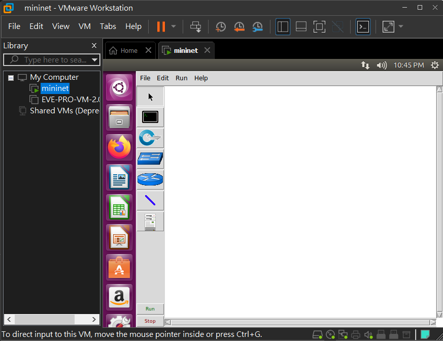

# miniedit

## 簡易操作範例

- ubuntu

    - `cd mininet/example`

    - `python miniedit.py`

        

## 作業

- ubuntu

    - `1.py`

        ```py
        #!/usr/bin/env python
        from mininet.cli import CLI
        from mininet.net import Mininet
        from mininet.link import Link,TCLink
        
        if '__main__' == __name__:
          net = Mininet(link=TCLink)
          h1 = net.addHost('h1')
          h2 = net.addHost('h2')
          r1 = net.addHost('r1')
          r2 = net.addHost('r2')
          r3 = net.addHost('r3')
          r4 = net.addHost('r4')
          Link(h1, r1)
          Link(h2, r4)
          Link(r1, r2)
		  Link(r1, r3)
		  Link(r2, r4)
		  Link(r3, r4)
          net.build()

          h1.cmd("ifconfig h1-eth0 0")
          h2.cmd("ifconfig h2-eth0 0")
		  r1.cmd("ifconfig r1-eth0 0")
		  r1.cmd("ifconfig r1-eth1 0")
		  r1.cmd("ifconfig r1-eth2 0")
		  r2.cmd("ifconfig r2-eth0 0")
          r2.cmd("ifconfig r2-eth1 0")
		  r3.cmd("ifconfig r3-eth0 0")
		  r3.cmd("ifconfig r3-eth1 0")
		  r4.cmd("ifconfig r4-eth0 0")
		  r4.cmd("ifconfig r4-eth1 0")
		  r4.cmd("ifconfig r4-eth2 0")
		  
          h1.cmd("ip addr add 192.168.1.1/24 brd + dev h1-eth0")
          h2.cmd("ip addr add 192.168.2.1/24 brd + dev h2-eth0")
		  r1.cmd("ip addr add 192.168.1.254/24 brd + dev r1-eth0")
          r1.cmd("ip addr add 12.0.0.1/24 brd + dev r1-eth1")
		  r1.cmd("ip addr add 13.0.0.1/24 brd + dev r1-eth2")
		  r2.cmd("ip addr add 12.0.0.2/24 brd + dev r2-eth0")
          r2.cmd("ip addr add 24.0.0.2/24 brd + dev r2-eth1")
		  r3.cmd("ip addr add 13.0.0.3/24 brd + dev r3-eth0")
          r3.cmd("ip addr add 34.0.0.3/24 brd + dev r3-eth1")
		  r4.cmd("ip addr add 192.168.2.254/24 brd + dev r4-eth0")
          r4.cmd("ip addr add 24.0.0.4/24 brd + dev r4-eth1")
		  r4.cmd("ip addr add 34.0.0.4/24 brd + dev r4-eth2")

		  r1.cmd("echo 1 > /proc/sys/net/ipv4/ip_forward")
		  r2.cmd("echo 1 > /proc/sys/net/ipv4/ip_forward")
		  r3.cmd("echo 1 > /proc/sys/net/ipv4/ip_forward")
		  r4.cmd("echo 1 > /proc/sys/net/ipv4/ip_forward")

          h1.cmd("ip route add default via 192.168.1.254")
          h2.cmd("ip route add default via 192.168.2.254")
          r1.cmd("ip route add default via 12.0.0.2")
          r2.cmd("ip route add default via 24.0.0.4")
		  r3.cmd("ip route add default via 13.0.0.1")
		  r4.cmd("ip route add default via 34.0.0.3")
          
          CLI(net)
          net.stop()
        ```

    - `2.py`

        ```py
        #!/usr/bin/env python
        from mininet.cli import CLI
        from mininet.net import Mininet
        from mininet.link import Link,TCLink,Intf
        from mininet.node import Controller,RemoteController
        
        if '__main__' == __name__:
          net = Mininet(link=TCLink)
          h1 = net.addHost('h1')
          h2 = net.addHost('h2')
          s1 = net.addSwitch('s1')
          s2 = net.addSwitch('s2')
          s3 = net.addSwitch('s3')
          s4 = net.addSwitch('s4')
          c0 = net.addController('c0', controller=RemoteController)
          net.addLink(h1, s1)
          net.addLink(h2, s4)
          net.addLink(s1, s2)
          net.addLink(s1, s3)
          net.addLink(s2, s4)
          net.addLink(s3, s4)
          net.build()
          c0.start()
          s1.start([c0])
          s2.start([c0])
          s3.start([c0])
          s4.start([c0])
          # rules for s1
          s1.cmd("ovs-ofctl add-flow s1 arp,arp_op=1,arp_spa=10.0.0.1,arp_tpa=10.0.0.2,actions=output:2")
          s1.cmd("ovs-ofctl add-flow s1 arp,arp_op=1,arp_spa=10.0.0.2,arp_tpa=10.0.0.1,actions=output:1")
          s1.cmd("ovs-ofctl add-flow s1 arp,arp_op=2,arp_spa=10.0.0.1,arp_tpa=10.0.0.2,actions=output:2")
          s1.cmd("ovs-ofctl add-flow s1 arp,arp_op=2,arp_spa=10.0.0.2,arp_tpa=10.0.0.1,actions=output:1")
          s1.cmd("ovs-ofctl add-flow s1 icmp,nw_src=10.0.0.1,nw_dst=10.0.0.2,icmp_type=8,icmp_code=0,actions=output:2")
          s1.cmd("ovs-ofctl add-flow s1 icmp,nw_src=10.0.0.2,nw_dst=10.0.0.1,icmp_type=8,icmp_code=0,actions=output:1")
          s1.cmd("ovs-ofctl add-flow s1 icmp,nw_src=10.0.0.1,nw_dst=10.0.0.2,icmp_type=0,icmp_code=0,actions=output:2")
          s1.cmd("ovs-ofctl add-flow s1 icmp,nw_src=10.0.0.2,nw_dst=10.0.0.1,icmp_type=0,icmp_code=0,actions=output:1")

          # rules for s2
          s2.cmd("ovs-ofctl add-flow s2 arp,arp_op=1,arp_spa=10.0.0.1,arp_tpa=10.0.0.2,actions=output:2")
          s2.cmd("ovs-ofctl add-flow s2 arp,arp_op=2,arp_spa=10.0.0.1,arp_tpa=10.0.0.2,actions=output:2")
          s2.cmd("ovs-ofctl add-flow s2 icmp,nw_src=10.0.0.1,nw_dst=10.0.0.2,icmp_type=8,icmp_code=0,actions=output:2")
          s2.cmd("ovs-ofctl add-flow s2 icmp,nw_src=10.0.0.1,nw_dst=10.0.0.2,icmp_type=0,icmp_code=0,actions=output:2")

          # rules for s3
          s3.cmd("ovs-ofctl add-flow s3 arp,arp_op=1,arp_spa=10.0.0.2,arp_tpa=10.0.0.1,actions=output:1")
          s3.cmd("ovs-ofctl add-flow s3 arp,arp_op=2,arp_spa=10.0.0.2,arp_tpa=10.0.0.1,actions=output:1")
          s3.cmd("ovs-ofctl add-flow s3 icmp,nw_src=10.0.0.2,nw_dst=10.0.0.1,icmp_type=8,icmp_code=0,actions=output:1")
          s3.cmd("ovs-ofctl add-flow s3 icmp,nw_src=10.0.0.2,nw_dst=10.0.0.1,icmp_type=0,icmp_code=0,actions=output:1")

          # rules for s4
          s4.cmd("ovs-ofctl add-flow s4 arp,arp_op=1,arp_spa=10.0.0.1,arp_tpa=10.0.0.2,actions=output:1")
          s4.cmd("ovs-ofctl add-flow s4 arp,arp_op=1,arp_spa=10.0.0.2,arp_tpa=10.0.0.1,actions=output:3")
          s4.cmd("ovs-ofctl add-flow s4 arp,arp_op=2,arp_spa=10.0.0.1,arp_tpa=10.0.0.2,actions=output:1")
          s4.cmd("ovs-ofctl add-flow s4 arp,arp_op=2,arp_spa=10.0.0.2,arp_tpa=10.0.0.1,actions=output:3")
          s4.cmd("ovs-ofctl add-flow s4 icmp,nw_src=10.0.0.1,nw_dst=10.0.0.2,icmp_type=8,icmp_code=0,actions=output:1")
          s4.cmd("ovs-ofctl add-flow s4 icmp,nw_src=10.0.0.2,nw_dst=10.0.0.1,icmp_type=8,icmp_code=0,actions=output:3")
          s4.cmd("ovs-ofctl add-flow s4 icmp,nw_src=10.0.0.1,nw_dst=10.0.0.2,icmp_type=0,icmp_code=0,actions=output:1")
          s4.cmd("ovs-ofctl add-flow s4 icmp,nw_src=10.0.0.2,nw_dst=10.0.0.1,icmp_type=0,icmp_code=0,actions=output:3")

          CLI(net)
          net.stop()

    - `3.py`

        ```py
        #!/usr/bin/env python
        from mininet.cli import CLI
        from mininet.net import Mininet
        from mininet.link import Link,TCLink
        
        if '__main__' == __name__:
          net = Mininet(link=TCLink)
          h1 = net.addHost('h1')
          h2 = net.addHost('h2')
          r1 = net.addHost('r1')
          r2 = net.addHost('r2')
          r3 = net.addHost('r3')
          Link(h1, r1)
          Link(h2, r3)
          Link(r1, r2)
		  Link(r1, r3)
		  Link(r2, r3)
          net.build()

          h1.cmd("ifconfig h1-eth0 0")
          h2.cmd("ifconfig h2-eth0 0")
		  r1.cmd("ifconfig r1-eth0 0")
		  r1.cmd("ifconfig r1-eth1 0")
		  r1.cmd("ifconfig r1-eth2 0")
		  r2.cmd("ifconfig r2-eth0 0")
          r2.cmd("ifconfig r2-eth1 0")
		  r3.cmd("ifconfig r3-eth0 0")
		  r3.cmd("ifconfig r3-eth1 0")
		  
          h1.cmd("ip addr add 192.168.1.1/24 brd + dev h1-eth0")
          h2.cmd("ip addr add 192.168.2.1/24 brd + dev h2-eth0")
		  r1.cmd("ip addr add 192.168.1.254/24 brd + dev r1-eth0")
          r1.cmd("ip addr add 12.0.0.1/24 brd + dev r1-eth1")
		  r1.cmd("ip addr add 13.0.0.1/24 brd + dev r1-eth2")
		  r2.cmd("ip addr add 12.0.0.2/24 brd + dev r2-eth0")
          r2.cmd("ip addr add 23.0.0.2/24 brd + dev r2-eth1")
		  r3.cmd("ip addr add 192.168.2.254/24 brd + dev r3-eth0")
		  r3.cmd("ip addr add 13.0.0.3/24 brd + dev r3-eth1")
          r3.cmd("ip addr add 23.0.0.3/24 brd + dev r3-eth2")

		  r1.cmd("echo 1 > /proc/sys/net/ipv4/ip_forward")
		  r2.cmd("echo 1 > /proc/sys/net/ipv4/ip_forward")
		  r3.cmd("echo 1 > /proc/sys/net/ipv4/ip_forward")

          h1.cmd("ip route add 192.168.2.0/24 dev h1-eth0")
          h2.cmd("ip route add 192.168.1.0/24 dev h2-eth0")
          r1.cmd("ip route add 192.168.2.0/24 dev r1-eth2")
          r2.cmd("ip route add 192.168.1.0/24 dev r2-eth0")
		  r3.cmd("ip route add 192.168.1.0/24 dev r3-eth2")
          
          CLI(net)
          net.stop()
        ```