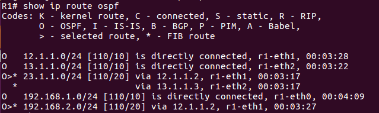
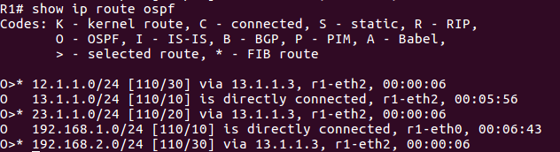

# containernet

## ssh

- ubuntu

    - `cd /home/user/containernet`

    - `python3 ./setup.py install`

    - `cd example`

    - `python3 dockerhosts.py`

    - `docker run -it ubuntu:trusty`

- docker

    - `apt update`

    - `apt install openssh-server`

    - `/etc/init.d/ssh start`

    - `/etc/init.d/ssh status`

    - `adduser tom`

- ubuntu

    - `ssh tom@172.17.0.2`

    - `docker commit 7e5 ubuntu:sshd1`

    - `docker commit 7e5 ubuntu:sshd2`

    - `vim 1.py`

        ```py
        #!/usr/bin/python
        """
        This is the most simple example to showcase Containernet.
        """
        from mininet.net import Containernet
        from mininet.node import Controller
        from mininet.cli import CLI
        from mininet.link import TCLink
        from mininet.log import info, setLogLevel
        setLogLevel('info')

        net = Containernet(controller=Controller)
        info('*** Adding controller\n')
        net.addController('c0')
        info('*** Adding docker containers\n')
        h1 = net.addHost('h1', ip='10.0.0.250/24')
        d1 = net.addDocker('d1', ip='10.0.0.251/24', dimage="ubuntu:sshd1")
        d2 = net.addDocker('d2', ip='10.0.0.252/24', dimage="ubuntu:sshd2")
        info('*** Adding switches\n')
        s1 = net.addSwitch('s1')
        info('*** Creating links\n')
        net.addLink(h1, s1)
        net.addLink(d1, s1)
        net.addLink(d2, s1)
        info('*** Starting network\n')
        net.start()
        info('*** Running CLI\n')
        CLI(net)
        info('*** Stopping network')
        net.stop()
        ```

    - `python3 1.py`

    - `docker exec -it mn.d1 bash`

- docker 

    - `/etc/init.d/ssh start`

- mininet

    - `h1 ssh tom@10.0.0.251`

    - 準備一個user跟password的字典

    - `hydra -L user.txt -P password.txt 10.0.0.252 ssh -t 4`


## quagga

- ubuntu

    - `docker pull kathara/quagga`

    - `python3 dynamic_routing.py`
        
        ```

        ```

    - `docker exec -it 2f4 bash`

- mininet

    - `h1 ping h2`

- docker

    - `telnet localhost 2601` **:** 密碼 zebra

    - `enable` **:** 密碼 zebra

    - `show ip route ospf`

        

- mininet

    - `r1 ifconfig r1-eth1 down`

    - `h1 ping h2`

- docker

    - `show ip route ospf`

        


