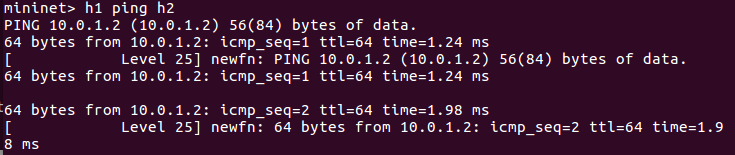

# P4(programming protocol-independent packet processors)

- 早期的 sdn 是 bottom-up design，需要從底層的限制去往上發展。而 P4 是 top-down design，是底層去配合上層的動作

- P4 有分 14 跟 16 的版本

## 簡單實驗

使用需要準備 p4qpp.json、basic.p4、cmd.txt

- p4app.json

  ```json
  {

    "program": "basic.p4",

    "switch": "simple_switch",

    "compiler": "p4c",

    "options": "--target bmv2 --arch v1model --std p4-16",

    "switch_cli": "simple_switch_CLI",

    "cli": true,

    "pcap_dump": true,

    "enable_log": true,

    "topo_module": {

      "file_path": "",

      "module_name": "p4utils.mininetlib.apptopo",

      "object_name": "AppTopoStrategies"

    },

    "controller_module": null,

    "topodb_module": {

      "file_path": "",

      "module_name": "p4utils.utils.topology",

      "object_name": "Topology"

    },

    "mininet_module": {

      "file_path": "",

      "module_name": "p4utils.mininetlib.p4net",

      "object_name": "P4Mininet"

    },

    "topology": {

      "assignment_strategy": "l2",

      "links": [["h1", "s1"], ["h2", "s1"]],

      "hosts": {

        "h1": {

        },

        "h2": {

        }

      },

      "switches": {

        "s1": {

          "cli_input": "cmd.txt",

          "program": "basic.p4"

        }

      }

    }

  }
  ```

- basic.p4

  ```c
  /* -*- P4_16 -*- */
  #include <core.p4>
  #include <v1model.p4>

  /*************************************************************************
  *********************** H E A D E R S  ***********************************
  *************************************************************************/
  
  struct metadata {
      /* empty */
  }

  

  struct headers {
  }

  

  /*************************************************************************
  *********************** P A R S E R  ***********************************
  *************************************************************************/

  parser MyParser(packet_in packet,
                  out headers hdr,
                  inout metadata meta,
                  inout standard_metadata_t standard_metadata) {

      state start {
          transition accept;
      }

  }

  

  /*************************************************************************

  ************   C H E C K S U M    V E R I F I C A T I O N   *************

  *************************************************************************/

  

  control MyVerifyChecksum(inout headers hdr, inout metadata meta) {  
      apply {  }
  }

  /*************************************************************************
  **************  I N G R E S S   P R O C E S S I N G   *******************
  *************************************************************************/
  control MyIngress(inout headers hdr,
                    inout metadata meta,
                    inout standard_metadata_t standard_metadata) {
      action drop() {
          mark_to_drop(standard_metadata);
      }

      action forward(bit<9> port) {
          standard_metadata.egress_spec = port;
      }

      table phy_forward {
          key = {
              standard_metadata.ingress_port: exact;
          }

          actions = {
              forward;
              drop;
          }
          size = 1024;
          default_action = drop();
      }

      apply {
          phy_forward.apply();
      }
  }

  /*************************************************************************
  ****************  E G R E S S   P R O C E S S I N G   *******************
  *************************************************************************/

  control MyEgress(inout headers hdr,
                  inout metadata meta,
                  inout standard_metadata_t standard_metadata) {
      apply {  }
  }

  /*************************************************************************
  *************   C H E C K S U M    C O M P U T A T I O N   **************
  *************************************************************************/

  control MyComputeChecksum(inout headers  hdr, inout metadata meta) {
      apply {
      }
  }

  /*************************************************************************
  ***********************  D E P A R S E R  *******************************
  *************************************************************************/

  control MyDeparser(packet_out packet, in headers hdr) {
      apply {
      }
  }

  /*************************************************************************
  ***********************  S W I T C H  *******************************
  *************************************************************************/

  V1Switch(
  MyParser(),
  MyVerifyChecksum(),
  MyIngress(),
  MyEgress(),
  MyComputeChecksum(),
  MyDeparser()

  ) main;
  ```

- cmd.txt

  ```txt
  table_add phy_forward forward 1 => 2

  table_add phy_forward forward 2 => 1
  ```

- ubuntu

  - `p4run`

- mininet

  - `h1 ping h2`

    

- ubuntu

  - `simple_switch_CLI --thrift-port 9090` **:** 預設 port 會從 9090 開始