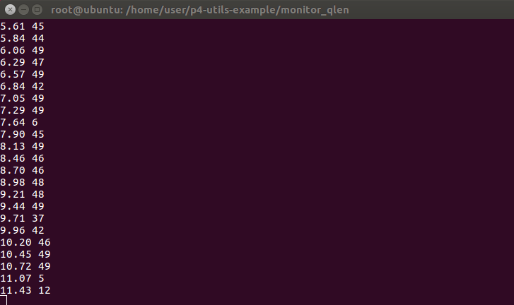
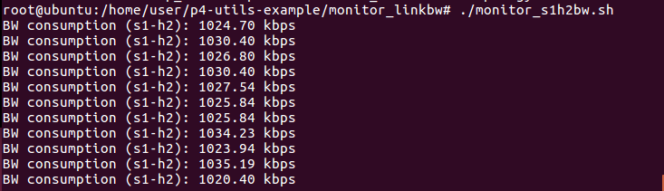
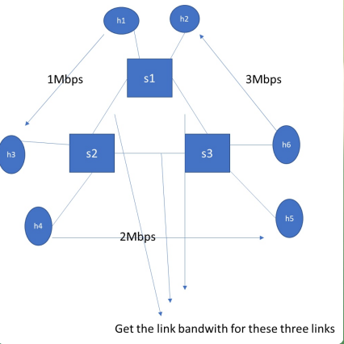
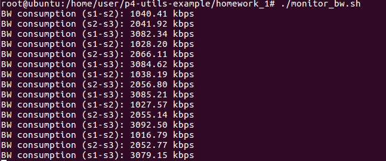

# Register & Counter

## Register實驗

- ip_forward.p4

```c
#include <core.p4>
#include <v1model.p4>
typedef bit<48> macAddr_t;
typedef bit<9> egressSpec_t;
  
header ethernet_t {
    bit<48> dstAddr;
    bit<48> srcAddr;
    bit<16> etherType;
}
 
header ipv4_t {
    bit<4>  version;
    bit<4>  ihl;
    bit<8>  diffserv;
    bit<16> totalLen;
    bit<16> identification;
    bit<3>  flags;
    bit<13> fragOffset;
    bit<8>  ttl;
    bit<8>  protocol;
    bit<16> hdrChecksum;
    bit<32> srcAddr;
    bit<32> dstAddr;
}
 
struct metadata {
}
 
struct headers {
    @name(".ethernet")
    ethernet_t ethernet;
    @name(".ipv4")
    ipv4_t     ipv4;
}
 
parser ParserImpl(packet_in packet, out headers hdr, inout metadata meta, inout standard_metadata_t standard_metadata) {

    @name(".parse_ethernet") state parse_ethernet {
        packet.extract(hdr.ethernet);
        transition select(hdr.ethernet.etherType) {
            16w0x800: parse_ipv4;
            default: accept;
        }
    }
    @name(".parse_ipv4") state parse_ipv4 {
        packet.extract(hdr.ipv4);
        transition accept;
    }
    @name(".start") state start {
        transition parse_ethernet;
    }
}
 
control egress(inout headers hdr, inout metadata meta, inout standard_metadata_t standard_metadata) {
    register<bit<32>>(15) qdepth;   
    apply {
      qdepth.write((bit<32>)standard_metadata.egress_port, (bit<32>)standard_metadata.deq_qdepth);
    }
}
 
control ingress(inout headers hdr, inout metadata meta, inout standard_metadata_t standard_metadata) {
    @name(".set_nhop") action set_nhop(macAddr_t dstAddr, egressSpec_t port) {
        //set the src mac address as the previous dst, this is not correct right?
        hdr.ethernet.srcAddr = hdr.ethernet.dstAddr;
 
        //set the destination mac address that we got from the match in the table
        hdr.ethernet.dstAddr = dstAddr;
 
        //set the output port that we also get from the table
        standard_metadata.egress_spec = port;
 
        //decrease ttl by 1
        hdr.ipv4.ttl = hdr.ipv4.ttl - 1;
    }
    @name("._drop") action _drop() {
        mark_to_drop(standard_metadata);
    }
    @name(".ipv4_lpm") table ipv4_lpm {
        actions = {
            set_nhop;
            _drop;
        }
        key = {
            hdr.ipv4.dstAddr: lpm;
        }
        size = 512;
        const default_action = _drop();
    }
    apply {
        ipv4_lpm.apply();
    }
}
 
control DeparserImpl(packet_out packet, in headers hdr) {
    apply {
        packet.emit(hdr.ethernet);
        packet.emit(hdr.ipv4);
    }
}
 
control verifyChecksum(inout headers hdr, inout metadata meta) {
    apply {
        verify_checksum(true, { hdr.ipv4.version, hdr.ipv4.ihl, hdr.ipv4.diffserv, hdr.ipv4.totalLen, hdr.ipv4.identification, hdr.ipv4.flags, hdr.ipv4.fragOffset, hdr.ipv4.ttl, hdr.ipv4.protocol, hdr.ipv4.srcAddr, hdr.ipv4.dstAddr }, hdr.ipv4.hdrChecksum, HashAlgorithm.csum16);
    }
}
 
control computeChecksum(inout headers hdr, inout metadata meta) {
    apply {
        update_checksum(true, { hdr.ipv4.version, hdr.ipv4.ihl, hdr.ipv4.diffserv, hdr.ipv4.totalLen, hdr.ipv4.identification, hdr.ipv4.flags, hdr.ipv4.fragOffset, hdr.ipv4.ttl, hdr.ipv4.protocol, hdr.ipv4.srcAddr, hdr.ipv4.dstAddr }, hdr.ipv4.hdrChecksum, HashAlgorithm.csum16);
    }
}
 
V1Switch(ParserImpl(), verifyChecksum(), ingress(), egress(), computeChecksum(), DeparserImpl()) main;
```

- cmd.txt

```
set_queue_depth 50
set_queue_rate 1000
table_add ipv4_lpm set_nhop 10.0.1.1/32 => 00:00:0a:00:01:01 1
table_add ipv4_lpm set_nhop 10.0.2.1/32 => 00:00:0a:00:02:01 2
```

- monitor_qlens1h2.sh

```sh
#!/bin/bash

CLI_PATH=/usr/local/bin/simple_switch_CLI

#get current unix time in milliseconds
prev_time=`date +%s%N | cut -b1-13`


while true; do
  qlen=`echo register_read qdepth 2 | $CLI_PATH --thrift-port 9090 | grep qdepth | awk '{print $3}'`       

  now=`date +%s%N | cut -b1-13` 
  time=$(echo "scale=2; ($now -  $prev_time) / 1000.0"| bc -l)
  echo $time $qlen
  sleep 0.1
done
```

- 使用 iperf 傳資料，並使用腳本查看 Register

    

## Counter實驗

- ip_forward.p4

```c
#include <core.p4>
#include <v1model.p4>
typedef bit<48> macAddr_t;
typedef bit<9> egressSpec_t;

const bit<4> MAX_PORT = 15;
  
header ethernet_t {
    bit<48> dstAddr;
    bit<48> srcAddr;
    bit<16> etherType;
}
 
header ipv4_t {
    bit<4>  version;
    bit<4>  ihl;
    bit<8>  diffserv;
    bit<16> totalLen;
    bit<16> identification;
    bit<3>  flags;
    bit<13> fragOffset;
    bit<8>  ttl;
    bit<8>  protocol;
    bit<16> hdrChecksum;
    bit<32> srcAddr;
    bit<32> dstAddr;
}
 
struct metadata {
}
 
struct headers {
    @name(".ethernet")
    ethernet_t ethernet;
    @name(".ipv4")
    ipv4_t     ipv4;
}
 
parser ParserImpl(packet_in packet, out headers hdr, inout metadata meta, inout standard_metadata_t standard_metadata) {

    @name(".parse_ethernet") state parse_ethernet {
        packet.extract(hdr.ethernet);
        transition select(hdr.ethernet.etherType) {
            16w0x800: parse_ipv4;
            default: accept;
        }
    }
    @name(".parse_ipv4") state parse_ipv4 {
        packet.extract(hdr.ipv4);
        transition accept;
    }
    @name(".start") state start {
        transition parse_ethernet;
    }
}
 
control egress(inout headers hdr, inout metadata meta, inout standard_metadata_t standard_metadata) {
    counter((bit<32>)MAX_PORT, CounterType.bytes) egressPortCounter;
    apply {
       egressPortCounter.count((bit<32>)standard_metadata.egress_port);
    }
}
 
control ingress(inout headers hdr, inout metadata meta, inout standard_metadata_t standard_metadata) {
    @name(".set_nhop") action set_nhop(macAddr_t dstAddr, egressSpec_t port) {
        //set the src mac address as the previous dst, this is not correct right?
        hdr.ethernet.srcAddr = hdr.ethernet.dstAddr;
 
        //set the destination mac address that we got from the match in the table
        hdr.ethernet.dstAddr = dstAddr;
 
        //set the output port that we also get from the table
        standard_metadata.egress_spec = port;
 
        //decrease ttl by 1
        hdr.ipv4.ttl = hdr.ipv4.ttl - 1;
    }
    @name("._drop") action _drop() {
        mark_to_drop(standard_metadata);
    }
    @name(".ipv4_lpm") table ipv4_lpm {
        actions = {
            set_nhop;
            _drop;
        }
        key = {
            hdr.ipv4.dstAddr: lpm;
        }
        size = 512;
        const default_action = _drop();
    }
    apply {
        ipv4_lpm.apply();
    }
}
 
control DeparserImpl(packet_out packet, in headers hdr) {
    apply {
        packet.emit(hdr.ethernet);
        packet.emit(hdr.ipv4);
    }
}
 
control verifyChecksum(inout headers hdr, inout metadata meta) {
    apply {
        verify_checksum(true, { hdr.ipv4.version, hdr.ipv4.ihl, hdr.ipv4.diffserv, hdr.ipv4.totalLen, hdr.ipv4.identification, hdr.ipv4.flags, hdr.ipv4.fragOffset, hdr.ipv4.ttl, hdr.ipv4.protocol, hdr.ipv4.srcAddr, hdr.ipv4.dstAddr }, hdr.ipv4.hdrChecksum, HashAlgorithm.csum16);
    }
}
 
control computeChecksum(inout headers hdr, inout metadata meta) {
    apply {
        update_checksum(true, { hdr.ipv4.version, hdr.ipv4.ihl, hdr.ipv4.diffserv, hdr.ipv4.totalLen, hdr.ipv4.identification, hdr.ipv4.flags, hdr.ipv4.fragOffset, hdr.ipv4.ttl, hdr.ipv4.protocol, hdr.ipv4.srcAddr, hdr.ipv4.dstAddr }, hdr.ipv4.hdrChecksum, HashAlgorithm.csum16);
    }
}
 
V1Switch(ParserImpl(), verifyChecksum(), ingress(), egress(), computeChecksum(), DeparserImpl()) main;
```

- monitor_s1h2bw.sh

```sh
#!/bin/bash

CLI_PATH=/usr/local/bin/simple_switch_CLI

bytes_s1h2=0
pre_bytes_s1h2=0

#get current unix time in milliseconds
prev_time=`date +%s%N | cut -b1-13`


while true; do
  bytes_s1h2=`echo counter_read egressPortCounter 2 | $CLI_PATH --thrift-port 9090 | grep egressPortCounter | tr '=' ' ' | tr ')' ' ' | awk '{print $6}'`       

  now=`date +%s%N | cut -b1-13` 
 
  if [ ! $pre_bytes_s1h2 -eq 0 ];then
     thr=`echo "scale=2;($bytes_s1h2-$pre_bytes_s1h2) * 8.0  / ($now-$pre_time)" | bc -l`
     echo "BW consumption (s1-h2):" $thr "kbps"      
  fi

  pre_bytes_s1h2=$bytes_s1h2
  pre_time=$now
  sleep 1
done
```

- 使用 iperf 傳資料，並使用腳本查看 Counter

    

## 作業



- p4app.json

```c
{
  "program": "ip_forward.p4",
  "switch": "simple_switch",
  "compiler": "p4c",
  "options": "--target bmv2 --arch v1model --std p4-16",
  "switch_cli": "simple_switch_CLI",
  "cli": true,
  "pcap_dump": false,
  "enable_log": false,
  "topo_module": {
    "file_path": "",
    "module_name": "p4utils.mininetlib.apptopo",
    "object_name": "AppTopoStrategies"
  },
  "controller_module": null,
  "topodb_module": {
    "file_path": "",
    "module_name": "p4utils.utils.topology",
    "object_name": "Topology"
  },
  "mininet_module": {
    "file_path": "",
    "module_name": "p4utils.mininetlib.p4net",
    "object_name": "P4Mininet"
  },
  "topology": {
    "assignment_strategy": "manual",
    "auto_arp_tables": "true",
    "auto_gw_arp": "true",
    "links": [["h1", "s1"], ["h2", "s1"], ["h3", "s2"], ["h4", "s2"], ["h5", "s3"], ["h6", "s3"], ["s1", "s2"], ["s1", "s3"], ["s2", "s3"]],
    "hosts": {
      "h1": {
        "ip": "10.0.1.1/24",
        "gw": "10.0.1.254"
      },
      "h2": {
        "ip": "10.0.1.2/24",
        "gw": "10.0.1.254"
      },
      "h3": {
        "ip": "10.0.2.1/24",
        "gw": "10.0.2.254"
      },
      "h4": {
        "ip": "10.0.2.2/24",
        "gw": "10.0.2.254"
      },
      "h5": {
        "ip": "10.0.3.1/24",
        "gw": "10.0.3.254"
      },
      "h6": {
        "ip": "10.0.3.2/24",
        "gw": "10.0.3.254"
      }
    },
    "switches": {
      "s1": {
        "cli_input": "cmd1.txt",
        "program": "ip_forward.p4"
      },
      "s2": {
        "cli_input": "cmd2.txt",
        "program": "ip_forward.p4"
      },
      "s3": {
        "cli_input": "cmd3.txt",
        "program": "ip_forward.p4"
      }
    }
  }
}
```

- ip_forward.p4

```c
#include <core.p4>
#include <v1model.p4>
typedef bit<48> macAddr_t;
typedef bit<9> egressSpec_t;

const bit<4> MAX_PORT = 15;
  
header ethernet_t {
    bit<48> dstAddr;
    bit<48> srcAddr;
    bit<16> etherType;
}
 
header ipv4_t {
    bit<4>  version;
    bit<4>  ihl;
    bit<8>  diffserv;
    bit<16> totalLen;
    bit<16> identification;
    bit<3>  flags;
    bit<13> fragOffset;
    bit<8>  ttl;
    bit<8>  protocol;
    bit<16> hdrChecksum;
    bit<32> srcAddr;
    bit<32> dstAddr;
}
 
struct metadata {
}
 
struct headers {
    @name(".ethernet")
    ethernet_t ethernet;
    @name(".ipv4")
    ipv4_t     ipv4;
}
 
parser ParserImpl(packet_in packet, out headers hdr, inout metadata meta, inout standard_metadata_t standard_metadata) {

    @name(".parse_ethernet") state parse_ethernet {
        packet.extract(hdr.ethernet);
        transition select(hdr.ethernet.etherType) {
            16w0x800: parse_ipv4;
            default: accept;
        }
    }
    @name(".parse_ipv4") state parse_ipv4 {
        packet.extract(hdr.ipv4);
        transition accept;
    }
    @name(".start") state start {
        transition parse_ethernet;
    }
}
 
control egress(inout headers hdr, inout metadata meta, inout standard_metadata_t standard_metadata) {
    counter((bit<32>)MAX_PORT, CounterType.bytes) egressPortCounter;
    apply {
       egressPortCounter.count((bit<32>)standard_metadata.egress_port);
    }
}
 
control ingress(inout headers hdr, inout metadata meta, inout standard_metadata_t standard_metadata) {
    @name(".set_nhop") action set_nhop(macAddr_t dstAddr, egressSpec_t port) {
        //set the src mac address as the previous dst, this is not correct right?
        hdr.ethernet.srcAddr = hdr.ethernet.dstAddr;
 
        //set the destination mac address that we got from the match in the table
        hdr.ethernet.dstAddr = dstAddr;
 
        //set the output port that we also get from the table
        standard_metadata.egress_spec = port;
 
        //decrease ttl by 1
        hdr.ipv4.ttl = hdr.ipv4.ttl - 1;
    }
    @name("._drop") action _drop() {
        mark_to_drop(standard_metadata);
    }
    @name(".ipv4_lpm") table ipv4_lpm {
        actions = {
            set_nhop;
            _drop;
        }
        key = {
            hdr.ipv4.dstAddr: lpm;
        }
        size = 512;
        const default_action = _drop();
    }
    apply {
        ipv4_lpm.apply();
    }
}
 
control DeparserImpl(packet_out packet, in headers hdr) {
    apply {
        packet.emit(hdr.ethernet);
        packet.emit(hdr.ipv4);
    }
}
 
control verifyChecksum(inout headers hdr, inout metadata meta) {
    apply {
        verify_checksum(true, { hdr.ipv4.version, hdr.ipv4.ihl, hdr.ipv4.diffserv, hdr.ipv4.totalLen, hdr.ipv4.identification, hdr.ipv4.flags, hdr.ipv4.fragOffset, hdr.ipv4.ttl, hdr.ipv4.protocol, hdr.ipv4.srcAddr, hdr.ipv4.dstAddr }, hdr.ipv4.hdrChecksum, HashAlgorithm.csum16);
    }
}
 
control computeChecksum(inout headers hdr, inout metadata meta) {
    apply {
        update_checksum(true, { hdr.ipv4.version, hdr.ipv4.ihl, hdr.ipv4.diffserv, hdr.ipv4.totalLen, hdr.ipv4.identification, hdr.ipv4.flags, hdr.ipv4.fragOffset, hdr.ipv4.ttl, hdr.ipv4.protocol, hdr.ipv4.srcAddr, hdr.ipv4.dstAddr }, hdr.ipv4.hdrChecksum, HashAlgorithm.csum16);
    }
}
 
V1Switch(ParserImpl(), verifyChecksum(), ingress(), egress(), computeChecksum(), DeparserImpl()) main;
```

- cmd1.txt

```
table_add ipv4_lpm set_nhop 10.0.1.1/32 => 00:00:0a:00:01:01 1
table_add ipv4_lpm set_nhop 10.0.1.2/32 => 00:00:0a:00:01:02 2
table_add ipv4_lpm set_nhop 10.0.2.1/32 => 00:00:0a:00:02:01 3
table_add ipv4_lpm set_nhop 10.0.2.2/32 => 00:00:0a:00:02:02 3
table_add ipv4_lpm set_nhop 10.0.3.1/32 => 00:00:0a:00:03:01 4
table_add ipv4_lpm set_nhop 10.0.3.2/32 => 00:00:0a:00:03:02 4
```

- cmd2.txt

```
table_add ipv4_lpm set_nhop 10.0.1.1/32 => 00:00:0a:00:01:01 3
table_add ipv4_lpm set_nhop 10.0.1.2/32 => 00:00:0a:00:01:02 3
table_add ipv4_lpm set_nhop 10.0.2.1/32 => 00:00:0a:00:02:01 1
table_add ipv4_lpm set_nhop 10.0.2.2/32 => 00:00:0a:00:02:02 2
table_add ipv4_lpm set_nhop 10.0.3.1/32 => 00:00:0a:00:03:01 4
table_add ipv4_lpm set_nhop 10.0.3.2/32 => 00:00:0a:00:03:02 4
```

- cmd3.txt

```
table_add ipv4_lpm set_nhop 10.0.1.1/32 => 00:00:0a:00:01:01 3
table_add ipv4_lpm set_nhop 10.0.1.2/32 => 00:00:0a:00:01:02 3
table_add ipv4_lpm set_nhop 10.0.2.1/32 => 00:00:0a:00:02:01 4
table_add ipv4_lpm set_nhop 10.0.2.2/32 => 00:00:0a:00:02:02 4
table_add ipv4_lpm set_nhop 10.0.3.1/32 => 00:00:0a:00:03:01 1
table_add ipv4_lpm set_nhop 10.0.3.2/32 => 00:00:0a:00:03:02 2
```

- monitor_bw.sh

```sh
#!/bin/bash

CLI_PATH=/usr/local/bin/simple_switch_CLI

bytes_s1s2=0
pre_bytes_s1s2=0
bytes_s2s3=0
pre_bytes_s2s3=0
bytes_s1s3=0
pre_bytes_s1s3=0

#get current unix time in milliseconds
prev_time=`date +%s%N | cut -b1-13`

while true; do
  bytes_s1s2=`echo counter_read egressPortCounter 3 | $CLI_PATH --thrift-port 9090 | grep egressPortCounter | tr '=' ' ' | tr ')' ' ' | awk '{print $6}'`    

  bytes_s2s3=`echo counter_read egressPortCounter 4 | $CLI_PATH --thrift-port 9091 | grep egressPortCounter | tr '=' ' ' | tr ')' ' ' | awk '{print $6}'` 

  bytes_s1s3=`echo counter_read egressPortCounter 2 | $CLI_PATH --thrift-port 9090 | grep egressPortCounter | tr '=' ' ' | tr ')' ' ' | awk '{print $6}'`    

  now=`date +%s%N | cut -b1-13` 
 
  if [ ! $pre_bytes_s1s2 -eq 0 ];then
     thr=`echo "scale=2;($bytes_s1s2-$pre_bytes_s1s2) * 8.0  / ($now-$pre_time)" | bc -l`
     echo "BW consumption (s1-s2):" $thr "kbps"      
  fi

  if [ ! $pre_bytes_s2s3 -eq 0 ];then
     thr=`echo "scale=2;($bytes_s2s3-$pre_bytes_s2s3) * 8.0  / ($now-$pre_time)" | bc -l`
     echo "BW consumption (s2-s3):" $thr "kbps"      
  fi

  if [ ! $pre_bytes_s1s3 -eq 0 ];then
     thr=`echo "scale=2;($bytes_s1s3-$pre_bytes_s1s3) * 8.0  / ($now-$pre_time)" | bc -l`
     echo "BW consumption (s1-s3):" $thr "kbps"      
  fi

  pre_bytes_s1s2=$bytes_s1s2
  pre_bytes_s2s3=$bytes_s2s3
  pre_bytes_s1s3=$bytes_s1s3
  pre_time=$now
  sleep 1
done
```

- 執行結果

    
