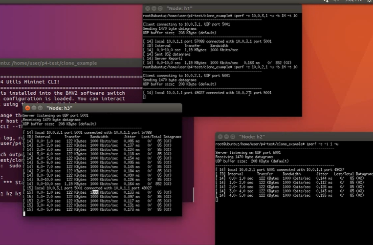
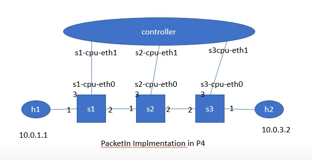
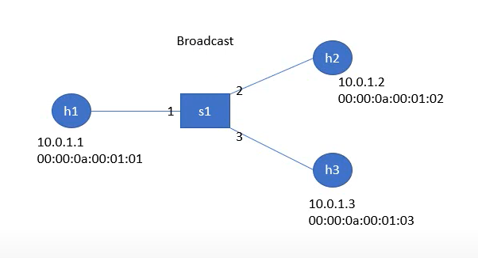

# Packet clone

## 範例

將 h1 通往 h2 的封包複製一份給 h3

- p4app.json

  ```json
  .
  .
  .
    "topology": {
      "assignment_strategy": "manual",
      "auto_arp_tables": "true",
      "auto_gw_arp": "true",
      "links": [["h1", "s1"], ["h2", "s1"], ["h3", "s1"]],
      "hosts": {
        "h1": {
          "ip": "10.0.1.1/24",
          "gw": "10.0.1.254"
        },
        "h2": {
          "ip": "10.0.2.1/24",
        "gw": "10.0.2.254"
        },
        "h3": {
          "ip": "10.0.3.1/24",
        "gw": "10.0.3.254"
        }
      },
      "switches": {
        "s1": {
          "cli_input": "cmd.txt",
          "program": "ip_forward.p4"
        }
      }
    }
  }
  ```

- ip_forward.p4

  - `if (hdr.ipv4.isValid() && standard_metadata.instance_type == 1)` **:** 判斷封包是否合法並且為複製的封包

  - `if(hdr.ipv4.isValid() && hdr.ipv4.srcAddr==0x0a000101 && hdr.ipv4.dstAddr==0x0a000201)` **:** 判斷封包是否合法並且是從 h1 到 h2

  - `clone(CloneType.I2E, (bit<32>)32w250);` **:** clonetype 是 ingress to egress。session id 是 250，用來對應到 cmd.txt 的 mirroring_add

  - `update_checksum_with_payload` **:** tcp 與 udp 在計算chacksum 時，payload 也會加入一起計算

  ```c
  .
  .
  .

  control egress(inout headers hdr, inout metadata meta, inout standard_metadata_t standard_metadata) {
      apply {
          if (hdr.ipv4.isValid() && standard_metadata.instance_type == 1) {
              hdr.ethernet.dstAddr = 0x00000a000301;
              hdr.ipv4.dstAddr = 0x0a000301;
          }
      }
  }

  control ingress(inout headers hdr, inout metadata meta, inout standard_metadata_t standard_metadata) {
      action do_copy() {
          clone(CloneType.I2E, (bit<32>)32w250);
      }
      .
      .
      .
          apply {
          ipv4_lpm.apply();
          if(hdr.ipv4.isValid() && hdr.ipv4.srcAddr==0x0a000101 && hdr.ipv4.dstAddr==0x0a000201){
            do_copy();
          }
      }
  }
  .
  .
  .
  control computeChecksum(inout headers hdr, inout metadata meta) {
      apply {
          update_checksum(true, { hdr.ipv4.version, hdr.ipv4.ihl, hdr.ipv4.diffserv, hdr.ipv4.totalLen, hdr.ipv4.identification, hdr.ipv4.flags, hdr.ipv4.fragOffset, hdr.ipv4.ttl, hdr.ipv4.protocol, hdr.ipv4.srcAddr, hdr.ipv4.dstAddr }, hdr.ipv4.hdrChecksum, HashAlgorithm.csum16);
          update_checksum_with_payload(hdr.udp.isValid(), { hdr.ipv4.srcAddr, hdr.ipv4.dstAddr, 8w0, hdr.ipv4.protocol, hdr.udp.length_, hdr.udp.srcPort, hdr.udp.dstPort,  hdr.udp.length_}, hdr.udp.checksum, HashAlgorithm.csum16);
      }
  }
  ```

- cmd.txt

  ```
  table_add ipv4_lpm set_nhop 10.0.1.1/32 => 00:00:0a:00:01:01 1
  table_add ipv4_lpm set_nhop 10.0.2.1/32 => 00:00:0a:00:02:01 2
  table_add ipv4_lpm set_nhop 10.0.3.1/32 => 00:00:0a:00:03:01 3
  mirroring_add 250 3
  ```

- 使用 iperf 測試

  

# PacketIn implmentation

## 範例

讓 controller 配置規則給 s1、s2、s3



- p4app.json

  - `"cpu_port": true` **:** 自動產生一個埠號，若是 s1 就會產生 s1-cpu-eth0 的接口

  ```json
  .
  .
  .
    "topology": {
        "links": [["h1","s1"], ["s3","h2"], ["s1","s2"], ["s2","s3"]],
        "hosts": {
          "h1": {
          },
          "h2": {
          }
        },
        "switches": {
          "s1": {
            "cli_input": "s1-commands.txt",
            "program": "send_to_cpu.p4",
            "cpu_port": true
          },
          "s2": {
            "cli_input": "s2-commands.txt",
            "program": "send_to_cpu.p4",
            "cpu_port": true
          },
          "s3": {
            "cli_input": "s3-commands.txt",
            "program": "send_to_cpu.p4",
            "cpu_port": true
          }		
        }
      }
  }
  ```

- send_to_cpu.p4

  ```c
  .
  .
  .
      action to_cpu(egressSpec_t port) {
              standard_metadata.egress_spec = port;
          }

          table ipv4_lpm {
              key = {
                  hdr.ipv4.dstAddr: lpm;
              }
              actions = {
                  ipv4_forward;
            to_cpu;	
                  drop;
              }
              size = 1024;
          }
  .
  .
  .
  ```

- s1-command.txt、s3-command.txt

  - s1、s3 預設把封包往 port 3 傳送 

  ```
  table_set_default ipv4_lpm to_cpu 3
  ```

- controller.py

  - `cpu_interfaces = [str(self.topo.get_cpu_port_intf(sw_name).replace("eth0", "eth1")) for sw_name in self.controllers]` **:** 產生對應的 controller 接口字串

  - `sniff(iface=cpu_interfaces, prn=self.recv_msg_cpu)` **:** 監聽對應的 controller 接口

  - `self.controllers[sw_name].table_add("ipv4_lpm", "ipv4_forward", [str(host_ip)], [str(host_mac), str(sw_port)])` **:** 加入 forward 規則

  ```py
  import nnpy
  import struct
  from p4utils.utils.topology import Topology
  from p4utils.utils.sswitch_API import SimpleSwitchAPI
  #from scapy.all import Ether, sniff, Packet, BitField
  from scapy.all import *

  rules=[]

  class myController(object):

      def __init__(self):
          self.topo = Topology(db="topology.db")
          self.controllers = {}
          self.connect_to_switches()
          
      def connect_to_switches(self):
          for p4switch in self.topo.get_p4switches():
              thrift_port = self.topo.get_thrift_port(p4switch)
              #print "p4switch:", p4switch, "thrift_port:", thrift_port
              self.controllers[p4switch] = SimpleSwitchAPI(thrift_port) 	

      def recv_msg_cpu(self, pkt):
          print "-------------------------------------------------------------------"
          global rules
          print "interface:", pkt.sniffed_on
          print "summary:", pkt.summary()
          if IP in pkt:
            ip_src=pkt[IP].src
            ip_dst=pkt[IP].dst
            print "ip_src:", ip_src, " ip_dst:", ip_dst
          if (ip_src, ip_dst) not in rules:
              rules.append((ip_src, ip_dst))
              print "rules:", rules
          else:
            return 
        
          switches = {sw_name:{} for sw_name in self.topo.get_p4switches().keys()}
          #print "switches:", switches
          for sw_name, controller in self.controllers.items():
            for host in self.topo.get_hosts_connected_to(sw_name):
              host_ip_addr = self.topo.get_host_ip(host)
              if ip_src == host_ip_addr:
                sw_src = sw_name
              
              if ip_dst == host_ip_addr:
                sw_dst = sw_name  
                sw_port = self.topo.node_to_node_port_num(sw_name, host)
                host_ip = self.topo.get_host_ip(host) + "/32"
                host_mac = self.topo.get_host_mac(host)
                #print host, "(", host_ip, host_mac, ")", "-->", sw_name, "with port:", sw_port
    
                #add rule
                print "table_add at {}:".format(sw_name)
                self.controllers[sw_name].table_add("ipv4_lpm", "ipv4_forward", [str(host_ip)], [str(host_mac), str(sw_port)])

          print "sw_src:", sw_src, "sw_dst:", sw_dst   
          paths = self.topo.get_shortest_paths_between_nodes(sw_src, sw_dst)
          sw_1=sw_src
          for next_hop in paths[0][1:]:
          host_ip = ip_dst + "/32"
          sw_port = self.topo.node_to_node_port_num(sw_1, next_hop)
          dst_sw_mac = self.topo.node_to_node_mac(next_hop, sw_1)
          #add rule
          print "table_add at {}:".format(sw_1)
          self.controllers[sw_1].table_add("ipv4_lpm", "ipv4_forward", [str(host_ip)],
                                                      [str(dst_sw_mac), str(sw_port)])
          sw_1=next_hop

          print "send original packet back from ", pkt.sniffed_on
          sendp(pkt, iface=pkt.sniffed_on, verbose=False)
              

  
        
      def run_cpu_port_loop(self):
          cpu_interfaces = [str(self.topo.get_cpu_port_intf(sw_name).replace("eth0", "eth1")) for sw_name in self.controllers]
          sniff(iface=cpu_interfaces, prn=self.recv_msg_cpu)
          
  if __name__ == "__main__":
      controller = myController()
      controller.run_cpu_port_loop()
  ```

- 開啟 controller 並執行 `h1 ping h2 -c 1`

  

# Broadcast

## 範例

讓 h1、h2、h3 可以各自廣播封包給其他人



- p4app.json

  ```json
  .
  .
  .
    "topology": {
      "links": [["h1", "s1"], ["h2", "s1"], ["h3", "s1"]],
      "hosts": {
        "h1": {
        },
        "h2": {
        },
        "h3": {
        },
      },
      "switches": {
        "s1": {
          "cli_input": "cmd.txt",
          "program": "basic.p4"
        }
      }
    }
  }
  ```

- basic.p4

  - 設置了一個 action 叫做 broadcast 用來設置廣播群組

  ```c
  .
  .
  .
      action broadcast(bit<16> mcast_grp_id) {
          standard_metadata.mcast_grp = mcast_grp_id;
      }

      table ip_broadcast {
          key = {
              hdr.ipv4.dstAddr: exact;
              standard_metadata.ingress_port: exact;
          }

          actions = {
              broadcast;
              NoAction;
          }
          size = 1024;
          default_action = NoAction();
      }
  .
  .
  .
  ```

- cmd.txt

  - `table_add ip_broadcast broadcast 255.255.255.255 1 => 1` **:** 將來自 1 號接口的廣播封包設置群播 ID 為1

  - `mc_mgrp_create 1` **:** 創建群播ID 1

  - `mc_node_create 0 2 3` **:** 創建節點0，包含2跟3接口

  - `mc_node_associate 1 0` **:** 將群播 ID 1 與節點連結

  ```
  table_add mac_forward forward 00:00:0a:00:01:01 => 1
  table_add mac_forward forward 00:00:0a:00:01:02 => 2
  table_add mac_forward forward 00:00:0a:00:01:03 => 3
  table_add ip_broadcast broadcast 255.255.255.255 1 => 1
  table_add ip_broadcast broadcast 255.255.255.255 2 => 2
  table_add ip_broadcast broadcast 255.255.255.255 3 => 3
  mc_mgrp_create 1
  mc_node_create 0 2 3 
  mc_node_associate 1 0
  mc_mgrp_create 2
  mc_node_create 1 1 3  
  mc_node_associate 2 1
  mc_mgrp_create 3
  mc_node_create 2 1 2 
  mc_node_associate 3 2 
  ```

- send.py

  ```py
  #!/usr/bin/env python

  from socket import *

  s = socket(AF_INET, SOCK_DGRAM)
  s.setsockopt(SOL_SOCKET, SO_BROADCAST, 1)
  s.sendto('hello', ('255.255.255.255', 1234))
  ```

- receive.py

  ```py
  #!/usr/bin/env python

  import sys
  from socket import *

  s = socket(AF_INET, SOCK_DGRAM)
  s.bind(('', 1234))
  sys.stderr.write("received '%s' from %s\n" % s.recvfrom(1024))
  ```

- 使用 xterm 打開 h1、h2、h3 執行 send 與 receive

  
  
---

**參考資料:**

- [clone example](https://www.youtube.com/watch?v=bEzE0MxCTjM)
- [PacketIn Implmentation](https://www.youtube.com/watch?v=hHJvQIWrRag)
- [Broadcast](https://www.youtube.com/watch?v=7iOBUQYBW1s)