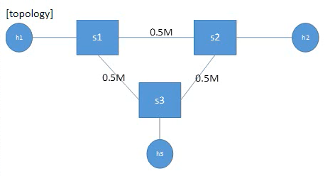

# Meter

Meters是用於測量數據速率（packets or bytes per second）的帶狀態內存單元，輸出結果爲三種顏色（red、yellow、green）中的一種，被編碼成2-bit-wide字段。

## 範例

- p4app.json   

	```json
	.
	.
	.
		"topology": {
			"assignment_strategy": "manual",
			"auto_arp_tables": "true",
			"auto_gw_arp": "true",
			"links": [["h1", "s1"], ["h2", "s1"]],
			"hosts": {
				"h1": {
					"ip": "10.0.1.1/24",
					"gw": "10.0.1.254"
				},
				"h2": {
					"ip": "10.0.2.1/24",
				"gw": "10.0.2.254"
				}
			},
			"switches": {
				"s1": {
					"cli_input": "cmd.txt",
					"program": "ip_forward.p4"
				}
			}
		}
	}
	```

- ip_forward.p4

	- m_action 用來設置 meter_tag

	- 

	```c
	.
	.
	.
	struct metadata {
			bit<32> meter_tag;
	}
	.
	.
	.
			meter(10, MeterType.packets) my_meter;

			action m_action(bit<32> meter_idx) {
					my_meter.execute_meter((bit<32>)meter_idx, meta.meter_tag);
			}      

			action set_tos(bit<8> tos) {
					hdr.ipv4.diffserv=tos;
			}    
			.
			.
			.
			table m_table {
					key = {
							hdr.ethernet.dstAddr: exact;
					}

					actions = {
							m_action;
							NoAction;
					}
					size = 1024;
					default_action = NoAction();
			}

			table m_filter {
					key = {
							meta.meter_tag: exact;
					}

					actions = {
							set_tos;
							_drop;
							NoAction;
					}
					size = 1024;
					default_action = _drop();
			}      
	.
	.
	.
	```

- cmd.txt

	- `table_add m_table m_action 00:00:0a:00:02:01 => 2` **:** 將通往 h2 的封包 meter_tag 標記成 2

	- `table_add m_filter NoAction 0 =>` **:** 預設為丟掉，只有標記成綠色的才可以通過

	- `	meter_set_rates my_meter 2 0.0001:1 0.0005:1` **:** 設置 meter_tag 為 2 的傳輸速率若小於1秒100個封包，標記成綠色；介於100與500之間則標記成黃色；超過500則標記成紅色

	```
	table_add ipv4_lpm set_nhop 10.0.1.1/32 => 00:00:0a:00:01:01 1
	table_add ipv4_lpm set_nhop 10.0.2.1/32 => 00:00:0a:00:02:01 2
	table_add m_table m_action 00:00:0a:00:02:01 => 2
	table_add m_filter NoAction 0 =>
	meter_set_rates my_meter 2 0.0001:1 0.0005:1
	```

# Recirculate

## 範例

根據 Tos 欄位來決定要不要 Recirculate

- p4app.json

	```json
	.
	.
	.
		"topology": {
			"assignment_strategy": "manual",
			"auto_arp_tables": "true",
			"auto_gw_arp": "true",
			"links": [["h1", "s1"], ["h2", "s1"]],
			"hosts": {
				"h1": {
					"ip": "10.0.1.1/24",
					"gw": "10.0.1.254"
				},
				"h2": {
					"ip": "10.0.2.1/24",
				"gw": "10.0.2.254"
				}
			},
			"switches": {
				"s1": {
					"cli_input": "cmd.txt",
					"program": "ip_forward.p4"
				}
			}
		}
	}
	```

- ip_forward.p4

	- set_mytos 這個 action 會讓 tos-1 並 recirculate

	- `1..10 : set_mytos()` **:** 只讓 tos 介於 1 到 10 執行 set_mytos

	```c
	standard_metadata) {
			action set_mytos() {
					hdr.ipv4.diffserv=hdr.ipv4.diffserv-1;
					recirculate<headers>(hdr);
			}              

			table set_tos {
					key = {
							hdr.ipv4.diffserv: range;
					}

					actions = {
							set_mytos;
							NoAction;
					}

					size = 1024;
					default_action = NoAction();

					const entries = {
					1..10 : set_mytos();
					_ : NoAction();
					}
			}

			apply {
				set_tos.apply();
			}
	}
	```

# Multipath transmission

增加線路頻寬使用率

## 範例



- p4app.json

	- `"s1", "s3", {"bw":0.5}` **:** 可以設置線路頻寬為 0.5M

	```json
	.
	.
	.
			"topology": {
			"assignment_strategy": "manual",
			"auto_arp_tables": "true",
			"auto_gw_arp": "true",
			"links": [["h1", "s1"], ["h2", "s2"], ["s1", "s2", {"bw":0.5}], ["s1", "s3", {"bw":0.5}], ["s3", "s2", {"bw":0.5}]],
			"hosts": {
				"h1": {
					"ip": "10.0.1.1/24",
					"gw": "10.0.1.254"
				},
				"h2": {
					"ip": "10.0.2.1/24",
					"gw": "10.0.2.254"
				}
			},
			"switches": {
				"s1": {
					"cli_input": "s1-multipath.txt",
					"program": "ip_forward.p4"
				},
				"s2": {
					"cli_input": "s2.txt",
					"program": "ip_forward.p4"
				},	
				"s3": {
					"cli_input": "s3.txt",
					"program": "ip_forward.p4"
				}
			}
		}
	}
	```

- ip_forward.p4

	```c
	.
	.
	.
	struct metadata {
			macAddr_t dstAddr;
			egressSpec_t port;
			bit<8>  lower;
			bit<8>  upper;      
			bit<8>  result;
			bit<1>  final;
	}
	.
	.
	.
	parser MyParser(packet_in packet,
									out headers hdr,
									inout metadata meta,
									inout standard_metadata_t standard_metadata) {
	
			state start {
					meta.result=127;
					meta.final=0;
					transition parse_ethernet;
			}
	.
	.
	.
			table ipv4_lpm {
					key = {
							hdr.ipv4.dstAddr: lpm;
					}
					actions = {
							ipv4_forward;
							drop;
							NoAction;
					}
					size = 1024;
					default_action = NoAction();
			}
	
			action myforward(){
					standard_metadata.egress_spec = meta.port;
					hdr.ethernet.srcAddr = hdr.ethernet.dstAddr;
					hdr.ethernet.dstAddr = meta.dstAddr;
					hdr.ipv4.ttl = hdr.ipv4.ttl - 1; 
					meta.final=1;
			}      
	
			action set_param1(bit<8> lower, bit<8> upper, macAddr_t dstAddr, egressSpec_t port) {
					random(meta.result, (bit<8>)0,(bit<8>)100);
					meta.lower=lower;
					meta.upper=upper;
					meta.dstAddr=dstAddr;
					meta.port=port;
			}
	
			action set_param2(bit<8> lower, bit<8> upper, macAddr_t dstAddr, egressSpec_t port) {
					meta.lower=lower;
					meta.upper=upper;
					meta.dstAddr=dstAddr;
					meta.port=port;
			}
	
			table ipv4_lpm2 {
					key = {
							hdr.ipv4.dstAddr: lpm;
							meta.final: exact;
					}
					actions = {
							set_param1;
							drop;
							NoAction;
					}
					size = 1024;
					default_action = NoAction();
			}
	
			table ipv4_lpm3 {
					key = {
							hdr.ipv4.dstAddr: lpm;
							meta.final: exact;
					}
					actions = {
							set_param2;
							drop;
							NoAction;
					}
					size = 1024;
					default_action = NoAction();
			}
		
			apply {
					if (hdr.ipv4.isValid()) {
							ipv4_lpm2.apply();
							if (meta.result >= meta.lower && meta.result <= meta.upper){
									myforward();
							}
						
							if (meta.final==0){
									ipv4_lpm3.apply();
									if (meta.result >= meta.lower && meta.result <= meta.upper){
											myforward();
									}
							}
					}
				
					if (hdr.ipv4.isValid() && meta.result==127) {
							ipv4_lpm.apply();
					}
			}
	.
	.
	.
	```

- s1-multipath.txt

	```
	table_set_default ipv4_lpm drop
	table_add ipv4_lpm ipv4_forward 10.0.1.1/32 => 00:00:00:00:01:01 1
	table_add ipv4_lpm2 set_param1 10.0.2.1/32 0 => 0   49 00:00:00:02:00:00 2
	table_add ipv4_lpm3 set_param2 10.0.2.1/32 0 => 50 100 00:00:00:03:00:00 3
	```


---

**參考資料:**

- [Meter](https://www.youtube.com/watch?v=nqp_Qm631K4)
- [recirculate](https://www.youtube.com/watch?v=xmuEACKJ-tQ)
- [multipath transmission](https://www.youtube.com/watch?v=VqkiZVyJT_4)